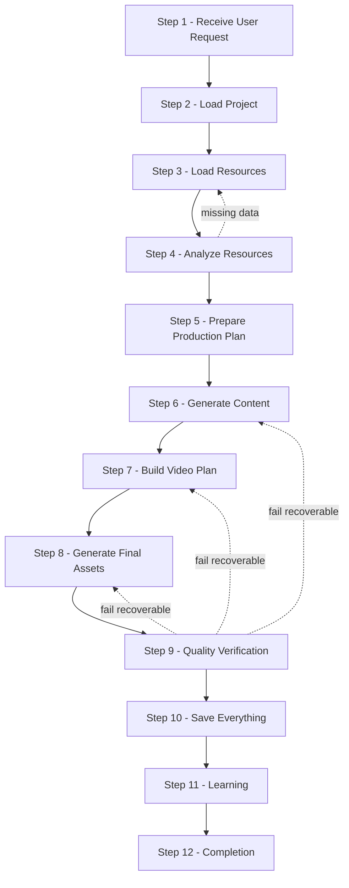
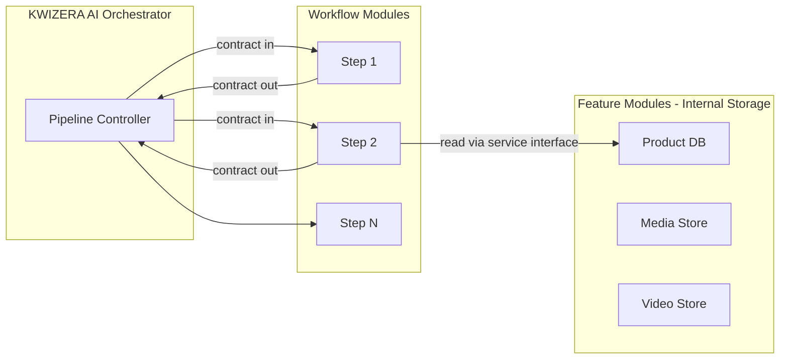

# KWIZERA AI STUDIO — Complete AI Workflow Blueprint

**Document status:** Permanent foundation · Step 1F  
**Effective date:** 2026-06-28  
**Scope:** Complete internal AI execution pipeline for new-project workflows — not frontend, backend, API, database, or UI implementation.

**Companion documents:**

| Document | Step | Scope |
|----------|------|-------|
| [BRAND-IDENTITY.md](./BRAND-IDENTITY.md) | 1A | Product name, logo, visual identity |
| [MISSION-VISION-BLUEPRINT.md](./MISSION-VISION-BLUEPRINT.md) | 1B | Mission, vision, purpose, objectives, principles, success criteria |
| [AI-IDENTITY-BLUEPRINT.md](./AI-IDENTITY-BLUEPRINT.md) | 1C | AI assistant identity, role, personality, behavior |
| [FEATURE-BLUEPRINT.md](./FEATURE-BLUEPRINT.md) | 1D | Complete feature specification by module |
| [USER-JOURNEY-BLUEPRINT.md](./USER-JOURNEY-BLUEPRINT.md) | 1E | Complete user journey by stage |

| Official identity | Value |
|-------------------|-------|
| **Project name** | **KWIZERA AI STUDIO** |
| **Official logo** | **`KWIZERA AI.png`** (project root) |
| **Official AI assistant** | **KWIZERA AI** |

---

## 1. Blueprint Purpose

This document defines the **complete internal AI workflow** that **KWIZERA AI** executes whenever a user creates a new project. It specifies how modular pipeline steps receive data, validate work, pass results forward, recover from errors, and persist outcomes.

### 1.1 Core design principles

| Principle | Requirement |
|-----------|-------------|
| **Modularity** | Each workflow step is one module with one primary responsibility |
| **Verify before pass** | Every module validates its output before handing data to the next module |
| **Recoverability** | Every workflow must be recoverable if an error occurs |
| **Interface isolation** | No module directly modifies another module's internal data |
| **Defined interfaces** | All inter-module communication uses clearly defined data contracts |
| **No data loss** | Never lose user data; never corrupt project files |
| **Quality gates** | Every generated result is validated before continuing |
| **Stop only on critical failure** | Workflow stops only for critical unrecoverable errors; otherwise continue automatically with recovery |

### 1.2 Governance

| Rule | Requirement |
|------|-------------|
| **Authoritative workflow** | This blueprint is the permanent internal AI workflow specification |
| **No silent changes** | New steps or altered pipelines require explicit blueprint amendment |
| **Alignment** | Must align with Steps 1A–1E and [AI-IDENTITY-BLUEPRINT.md](./AI-IDENTITY-BLUEPRINT.md) decision rules |
| **Implementation deferral** | Defines *what the AI pipeline does* — not *how it is coded* |

### 1.3 Pipeline overview

**Orchestrator:** **KWIZERA AI** coordinates all steps using the seven-step decision process from Step 1C (understand → analyze → detect gaps → choose workflow → execute → verify → report).

---

## 2. Workflow Step Specifications

Each step defines: **Purpose**, **Input**, **Output**, **Validation**, **Possible Errors**, **Recovery Strategy**, **Dependencies**, **AI Decision Rules**, and **Performance Requirements**.

---

### STEP 1 — Receive User Request

**Workflow module name:** `RequestIntakeModule`

#### Purpose

Receive and interpret the user's request at workflow start — understand objective, identify project type, and determine which AI pipeline modules are required.

#### Input

| Input | Source |
|-------|--------|
| User natural-language request or structured action | User / Dashboard Quick Action |
| Session context | Memory System (Module 9) |
| Optional project ID | Dashboard (resume path) |
| Workflow trigger type | `new_project`, `resume_project`, `regenerate_section` |

#### Output

| Output | Description |
|--------|-------------|
| `WorkflowIntent` | Parsed user objective (e.g. promotional video, full campaign) |
| `ProjectType` | Classified project type aligned with Feature Blueprint |
| `RequiredModules[]` | List of pipeline steps and feature modules to activate |
| `WorkflowPlan` | Ordered step list with skip/resume flags |
| `IntakeRecord` | Audit log entry for workflow history |

#### Validation

- [ ] User objective is non-empty and parseable  
- [ ] Project type maps to a supported blueprint type  
- [ ] Required modules list is complete for the project type  
- [ ] Workflow plan includes all mandatory steps (cannot skip Steps 9–10)  

#### Possible Errors

| Error | Severity |
|-------|----------|
| Ambiguous or empty request | Recoverable |
| Unsupported project type | Recoverable (fallback to generic promotional) |
| Module registry unavailable | Critical if orchestrator cannot start |

#### Recovery Strategy

- **KWIZERA AI** asks clarifying questions for ambiguous requests — do not proceed with guessed intent  
- Default to safest minimal pipeline (Load → Analyze → Plan → Generate → Verify → Save) for supported types  
- If module registry fails, abort with user notification and Recovery Center routing — no partial pipeline start  

#### Dependencies

- Step 1C — KWIZERA AI decision workflow  
- Module 12 — AI Decision Center (recommendations context)  
- Module 9 — Memory System (prior preferences)  

#### AI Decision Rules

1. Prefer explicit user intent over inferred intent  
2. Never invent project type — classify from request or ask  
3. Include Quality Verification (Step 9) and Save Everything (Step 10) in every plan  
4. For `regenerate_section`, build partial plan targeting Steps 6–9 only with dependency checks  
5. Log all decisions in `IntakeRecord` for Step 10  

#### Performance Requirements

- Intent parsing completes within **≤ 3 seconds** under normal local load  
- Non-blocking: user sees acknowledgment immediately while plan builds  

---

### STEP 2 — Load Project

**Workflow module name:** `ProjectLoaderModule`

#### Purpose

Load an existing project if available; otherwise create a new project and prepare an isolated project workspace for the pipeline.

#### Input

| Input | Source |
|-------|--------|
| `WorkflowIntent`, `ProjectType` | Step 1 output |
| Optional `projectId` | User selection / Dashboard |
| Project creation parameters | Stage 3 user journey (name, type, branding) |
| Local storage paths | Module 14 — Desktop Framework |

#### Output

| Output | Description |
|--------|-------------|
| `ProjectContext` | Project ID, name, type, status, workspace paths |
| `BrandReference` | Link to Brand Center profile (Module 6) |
| `WorkspaceState` | Clean workspace directories and checkpoint slot |
| `LoadResult` | `loaded` \| `created` \| `failed` |

#### Validation

- [ ] Project ID exists and is readable (load path) or newly created with valid ID (create path)  
- [ ] Workspace paths created and writable  
- [ ] Brand reference resolved or explicit `none` with flag for Step 4  
- [ ] Project status set to `pipeline_active`  

#### Possible Errors

| Error | Severity |
|-------|----------|
| Project not found | Recoverable |
| Create/save failure | Recoverable (retry) |
| Workspace permission denied | Critical |
| Corrupt project manifest | Recoverable (restore from backup) |

#### Recovery Strategy

- Retry create/save up to **3 times** with exponential backoff  
- Corrupt manifest → offer restore from Module 15 Backup; never overwrite without checkpoint  
- Permission errors → stop pipeline; guide user to Settings  
- Resume path: load last checkpoint from Step 10 workflow history  

#### Dependencies

- Module 2 — Product Management (project scope)  
- Module 6 — Brand Center  
- Module 9 — Memory System  
- Module 13 — Database Services  
- Module 14 — Local Storage  

#### AI Decision Rules

1. If `projectId` provided and valid → load; else → create  
2. Never merge two projects in one workspace  
3. On resume, restore last completed pipeline step from workflow history  
4. Prepare workspace before any resource writes in Step 3  

#### Performance Requirements

- Project load or create completes within **≤ 5 seconds** for typical projects  
- Workspace preparation must not block UI thread (async in implementation phase)  

---

### STEP 3 — Load Resources

**Workflow module name:** `ResourceLoaderModule`

#### Purpose

Load and validate all project resources — images, videos, audio, logo, brand assets, product information, and business information — before analysis begins.

#### Input

| Input | Source |
|-------|--------|
| `ProjectContext` | Step 2 output |
| Media asset references | Module 3 — Media Library |
| Product record | Module 2 — Product Management |
| Business information fields | User journey Stage 5 |
| Brand assets | Module 6 — Brand Center |

**Resource types loaded:**

- Images  
- Videos  
- Audio  
- Logo  
- Brand assets  
- Product information  
- Business information (including **RWF** price fields)  

#### Output

| Output | Description |
|--------|-------------|
| `ResourceBundle` | Validated references + metadata per asset type |
| `ValidationReport` | Per-file pass/fail with reasons |
| `MissingResources[]` | Required items not supplied |
| `ResourceManifest` | Immutable snapshot for downstream steps |

#### Validation

- [ ] Every file: exists, readable, format supported, size within limits  
- [ ] Images/videos: preview/decode probe succeeds  
- [ ] Audio: decode probe succeeds  
- [ ] Logo and brand assets: linked to Brand Center or flagged  
- [ ] Product information: required fields present per project type  
- [ ] Business information: **RWF** price valid when price is required  
- [ ] `ResourceManifest` checksum recorded for integrity  

#### Possible Errors

| Error | Severity |
|-------|----------|
| Missing required resource | Recoverable (halt → user intake) |
| Corrupt or unsupported file | Recoverable (exclude or re-upload) |
| Partial bundle load | Recoverable |
| Storage read failure | Critical if project data unreachable |

#### Recovery Strategy

- Per-file failure: quarantine file, continue with valid subset if project type allows  
- Missing required resources: **stop pipeline**, return gap list to **KWIZERA AI** for user guidance (User Journey Stage 4/5)  
- Automatic retry on transient read errors (**2 retries**)  
- Never delete user originals on validation failure  

#### Dependencies

- Module 2, 3, 6 — data sources  
- Module 13 — file indexing services  
- Module 14 — local paths  
- Step 1B — RWF primary currency rule  

#### AI Decision Rules

1. Validate every uploaded file — no unchecked passthrough  
2. Required vs optional resources defined by `ProjectType` from Step 1  
3. Do not fabricate missing product or business fields  
4. Emit `MissingResources[]` before Step 4 if blockers exist  
5. Freeze `ResourceManifest` after validation — downstream steps read-only  

#### Performance Requirements

- Validation of typical bundle (≤ 20 files) completes within **≤ 30 seconds**  
- Large video probes may stream metadata first; full decode deferred to Step 4 if needed  
- Progress events emitted per file for orchestrator status  

---

### STEP 4 — Analyze Resources

**Workflow module name:** `ResourceAnalysisModule`

#### Purpose

Analyze all loaded resources — images, videos, products, branding, and quality — detect missing information, and generate improvement suggestions.

#### Input

| Input | Source |
|-------|--------|
| `ResourceManifest`, `ResourceBundle` | Step 3 output |
| `BrandReference` | Step 2 output |
| Knowledge context | Module 7 — Knowledge Center |
| Memory context | Module 9 — Memory System |

**Analysis targets:**

- Images  
- Videos  
- Products  
- Branding  
- Quality (resolution, clarity, consistency)  
- Missing information detection  
- Improvement suggestions  

#### Output

| Output | Description |
|--------|-------------|
| `AnalysisReport` | Structured findings per resource category |
| `QualityScores` | Numeric/ordinal quality indicators |
| `MissingInformation[]` | Gaps blocking production |
| `ImprovementSuggestions[]` | Prioritized recommendations |
| `AnalysisConfidence` | Confidence level per finding |

#### Validation

- [ ] All manifest items analyzed or explicitly marked `analysis_failed`  
- [ ] Missing information list complete  
- [ ] No fabricated product facts or prices in report  
- [ ] Suggestions reference only verified findings  
- [ ] Critical gaps flagged for orchestrator halt decision  

#### Possible Errors

| Error | Severity |
|-------|----------|
| AI analysis service timeout | Recoverable (retry) |
| Unreadable media after Step 3 pass | Recoverable (re-validate Step 3) |
| Incomplete business data | Recoverable (user intake) |
| Analysis service unavailable | Critical if no degraded mode |

#### Recovery Strategy

- Retry analysis **2 times** on timeout  
- Failed single asset: mark failed, continue if non-critical  
- Critical gaps: pause pipeline, **KWIZERA AI** requests user input — route to Step 3/5 via orchestrator  
- Degraded mode (explicit user consent): proceed with reduced analysis depth — logged in workflow history  

#### Dependencies

- Module 13 — AI inference services  
- Modules 2, 3, 6, 7, 9  
- Step 1C — no invented information  

#### AI Decision Rules

1. Analyze in order: branding → product → images → videos → quality cross-check  
2. Detect missing information before generating suggestions  
3. Suggestions must be actionable and tied to specific gaps  
4. Halt before Step 5 if `MissingInformation[]` contains critical blockers unless user overrides with acknowledgment  
5. Never upgrade quality scores without evidence  

#### Performance Requirements

- Standard project analysis completes within **≤ 120 seconds**  
- Emit partial results for long-running video analysis (progressive interface in future UI)  
- Memory lookups cached within pipeline run  

---

### STEP 5 — Prepare Production Plan

**Workflow module name:** `ProductionPlanModule`

#### Purpose

Prepare the complete production plan — video style, marketing style, color palette, camera movements, transitions, animations, pacing, and visual hierarchy — for content and video generation.

#### Input

| Input | Source |
|-------|--------|
| `AnalysisReport`, `ImprovementSuggestions` | Step 4 output |
| `BrandReference`, brand colors/templates | Module 6 |
| User overrides (if any) | User journey Stage 7 |
| Memory: successful past plans | Module 9 |
| Recommendations | Module 12 |

**Plan dimensions:**

- Video style  
- Marketing style  
- Color palette  
- Camera movements  
- Transitions  
- Animations  
- Pacing  
- Visual hierarchy  

#### Output

| Output | Description |
|--------|-------------|
| `ProductionPlan` | Complete approved plan document |
| `PlanMetadata` | Version, timestamp, source decisions |
| `StyleTokens` | Resolved colors, fonts, motion presets |
| `PlanValidation` | Pass/fail with completeness checklist |

#### Validation

- [ ] All plan dimensions specified or explicit defaults documented  
- [ ] Color palette consistent with Brand Center unless override flagged  
- [ ] Plan completeness checklist 100% for project type  
- [ ] User approval recorded if required by orchestrator mode  
- [ ] Plan serializable to workflow checkpoint  

#### Possible Errors

| Error | Severity |
|-------|----------|
| Incomplete plan | Recoverable (apply defaults) |
| Brand conflict unresolved | Recoverable (user choice) |
| Plan save failure | Recoverable (retry) |
| Invalid style token | Recoverable (fallback preset) |

#### Recovery Strategy

- Apply **KWIZERA AI** recommended defaults for missing dimensions — log defaults in `PlanMetadata`  
- Brand conflict: pause for user choice or apply brand-first rule per Step 1C honesty  
- Retry plan persistence **3 times**  
- Never proceed to Step 6 without `PlanValidation.pass = true`  

#### Dependencies

- Module 6 — Brand Center  
- Module 9, 12 — memory and recommendations  
- Step 4 — analysis input  
- User Journey Stage 7 alignment  

#### AI Decision Rules

1. Recommend best plan from analysis + brand + memory — user may override  
2. Defaults must be conservative and professional — not experimental unless requested  
3. Pacing must match project type (social vs long-form promotional)  
4. Visual hierarchy must prioritize CTA and product identity  
5. Version plan on every regeneration  

#### Performance Requirements

- Plan generation completes within **≤ 15 seconds** after Step 4  
- Plan document size bounded for local storage (implementation TBD)  

---

### STEP 6 — Generate Content

**Workflow module name:** `ContentGenerationModule`

#### Purpose

Generate all textual and structured content required for video assembly and marketing export.

#### Input

| Input | Source |
|-------|--------|
| `ProductionPlan` | Step 5 output |
| `AnalysisReport`, product/business data | Steps 3–4 |
| Brand voice | Module 6 |
| Knowledge facts | Module 7 |
| Language memory | Module 9 |

**Content types generated:**

- Titles  
- Product descriptions  
- Marketing script  
- Subtitles  
- Captions  
- Call-to-action  
- Hashtags  

#### Output

| Output | Description |
|--------|-------------|
| `ContentPackage` | All generated text artifacts with IDs |
| `ContentMetadata` | Tone, language, plan version reference |
| `GenerationLog` | Per-item status and timing |
| `ContentValidation` | Pass/fail per content type |

#### Validation

- [ ] Every required content type for project type is present  
- [ ] Text grounded in verified business facts — no invented prices or claims  
- [ ] CTA and contact info match Step 3 business information  
- [ ] Subtitles/captions timing placeholders valid for Step 7  
- [ ] Hashtags relevant and non-spammy (quality heuristic)  
- [ ] RWF prices referenced correctly when mentioned  

#### Possible Errors

| Error | Severity |
|-------|----------|
| Partial generation failure | Recoverable (retry per item) |
| AI service error | Recoverable (retry) |
| Fact consistency failure | Recoverable (regenerate with stricter grounding) |
| Empty output | Recoverable |

#### Recovery Strategy

- Regenerate failed items individually up to **3 attempts** each  
- Fact consistency failure: re-bind to `ResourceManifest` business fields  
- Preserve successful items — never discard entire package on single failure  
- If critical content (script, CTA) fails after retries, pause pipeline before Step 7  

#### Dependencies

- Module 5 — AI Content Studio  
- Module 11 — Translation Center (optional downstream)  
- Module 13 — AI services  
- Step 1C — verify before pass  

#### AI Decision Rules

1. Generate in dependency order: descriptions → script → titles → captions/subtitles → CTA → hashtags  
2. Script length must fit pacing from `ProductionPlan`  
3. Never invent product attributes not in analysis or business data  
4. Match brand voice from Module 6  
5. Each item validated before adding to `ContentPackage`  

#### Performance Requirements

- Full content package for standard project within **≤ 90 seconds**  
- Individual item retry must not block unrelated items (parallel generation allowed in implementation)  

---

### STEP 7 — Build Video Plan

**Workflow module name:** `VideoPlanModule`

#### Purpose

Build the detailed video composition plan — scene order, durations, camera movements, transitions, animations, text timing, and audio timing — before final asset rendering.

#### Input

| Input | Source |
|-------|--------|
| `ProductionPlan` | Step 5 output |
| `ContentPackage` | Step 6 output |
| `ResourceBundle` (media) | Step 3 output |
| Video templates | Module 4 — Video Studio |
| Brand templates | Module 6 |

**Plan elements:**

- Scene order  
- Scene duration  
- Camera movements  
- Transitions  
- Animations  
- Text timing  
- Audio timing  

#### Output

| Output | Description |
|--------|-------------|
| `VideoPlan` | Scene graph / timeline specification |
| `TimingMap` | Text and audio sync map |
| `AssetRequirements[]` | Derived needs for Step 8 |
| `VideoPlanValidation` | Structural and timing validation result |

#### Validation

- [ ] Scene order non-empty and logically sequenced  
- [ ] Total duration matches `ProductionPlan.pacing` targets (± tolerance)  
- [ ] Every script segment mapped to text timing  
- [ ] Audio slots aligned with video duration  
- [ ] Transitions and animations reference valid presets  
- [ ] All media references resolve to Step 3 manifest IDs  
- [ ] No orphan scenes or broken references  

#### Possible Errors

| Error | Severity |
|-------|----------|
| Timing overflow/underflow | Recoverable (adjust pacing) |
| Missing media reference | Recoverable (fallback asset or halt) |
| Invalid scene graph | Recoverable (rebuild) |
| Template incompatibility | Recoverable (alternate template) |

#### Recovery Strategy

- Auto-adjust scene durations within pacing tolerance  
- Missing media: substitute from `ResourceBundle` or halt with clear gap report  
- Rebuild video plan up to **2 times** on structural validation failure  
- Checkpoint `VideoPlan` before Step 8  

#### Dependencies

- Module 4 — Video Studio templates  
- Steps 3, 5, 6 outputs  
- Module 13 — planning services  

#### AI Decision Rules

1. Open with product/brand hook; close with CTA per `ContentPackage`  
2. Camera movements must serve clarity — not distract  
3. Text timing must respect readability minimums  
4. Audio timing must not clip voice or music abruptly  
5. Prefer template consistency from Module 4  

#### Performance Requirements

- Video plan build completes within **≤ 30 seconds** for standard projects  
- Plan validation synchronous before Step 8 handoff  

---

### STEP 8 — Generate Final Assets

**Workflow module name:** `AssetGenerationModule`

#### Purpose

Generate all final deliverable assets — video, posters, banners, thumbnails, marketing images, and export-ready files — from the production and video plans.

#### Input

| Input | Source |
|-------|--------|
| `VideoPlan`, `TimingMap` | Step 7 output |
| `ContentPackage` | Step 6 output |
| `ProductionPlan`, `StyleTokens` | Step 5 output |
| `ResourceBundle` | Step 3 output |
| Brand templates | Module 6 |

**Asset types generated:**

- Video  
- Posters  
- Banners  
- Thumbnails  
- Marketing images  
- Export files  

#### Output

| Output | Description |
|--------|-------------|
| `AssetBundle` | File references + metadata per asset type |
| `RenderJobs[]` | Job IDs, status, paths |
| `ExportManifest` | Checksums, formats, sizes |
| `AssetGenerationValidation` | Per-asset pass/fail |

#### Validation

- [ ] Each requested asset type produced or explicitly skipped with reason  
- [ ] Video file: exists, non-zero size, decode/play probe passes  
- [ ] Images: exist, correct dimensions for type (poster, banner, thumbnail)  
- [ ] Export files match `ExportManifest` entries  
- [ ] Brand colors and logo applied per plan  
- [ ] No overwrite of prior exports without version increment  

#### Possible Errors

| Error | Severity |
|-------|----------|
| Render failure | Recoverable (retry) |
| Encoder timeout | Recoverable (retry/resume) |
| Disk full | Critical |
| Partial asset set | Recoverable |
| GPU/CPU resource exhaustion | Recoverable (queue/throttle) |

#### Recovery Strategy

- Automatic retry renders **2 times** for transient failures (Module 13 — Recovery Services)  
- Resume render from checkpoint for long video jobs  
- Disk full: halt pipeline, preserve partial assets, notify user  
- Failed poster/banner: retry individually without re-rendering video if video passed  
- Version increment on all successful outputs  

#### Dependencies

- Module 4 — Video Studio  
- Module 10 — Marketing Center  
- Module 13 — rendering workers  
- Module 14 — export paths  
- Steps 5, 6, 7 outputs  

#### AI Decision Rules

1. Generate video first if project type is video-primary; parallelize static assets when safe  
2. Thumbnail derived from approved video frame or hero product image  
3. Marketing images must use `StyleTokens` consistently  
4. Export formats per project type defaults (implementation TBD in later phase)  
5. Do not mark asset complete without file probe validation  

#### Performance Requirements

- Preview-quality video within **≤ 180 seconds** for standard projects (preview path)  
- Final render may exceed preview SLA — progress events required  
- Static assets each within **≤ 30 seconds** under normal load  
- Throttle concurrent jobs to maintain desktop stability (Step 1B)  

---

### STEP 9 — Quality Verification

**Workflow module name:** `QualityVerificationModule`

#### Purpose

Inspect all generated results before persistence and learning — verify visual quality, text quality, branding consistency, timing, readability, and export quality.

#### Input

| Input | Source |
|-------|--------|
| `AssetBundle`, `ExportManifest` | Step 8 output |
| `ContentPackage` | Step 6 output |
| `VideoPlan`, `TimingMap` | Step 7 output |
| `ProductionPlan`, `BrandReference` | Steps 5, 2 |
| `AnalysisReport` | Step 4 (ground truth for facts) |

**Verification dimensions:**

- Visual quality  
- Text quality  
- Branding consistency  
- Timing  
- Readability  
- Export quality  

#### Output

| Output | Description |
|--------|-------------|
| `QualityReport` | Pass/fail per dimension with evidence |
| `FailedChecks[]` | Items requiring regeneration |
| `QualityScore` | Overall project quality rating |
| `VerificationDecision` | `pass` \| `recoverable_fail` \| `critical_fail` |

#### Validation

- [ ] All dimensions evaluated or marked `skipped_with_reason`  
- [ ] Failed checks mapped to pipeline step for regeneration (6, 7, or 8)  
- [ ] Fact check: on-screen text matches business data  
- [ ] Branding check: colors/logo within tolerance of Brand Center  
- [ ] Video timing check: duration and sync within plan tolerance  
- [ ] Export check: files integrity verified via checksum  

#### Possible Errors

| Error | Severity |
|-------|----------|
| Quality below threshold | Recoverable (regenerate) |
| Branding mismatch | Recoverable |
| Text/fact error | Recoverable (regenerate Step 6) |
| Corrupt export file | Recoverable (re-render Step 8) |
| Verifier service failure | Critical if no manual fallback |

#### Recovery Strategy

- **`recoverable_fail`:** Orchestrator routes to Step 6, 7, or 8 as mapped — max **3 full verification cycles** per project run  
- **`critical_fail`:** Stop pipeline; preserve all artifacts and logs; route to Recovery Center  
- Never report success to user (Step 12) if `VerificationDecision != pass`  
- Automatic retry verification **once** on verifier service glitch  

#### Dependencies

- Steps 4–8 outputs  
- Module 6 — brand rules  
- Step 1C — verify before success  
- Step 1B — professional output success criteria  

#### AI Decision Rules

1. Fail text quality if any invented fact detected  
2. Fail branding if logo missing where plan requires it  
3. Fail timing if CTA not visible within final segment  
4. Pass with advisory warnings only for non-critical aesthetic variance  
5. Escalate to **KWIZERA AI** user review if max regeneration cycles exhausted  

#### Performance Requirements

- Quality verification completes within **≤ 60 seconds** excluding re-render time  
- Video spot-checks use sampling frames — full scan optional for long assets  

---

### STEP 10 — Save Everything

**Workflow module name:** `PersistenceModule`

#### Purpose

Persist all project state, generated assets, AI decisions, learning inputs, memory updates, workflow history, and logs — atomically where possible.

#### Input

| Input | Source |
|-------|--------|
| All validated outputs from Steps 1–9 | Pipeline state |
| `QualityReport` with `pass` decision | Step 9 output |
| `ProjectContext` | Step 2 output |
| Workflow audit trail | Orchestrator |

**Save targets:**

- Project  
- Generated assets  
- AI decisions  
- Learning history (pending Step 11)  
- Memory (pending Step 11)  
- Workflow history  
- Logs  

#### Output

| Output | Description |
|--------|-------------|
| `PersistenceReceipt` | Confirmation of all saved entities |
| `CheckpointId` | Recovery checkpoint reference |
| `SaveManifest` | Inventory of persisted paths and IDs |
| `PersistenceValidation` | All-or-nothing status per save group |

#### Validation

- [ ] Project record updated with final status  
- [ ] All `AssetBundle` files referenced in project manifest  
- [ ] AI decisions log written and readable  
- [ ] Workflow history complete for Steps 1–9  
- [ ] Application logs flushed  
- [ ] No partial project manifest without rollback marker  
- [ ] Checksum verification on critical files  

#### Possible Errors

| Error | Severity |
|-------|----------|
| Partial write failure | Recoverable (retry/rollback) |
| Database transaction failure | Recoverable |
| Disk full during save | Critical |
| Manifest corruption | Critical |

#### Recovery Strategy

- Use transactional save groups: project manifest + asset references together  
- On partial failure: **rollback to last checkpoint**, retry **3 times**  
- Never delete user-generated assets on save failure — orphan cleanup only via explicit maintenance  
- Queue learning/memory writes for Step 11 if project save succeeds first  
- Log all failures to Module 15 Logs  

#### Dependencies

- Modules 2, 9, 13, 14, 15  
- Step 9 must pass before final project status = `completed`  
- Module 15 — Backup recommendation after successful save  

#### AI Decision Rules

1. Do not trigger Step 11 until `PersistenceValidation` confirms project + assets saved  
2. Store all AI decision records immutably (append-only log)  
3. Workflow history must be sufficient to resume from any completed step  
4. Mark project `completed` only after save receipt  

#### Performance Requirements

- Save operation completes within **≤ 20 seconds** for typical projects (excluding large video copy if already in place)  
- Non-blocking log flush acceptable after receipt issued  

---

### STEP 11 — Learning

**Workflow module name:** `LearningModule`

#### Purpose

Learn from successful projects — update memory, knowledge, and AI experience to improve future recommendations without forgetting saved user data.

#### Input

| Input | Source |
|-------|--------|
| `PersistenceReceipt`, `SaveManifest` | Step 10 output |
| `QualityReport`, `ProductionPlan` | Steps 9, 5 |
| User feedback (if any) | Review stage / orchestrator |
| `AnalysisReport`, `ContentPackage` | Steps 4, 6 |
| Export outcomes | Step 8 |

**Learning actions:**

- Learn from successful projects  
- Update Memory  
- Update Knowledge  
- Update AI experience  
- Improve future recommendations  

#### Output

| Output | Description |
|--------|-------------|
| `LearningRecord` | What was learned and confidence |
| `MemoryUpdates[]` | Partitions updated (marketing, video, language, knowledge) |
| `KnowledgeUpdates[]` | Confirmed facts promoted to Knowledge Center |
| `RecommendationRefresh` | Updated suggestion queue for Module 12 |
| `LearningValidation` | All writes confirmed or queued |

#### Validation

- [ ] Learning updates are **additive** — no deletion of prior user data  
- [ ] Memory partitions updated or job queued with idempotency key  
- [ ] Knowledge updates only from user-confirmed or verification-passed facts  
- [ ] Learning history entry created  
- [ ] Failed learning does not revert Step 10 saves  

#### Possible Errors

| Error | Severity |
|-------|----------|
| Memory write failure | Recoverable (background retry) |
| Knowledge conflict | Recoverable (merge or skip) |
| Learning pipeline error | Recoverable |
| Partial partition update | Recoverable |

#### Recovery Strategy

- Background retry queue for failed learning jobs (Module 13)  
- Idempotent writes — safe to retry without duplication harm  
- User project remains **complete** even if learning fails — notify only on persistent failure  
- Rebuild memory indexes from workflow history if corruption detected (Module 15 Recovery)  

#### Dependencies

- Module 8 — Learning Center  
- Module 9 — Memory System  
- Module 7 — Knowledge Center  
- Module 12 — AI Decision Center  
- Step 1B — learn without forgetting  

#### AI Decision Rules

1. Learn more from `QualityScore` high outcomes  
2. Do not promote unverified facts to Knowledge Center  
3. User corrections override learned preferences  
4. Store successful workflow pattern for similar `ProjectType`  
5. Never compress or erase historical project records for learning space  

#### Performance Requirements

- Learning completes within **≤ 30 seconds** or async queue with user-visible “complete” from Step 12  
- Must not block desktop responsiveness  

---

### STEP 12 — Completion

**Workflow module name:** `CompletionModule`

#### Purpose

Notify the user, generate project summary, prepare next recommendations, and offer future improvements — closing the pipeline run.

#### Input

| Input | Source |
|-------|--------|
| `PersistenceReceipt`, `SaveManifest` | Step 10 |
| `LearningRecord`, `RecommendationRefresh` | Step 11 |
| `QualityReport`, `AssetBundle` | Steps 9, 8 |
| `WorkflowIntent` | Step 1 |

#### Output

| Output | Description |
|--------|-------------|
| `CompletionNotification` | User-facing success message |
| `ProjectSummary` | Plain-language summary of what was created |
| `NextRecommendations[]` | Prioritized follow-up actions |
| `FutureImprovements[]` | Optional enhancements for next project |
| `PipelineRunRecord` | Final audit closure |

#### Validation

- [ ] Notification sent only if Steps 9 and 10 succeeded  
- [ ] Summary reflects actual assets in `SaveManifest` — no false claims  
- [ ] Recommendations grounded in Memory and Decision Center  
- [ ] `PipelineRunRecord` status = `completed`  
- [ ] User guidance for next action present  

#### Possible Errors

| Error | Severity |
|-------|----------|
| Notification delivery failure | Recoverable (retry/Dashboard fallback) |
| Summary generation failure | Recoverable (template fallback) |
| Recommendations unavailable | Recoverable (generic next steps) |

#### Recovery Strategy

- Dashboard shows completion state even if push notification fails  
- Fallback summary from `SaveManifest` template  
- Generic recommendations if Module 12 unavailable  
- Never claim completion if Step 9 or 10 failed  

#### Dependencies

- Module 1 — Dashboard notifications  
- Module 12 — AI Decision Center  
- Step 1C — honest reporting  
- User Journey Stage 12 alignment  

#### AI Decision Rules

1. Summarize in plain language — no jargon  
2. List export paths from manifest  
3. Offer **one** primary next recommendation  
4. Future improvements optional and non-blocking  
5. Follow seven-step report: what was done, what was produced, what comes next  

#### Performance Requirements

- Completion bundle generated within **≤ 5 seconds** after Step 11  
- User sees completion state immediately; recommendations may stream in  

---

## 3. Data Flow Architecture

### 3.1 Interface isolation rule

**No workflow module may directly read or write another module's internal storage.** All communication occurs through **immutable data contracts** passed by the orchestrator (**KWIZERA AI** pipeline controller).

### 3.2 Data contract summary

| Contract | Produced by | Consumed by | Mutable by producer only |
|----------|-------------|-------------|--------------------------|
| `WorkflowIntent` | Step 1 | Steps 2+ | Yes (Step 1) |
| `ProjectContext` | Step 2 | Steps 3–12 | Yes (Step 2, Step 10) |
| `ResourceManifest` / `ResourceBundle` | Step 3 | Steps 4–8 | Yes (Step 3) |
| `AnalysisReport` | Step 4 | Steps 5–9 | Yes (Step 4) |
| `ProductionPlan` | Step 5 | Steps 6–9 | Yes (Step 5) |
| `ContentPackage` | Step 6 | Steps 7–9 | Yes (Step 6) |
| `VideoPlan` / `TimingMap` | Step 7 | Steps 8–9 | Yes (Step 7) |
| `AssetBundle` / `ExportManifest` | Step 8 | Steps 9–12 | Yes (Step 8) |
| `QualityReport` | Step 9 | Steps 10–12 | Yes (Step 9) |
| `PersistenceReceipt` | Step 10 | Steps 11–12 | Yes (Step 10) |
| `LearningRecord` | Step 11 | Step 12 | Yes (Step 11) |

Downstream modules receive **read-only copies** or **immutable snapshots**. Updates require orchestrator-routed regeneration of the producing step.

### 3.3 Feature module service boundaries

| Feature module | Exposes to pipeline | Does not expose |
|----------------|---------------------|-----------------|
| Module 2 — Product Management | Product read/write service | Internal ORM/schema |
| Module 3 — Media Library | Asset read/validate service | Raw filesystem handles |
| Module 4 — Video Studio | Render/plan services | Encoder internal state |
| Module 5 — AI Content Studio | Generation service | Prompt internals |
| Module 6 — Brand Center | Brand profile service | Template engine state |
| Module 9 — Memory System | Memory read/write service | Index implementation |
| Module 13 — Local Services | Job queue, AI inference, DB | Worker internals |

### 3.4 Pipeline state machine

| State | Meaning |
|-------|---------|
| `idle` | No active pipeline |
| `running` | Step executing |
| `paused_missing_data` | Waiting for user resources/info |
| `paused_user_review` | Waiting for user approval (optional gates) |
| `recovering` | Retry/regeneration in progress |
| `failed_critical` | Unrecoverable — Recovery Center |
| `completed` | Step 12 finished |

Orchestrator persists state after **every successful step validation**.

---

## 4. Error Handling

### 4.1 Global error handling rules

| Rule | Requirement |
|------|-------------|
| **Detect all failures** | Every step emits structured error codes and messages |
| **Automatic retry** | Transient errors retry per step policy (typically 2–3 attempts) |
| **Safe recovery** | Rollback to checkpoint on transactional failures |
| **Never lose user data** | User uploads and prior saves preserved on any failure |
| **Never corrupt project files** | Atomic manifest updates; versioned assets |
| **Continue automatically** | Non-critical failures trigger recovery, not full abort |
| **Stop only on critical** | Disk full, permission denied, unrecoverable corruption |

### 4.2 Error severity matrix

| Severity | Pipeline behavior | User visibility |
|----------|-------------------|-----------------|
| **Transient** | Auto-retry | Progress indicator only |
| **Recoverable** | Regenerate step or user intake | **KWIZERA AI** explains and guides |
| **Critical** | Halt pipeline | Recovery Center + clear message |
| **Advisory** | Continue with warning | Noted in summary |

### 4.3 Checkpoint and rollback

| Checkpoint | Created after | Rollback scope |
|------------|---------------|----------------|
| `CP-02` | Step 2 | Discard workspace init |
| `CP-03` | Step 3 | Re-validate resources |
| `CP-05` | Step 5 | Discard content/video plans |
| `CP-08` | Step 8 | Preserve plans; discard failed renders |
| `CP-10` | Step 10 | Full project save confirmed — no silent rollback |

Checkpoints stored in workflow history (Step 10) for automatic recovery (Module 14).

### 4.4 Retry policy summary

| Step | Max retries | Backoff |
|------|-------------|---------|
| 1 | 0 (clarify instead) | — |
| 2 | 3 | Exponential |
| 3 | 2 per file | Linear |
| 4 | 2 | Exponential |
| 5 | 3 | Linear |
| 6 | 3 per content item | Linear |
| 7 | 2 | Linear |
| 8 | 2 per render job | Exponential |
| 9 | 3 verification cycles | — |
| 10 | 3 | Exponential |
| 11 | Background unlimited (queued) | Exponential |
| 12 | 2 | Linear |

---

## 5. Quality Rules

### 5.1 Global quality gates

| Gate | Location | Rule |
|------|----------|------|
| **Input gate** | After Step 3 | No analysis without validated manifest |
| **Understanding gate** | After Step 4 | No planning with critical missing info (unless user override) |
| **Plan gate** | After Step 5 | No content without complete plan validation |
| **Content gate** | After Step 6 | No video plan without content validation |
| **Composition gate** | After Step 7 | No render without video plan validation |
| **Asset gate** | After Step 8 | No quality verification without asset probes |
| **Verification gate** | After Step 9 | No save/completion without quality pass |
| **Persistence gate** | After Step 10 | No learning notification without save receipt |

### 5.2 Validation-before-continue rule

Every module **must**:

1. Run its validation checklist before emitting output  
2. Set validation status to `pass` or `fail` explicitly  
3. Refuse handoff to orchestrator on `fail` unless error severity is advisory-only  
4. Log validation evidence for Step 10 workflow history  

### 5.3 Stop vs continue rule

| Condition | Behavior |
|-----------|----------|
| Critical unrecoverable error | **Stop** pipeline |
| Recoverable quality failure | **Continue** via regeneration loop (Step 9 → 6/7/8) |
| Missing user data | **Pause** pipeline (`paused_missing_data`) |
| Transient service error | **Continue** after retry |
| Learning failure after successful save | **Continue** to Step 12 with background retry |

### 5.4 Professional quality bar

Aligned with Step 1B success criteria:

- Video and visuals suitable for business promotion  
- Text factually grounded in user data  
- Branding consistent with Brand Center  
- Exports complete and integrity-verified  

---

## 6. Mapping to User Journey and Feature Modules

| Workflow step | User journey stage | Primary feature modules |
|---------------|-------------------|-------------------------|
| 1 — Receive Request | Stage 2–3 | 1, 12 |
| 2 — Load Project | Stage 3 | 2, 6, 9, 14 |
| 3 — Load Resources | Stage 4–5 | 2, 3, 6 |
| 4 — Analyze Resources | Stage 6 | 2, 3, 6, 7, 9, 13 |
| 5 — Prepare Production Plan | Stage 7 | 6, 9, 12 |
| 6 — Generate Content | Stage 8 | 5, 9, 13 |
| 7 — Build Video Plan | Stage 8–9 | 4, 6 |
| 8 — Generate Final Assets | Stage 9, 11 | 4, 10, 13, 14 |
| 9 — Quality Verification | Stage 10 | 4, 5, 6, 10 |
| 10 — Save Everything | Stage 11 | 2, 9, 13, 14, 15 |
| 11 — Learning | Stage 12 | 7, 8, 9, 12, 13 |
| 12 — Completion | Stage 12 | 1, 12 |

---

## 7. Workflow Change Control

| Action | Requirement |
|--------|-------------|
| **Add pipeline step** | Amend this document; update contracts and mappings |
| **Change data contract** | Version contract; migration for in-flight projects |
| **Remove validation gate** | Not allowed without success criteria amendment |
| **Skip Step 9 or 10** | Forbidden |

---

## 8. Explicit Non-Goals (Step 1F)

This document does **not** define or authorize:

- Application source code or class implementations  
- API endpoint definitions  
- Database table schemas  
- UI screens or components  
- Prompt templates or model weights  
- Specific file formats or encoder settings  

Those belong to later authorized development phases.

---

## 9. Quick Reference — Pipeline Steps

| Step | Module | One-line responsibility |
|------|--------|-------------------------|
| **1** | RequestIntakeModule | Parse intent, type, required modules |
| **2** | ProjectLoaderModule | Load or create project workspace |
| **3** | ResourceLoaderModule | Load and validate all resources |
| **4** | ResourceAnalysisModule | Analyze assets, detect gaps, suggest improvements |
| **5** | ProductionPlanModule | Build complete production plan |
| **6** | ContentGenerationModule | Generate all text content |
| **7** | VideoPlanModule | Build scene/timing composition plan |
| **8** | AssetGenerationModule | Render video and marketing assets |
| **9** | QualityVerificationModule | Verify all output quality |
| **10** | PersistenceModule | Save project, assets, logs, history |
| **11** | LearningModule | Update memory, knowledge, experience |
| **12** | CompletionModule | Notify, summarize, recommend |

---

**KWIZERA AI STUDIO** — Modular pipeline. Validated handoffs. Recoverable by design.

*End of Complete AI Workflow Blueprint — Step 1F*
