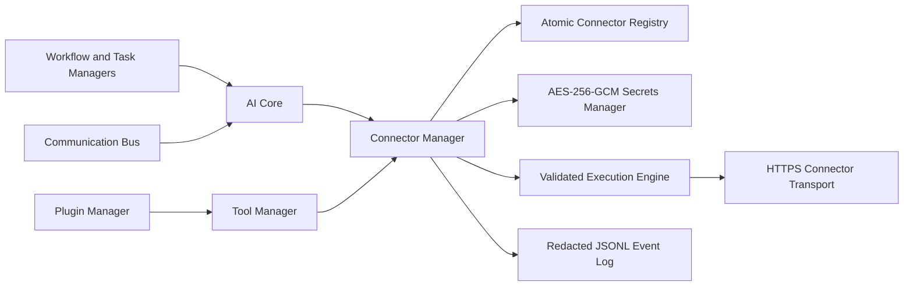

# External API and Connector Framework Report

## Summary

The External API and Connector Framework is implemented as an additive subsystem in `ai/connector-management`. `AiCoreManager` creates it after the Tool Manager and Plugin Manager. No existing AI Core module, local workflow, or user-data surface was removed or repurposed.

| Item | Status |
| --- | --- |
| Provider connectors preconfigured | 0 |
| External provider calls performed during setup | 0 |
| Connector categories | 15 |
| Authentication methods modeled | 5 |
| Tool Registry integration | `connector.registry-summary` |

No vendor endpoint or credential is hard-coded. A connector becomes executable only after a user or future trusted configuration flow registers its endpoint, provisions a secret, and enables it.

## Architecture

`AiConnectorManager` provides discovery, registration, validation, configuration profiles, authentication-header construction, execution, monitoring, updates, disablement, and removal. Metadata is persisted atomically at `connector-management/connectors.json`; encrypted credentials are persisted separately at `connector-management/secrets.json`; operational events are written to `connector-management/connector-events.jsonl`.

## Existing Integration Scan

The scan found no pre-existing third-party API client or external HTTP connector that required refactoring. The existing integration points are internal:

- AI Core composition and lifecycle: `ai/core/ai-core-manager.ts`.
- Tool Registry: `ai/tool-management/tool-manager.ts`.
- Trusted extension lifecycle: `ai/plugin-management/plugin-manager.ts`.
- Workflow and automation coordination: `ai/workflow/workflow-engine.ts` and `ai/creative-pipeline/creative-pipeline-manager.ts`.
- Task scheduling: `ai/task-manager/task-manager.ts` and workflow task scheduler.
- Inter-module retry, routing, history, and logs: `ai/communication-bus`.
- Local development API routes that expose creative workflow operations: `dev/server`.

Connector integration status reports availability for AI Core, Tool Registry/Manager, Plugin Manager, Workflow/Automation Engine, Communication Bus, Task Scheduler, and Multi-Agent System. No multi-agent implementation was found, so it is accurately reported unavailable.

## Categories and Authentication

Supported categories: AI providers, language models, image generation, video generation, audio, OCR, translation, cloud storage, social media, e-commerce, payment, email, business, developer APIs, and custom connectors.

Supported authentication models: API key, OAuth 2.0, bearer token, JWT, and custom authentication. API key, bearer token, JWT, and custom header credentials use an encrypted secret reference. OAuth 2.0 currently supports a securely provisioned access token; interactive authorization-code and refresh-token exchanges are intentionally deferred until a dedicated browser callback, PKCE, token rotation, and consent implementation exists.

## Security Implementation

- API keys, tokens, and credentials are encrypted locally with AES-256-GCM.
- Encryption keys are derived with scrypt from the runtime-only `KWIZERA_SECRETS_PASSPHRASE` value or explicit initialization passphrase. The passphrase is never stored in the registry or secret file.
- Authenticated connector execution fails closed when the Secrets Manager is locked.
- Secrets are referenced by ID only; manifests, profiles, registry records, and event logs do not contain plaintext credentials.
- HTTPS is mandatory. HTTP is permitted only for an explicitly configured localhost development connector.
- Endpoint URLs reject embedded credentials, query strings, and fragments; request paths must be approved relative paths and can be prefix allowlisted.
- Redirects are rejected. Caller-controlled `Authorization`, `Host`, and proxy authorization headers are rejected.
- Connector permissions are checked before request construction.

This is encrypted local storage, not OS-backed key protection. Windows DPAPI/keychain integration, secret rotation, audit access controls, and recovery procedures remain recommended production work.

## Execution, Monitoring, Logging, and Fallback

The execution engine validates the enabled connector, permission grants, selected configuration profile, endpoint, allowed path, timeout, and retry policy before sending a request. It adds connector-owned authentication, applies a bounded timeout, treats only $2xx$ results as successful, and parses JSON responses when available.

Retries are bounded to 1-5 attempts with exponential backoff and `Retry-After` support. When the primary connector exhausts its retries, it can invoke a configured backup connector; fallback cycles are rejected. Failed requests are logged and return a structured failed result so a workflow can decide whether continuation is safe.

Health monitoring records availability, credential readiness, response time, execution/failure counts, error rate, and stability. The JSONL event log records registration, enablement, disablement, configuration/profile changes, successful API calls, retries/fallback attempts, errors, and updates without recording secrets or request bodies.

Development, testing, and production profiles can override endpoint, authentication reference, retry policy, and timeout per connector. Each resolved profile is validated at execution time.

## Validation

- Diagnostics are clean for Connector Manager, Secrets Manager, core integration, Tool Registry integration, public exports, and the focused Connector Manager test.
- The focused test covers encrypted secret persistence, permission rejection, bounded retries, backup fallback, profile configuration, health monitoring, and restored connector metadata.
- The focused Vitest process could not provide a completion/exit result through the current terminal adapter. Automated test execution is therefore not claimed as passed.
- No full build or full suite result is claimed; existing repository-wide validation debt remains outside this additive framework.

## Remaining Improvements

1. Add a Windows DPAPI-backed key provider and platform keychain adapters.
2. Implement OAuth 2.0 authorization code + PKCE, refresh rotation, consent records, and secure callback handling.
3. Add response JSON-schema validation, request body schemas, idempotency keys, and per-provider adapters.
4. Add rate-limit budgets, circuit breakers, provider concurrency controls, and persistent retry queues.
5. Add audit-log integrity, secret rotation, deletion verification, and access-role authorization.
6. Add signed connector packages and configuration migrations for managed provider templates.
7. Connect approved connector actions to workflow/task continuation policies and communication-bus correlation IDs.
8. Run focused and full validation in reliable CI before production credentials or payment connectors are enabled.

## Recommendations for Step 4

Step 4 should prioritize production identity and authorization, OS-backed secret protection, OAuth consent/token lifecycle, durable audit controls, CI validation, provider circuit breakers, and approval workflows for high-risk connector categories such as payment, social publishing, and cloud storage.

## Step 4 Gate

Do not begin Step 4 until this report is approved.