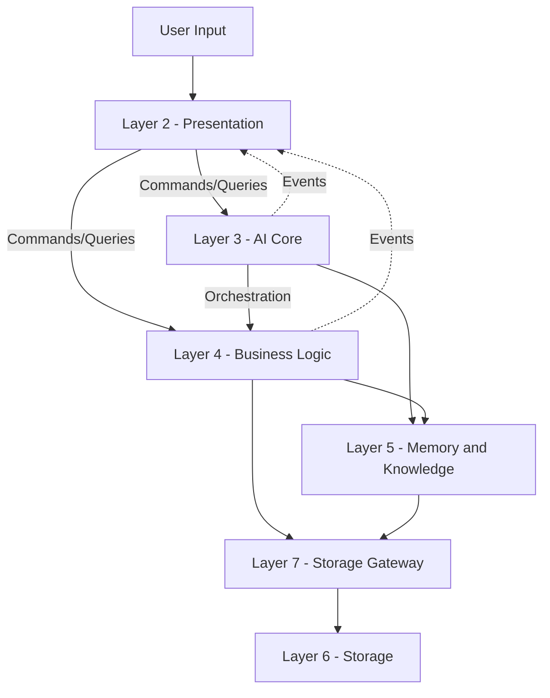
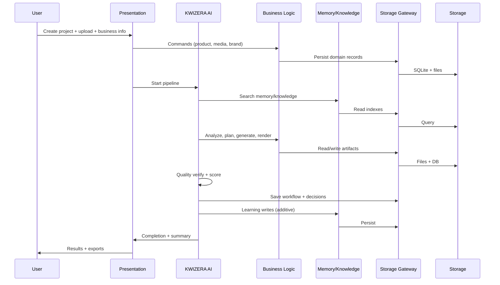

# KWIZERA AI STUDIO — Complete Data Flow Blueprint

**Document status:** Permanent foundation · Step 1I (consolidated specification)  
**Effective date:** 2026-06-28  
**Scope:** Authoritative data flow across layers, modules, and pipeline contracts — not implementation code, APIs, or database schemas.

**Companion documents:** See [BLUEPRINT-INDEX.md](./BLUEPRINT-INDEX.md)

| Official identity | Value |
|-------------------|-------|
| **Project name** | **KWIZERA AI STUDIO** |
| **Official logo** | **`KWIZERA AI.png`** (project root) |
| **Official AI assistant** | **KWIZERA AI** |

---

## 1. Blueprint Purpose

This document is the **single authoritative reference** for how data moves through **KWIZERA AI STUDIO**. It consolidates and extends data flow rules from [AI-WORKFLOW-BLUEPRINT.md](./AI-WORKFLOW-BLUEPRINT.md) and [SYSTEM-ARCHITECTURE-BLUEPRINT.md](./SYSTEM-ARCHITECTURE-BLUEPRINT.md).

### 1.1 Core rules

| Rule | Requirement |
|------|-------------|
| **Interface-only flow** | Data crosses module boundaries only through defined contracts |
| **No internal mutation** | No module modifies another module's internal storage |
| **Immutable snapshots** | Pipeline handoffs use read-only snapshots |
| **Gateway-only persistence** | Layer 6 accessed only via Layer 7 Storage Gateway |
| **Ownership** | Each data domain has one owning module (see §4) |
| **Traceability** | Every artifact traceable to project ID and workflow step |

---

## 2. Data Flow Layers

---

## 3. Pipeline Data Contracts (AI Workflow)

| Contract | Producer | Consumers | Mutability |
|----------|----------|-----------|------------|
| `WorkflowIntent` | RequestIntake (Step 1) | Steps 2–12 | Owner writes once; read-only downstream |
| `ProjectContext` | ProjectLoader (Step 2) | Steps 3–12 | Updated only by Step 2 and Persistence (Step 10) |
| `ResourceManifest` | ResourceLoader (Step 3) | Steps 4–8 | Frozen after Step 3 validation |
| `ResourceBundle` | ResourceLoader (Step 3) | Steps 4–8 | Read-only references |
| `AnalysisReport` | ResourceAnalysis (Step 4) | Steps 5–9 | Owner: Step 4 |
| `ProductionPlan` | ProductionPlan (Step 5) | Steps 6–9 | Versioned on regeneration |
| `ContentPackage` | ContentGeneration (Step 6) | Steps 7–9 | Per-item versioning |
| `VideoPlan` / `TimingMap` | VideoPlan (Step 7) | Steps 8–9 | Owner: Step 7 |
| `AssetBundle` / `ExportManifest` | AssetGeneration (Step 8) | Steps 9–12 | Owner: Step 8 |
| `QualityReport` | QualityVerification (Step 9) | Steps 10–12 | Owner: Step 9 |
| `PersistenceReceipt` | Persistence (Step 10) | Steps 11–12 | Immutable after issue |
| `LearningRecord` | Learning (Step 11) | Step 12 | Additive only |
| `CompletionNotification` | Completion (Step 12) | Presentation / Dashboard | Immutable |

---

## 4. Domain Data Ownership

| Data domain | Owner | Storage (Layer 6) | Read via |
|-------------|-------|-------------------|----------|
| Products & RWF pricing | Layer 4 — Product Analysis | SQLite + refs | Product query API |
| Media metadata | Layer 4 — Media services | SQLite + file refs | Media query API |
| Media bytes | Layer 6 — file stores | `media/` | Media service + Gateway |
| Brand profiles | Layer 4 — Brand Analysis | SQLite + refs | Brand query API |
| Generated content | Layer 4 — Content Generation | SQLite + files | Content query API |
| Video projects / renders | Layer 4 — Video Planning | SQLite + `media/` | Video query API |
| Marketing assets | Layer 4 — Marketing Strategy | SQLite + files | Marketing query API |
| Knowledge entries | Layer 5 — Knowledge Base | SQLite + index | Knowledge search API |
| Memory partitions | Layer 5 — Memory Service | SQLite + index | Memory search API |
| AI decision logs | Layer 3 — AI Core | SQLite (via Gateway) | AI audit read API |
| Workflow history | Layer 3 — Workflow Engine | SQLite | Workflow status API |
| Configuration | Layer 4 — Settings (System Ops) | `config/` + SQLite | Settings API |
| Logs | Layer 7 — Logging Engine | `logs/` | Logs API |
| Backups | Layer 7 — Backup/Recovery | `backups/` | Backup API |

---

## 5. End-to-End Project Data Flow

---

## 6. Event-Driven Data Flow

| Event | Data payload | Subscribers update |
|-------|--------------|-------------------|
| `ProjectCreated` | `projectId`, `ProjectContext` | Dashboard, Memory index |
| `ResourcesValidated` | `ResourceManifest` | AI Core, Analysis queue |
| `AnalysisCompleted` | `AnalysisReport` | Planning, Decision Center |
| `PlanApproved` | `ProductionPlan` | Content + Video queues |
| `ContentGenerated` | `ContentPackage` | Video plan, Marketing |
| `VideoRendered` | `AssetBundle` (video) | Quality verification |
| `QualityPassed` | `QualityReport` | Persistence, Review UI |
| `ProjectSaved` | `PersistenceReceipt` | Learning, Dashboard |
| `LearningStored` | `LearningRecord` | Recommendations, Memory search |

Events carry **IDs and snapshots** — not mutable object references.

---

## 7. Memory & Learning Data Flow

| Direction | Flow | Rule |
|-----------|------|------|
| **Read before create** | Memory/Knowledge → AI Thinking → AI Workflow | Step 1G §7 search order |
| **Write after success** | Quality pass → Learning → Memory partitions | Additive only |
| **Knowledge promotion** | User-confirmed fact → Knowledge Base | Never auto-promote unverified inference |
| **No erase** | Learning must not delete prior projects or user data | Step 1B, 1G |

| Memory partition | Written by | Read by |
|------------------|------------|---------|
| Marketing Memory | Learning Module, Marketing domain | AI Planning, Decision Engine |
| Video Memory | Learning Module, Video domain | AI Planning, Video Plan |
| Language Memory | Learning Module, Content domain | Content Generation |
| Knowledge Memory | Knowledge + Learning | Analysis, Content, Decision |

---

## 8. Storage Rules

| Rule | Specification |
|------|---------------|
| **Single write path** | All persistence via Storage Gateway (Layer 7) |
| **Transactional groups** | Project manifest + asset references saved atomically |
| **Versioning** | Regenerated assets increment version — no silent overwrite |
| **RWF fields** | Price stored with currency code `RWF` primary |
| **Backup scope** | Projects, memory, knowledge, config — user-triggered + pre-migrate |
| **Cache** | `cache/` regenerable — not source of truth |
| **Logs** | Append-only; rotation via Logging Engine |
| **Integrity** | Checksums on export manifest and backup archives |

---

## 9. User Journey ↔ Pipeline Data Mapping

| User stage | Primary contracts produced/consumed |
|------------|-------------------------------------|
| Stage 3 — New Project | `ProjectContext` |
| Stage 4 — Upload | `ResourceManifest`, `ResourceBundle` |
| Stage 5 — Business Info | Product/business records → Step 3 bundle |
| Stage 6 — AI Analysis | `AnalysisReport` |
| Stage 7 — AI Planning | `ProductionPlan` |
| Stage 8 — Content | `ContentPackage` |
| Stage 9 — Video | `VideoPlan`, `AssetBundle` |
| Stage 10 — Review | Updated packages + approval flag |
| Stage 11 — Export | `ExportManifest`, `PersistenceReceipt` |
| Stage 12 — Learning | `LearningRecord` |

---

## 10. Explicit Non-Goals

This document does not define SQL schemas, API endpoints, serialization formats, or file path implementations.

---

*End of Complete Data Flow Blueprint — Step 1I*
