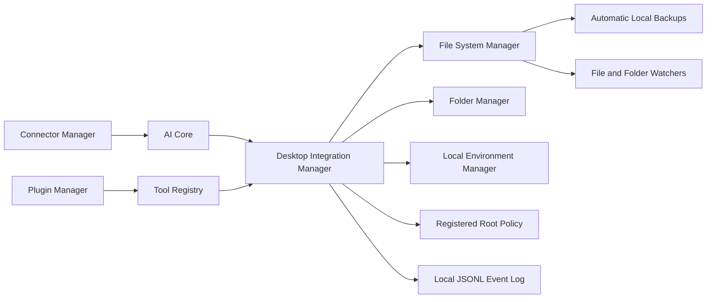

# Desktop, File System and Local Environment Integration Report

## Summary

The Desktop Integration Framework is implemented as an additive, offline-first subsystem in `ai/desktop-integration`. `AiCoreManager` creates it after Tool, Plugin, and Connector Managers. It does not replace existing storage, project, memory, model, backup, recovery, or desktop runtime systems.

The framework is the official policy boundary for future AI-directed local operations: callers must use a registered root, a relative path, and explicit permissions. It never accepts an arbitrary absolute path for file or folder actions.

## Architecture

`AiDesktopIntegrationManager` owns root registration, permission enforcement, backup metadata, monitoring, cache/temp management, registered application lifecycle, recovery, and event logging. It exposes dedicated `FileSystemManager`, `FolderManager`, and `LocalEnvironmentManager` surfaces.

## Existing Local Integration Scan

The scan found local operations distributed across established subsystems:

- Storage roots and persistent directory layout: `storage/paths/storage-paths.ts` and `dev/persistent/storage-bootstrap.ts`.
- Local project, upload, export, media, cache, temp, database, memory, knowledge, and intelligence persistence under the configured storage root.
- Model artifacts, local model integrity, GPU/CPU/RAM/storage detection, and model cache management: `ai/model-management/ai-model-manager.ts`.
- Memory and project data integrity, backup, restoration, and recovery: `ai/memory-storage-engine`, `ai/memory-backup-engine`, `ai/memory-recovery-engine`, and `ai/recovery-engine`.
- Local creative project files, pipeline artifacts, review/export assets, and development server routes in `ai/creative-*` and `dev`.
- Existing internal orchestration through AI Core, Tool Manager, Plugin Manager, Connector Manager, Workflow Engine, Task Manager, and Communication Bus.

No existing subsystem was removed or redirected. The new framework provides a separate secure entry point for future AI-directed desktop features.

## File and Folder Management

The File System Manager supports create, read, update, delete, copy, move, rename, recursive search, SHA-256 integrity verification, file monitoring, and monitor shutdown.

The Folder Manager supports create, delete, copy, move, recursive scan, watcher delegation, and organization by extension. Organization creates a recovery backup before moving files.

All file and folder operations validate:

- A registered root ID.
- A non-empty relative path with no null bytes.
- Canonical containment beneath the registered root.
- No symlink traversal through existing path components.
- The permission required by the requested operation.
- File-versus-folder type where relevant.

Updates, deletion, moves, overwrite copies, folder deletion, and organization create local backups before the destructive change. Backup restoration is available through `recoverBackup`.

## Local Environment and Hardware Detection

The Local Environment Manager detects Windows-compatible OS platform/release/architecture/hostname, CPU model/core count/load proxy, RAM, filesystem storage capacity, installed local model IDs, and package dependencies. GPU detection reuses the existing model manager, including its `nvidia-smi` support when available.

Resource monitoring emits local event records. Temperature is reported only when a future platform sensor provider exists; Node.js does not provide a reliable cross-vendor Windows temperature API, so this framework does not invent a value.

## Security and Reliability Improvements

- Registered-root policy prevents unapproved arbitrary filesystem access.
- Relative-path containment and symlink rejection prevent path traversal and link escape.
- Explicit permissions cover read, write, delete, watch, folder management, project access, model access, database access, resource reads, root registration, application registration, and process execution.
- Critical Studio paths (`config`, `database`, `projects`, `state`, model, connector, and plugin data) require `filesystem.critical-delete` in addition to delete authority.
- Automatic pre-change backups and recovery improve resilience against accidental edits or deletion.
- SHA-256 file integrity and aggregate project verification provide reproducible local checks.
- Registered local applications run without a shell, from an explicit registered command and root, with separate process-execution permission.
- Cache and temporary files are isolated under `desktop-integration/cache` and `desktop-integration/temp`; cleanup cannot target arbitrary user directories.

## Monitoring and Logging

File and folder change monitoring uses Node filesystem watchers. Windows recursive watching is enabled where supported; future platform-specific watcher adapters can be added without changing the public manager contract.

Desktop events are retained in memory and appended locally to `desktop-integration/desktop-events.jsonl`. Events cover file/folder actions, desktop/application events, resource monitoring, security denials, backup/recovery actions, and initialization. Event records store operation metadata rather than file contents.

## Integrations

- AI Core: lifecycle ownership and public getter.
- Tool Registry: `desktop.integration-status` provides a local, read-only summary.
- Plugin Manager: reaches desktop capabilities only through the existing permission-gated Tool Manager path.
- Connector Manager: reported as available integration status; no network capability is granted by this framework.
- Workflow/Automation Engine, Task Scheduler, and Communication Bus: reported as integration status for approved future task adapters.
- Multi-Agent System: no implementation was found and is reported unavailable rather than simulated.

## Validation

- Diagnostics are clean for the Desktop Integration Manager, AI Core integration, Tool Registry integration, public export, and focused test.
- The focused test exercises root-bounded file lifecycle, automatic backup, recovery, SHA-256 verification, search, project deletion protection, traversal rejection, and resource detection using a temporary storage root.
- The focused Vitest command did not provide a completion/exit result through the current terminal adapter, so automated execution is not claimed as passed.
- Existing full build and full-suite debt remains outside this additive Step 4 implementation.

## Remaining Improvements

1. Add Windows DPAPI/ACL integration and a user-facing root-approval workflow.
2. Add a native Windows hardware provider for temperature, battery, GPU telemetry, and process resource utilization.
3. Add durable watcher subscriptions, debounce/coalescing, and recovery after filesystem watcher overflow.
4. Add quota-aware backup retention, encryption-at-rest options, and backup integrity manifests.
5. Add file content schemas, MIME validation, malware scanning hooks, and atomic write/recovery journals for large files.
6. Add a signed application registry and structured IPC adapters for trusted local applications.
7. Attach approved file operations to workflow tasks, Communication Bus correlation IDs, and user consent/audit identities.
8. Run focused and full validation in reliable CI before enabling unrestricted user-selected roots.

## Recommendations for Step 5

Step 5 should build the user approval, identity, audit, and desktop UI workflows around this policy layer; add OS-backed credential and permission enforcement; then add approved workflow/tool adapters for project files, model artifacts, and local applications.

## Step 5 Gate

Do not begin Step 5 until this report is approved.