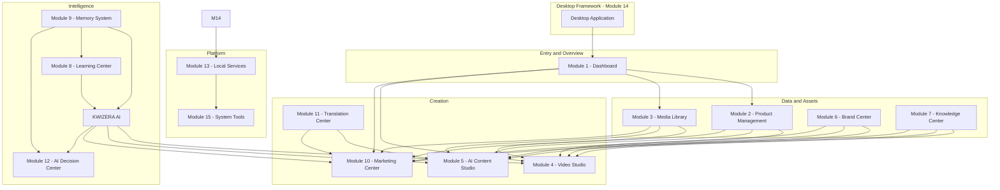

# KWIZERA AI STUDIO — Complete Feature Blueprint

**Document status:** Permanent foundation · Step 1D  
**Effective date:** 2026-06-28  
**Scope:** Complete feature specification for all major modules — not frontend, backend, API, database, or UI implementation.

**Companion documents:**

| Document | Step | Scope |
|----------|------|-------|
| [BRAND-IDENTITY.md](./BRAND-IDENTITY.md) | 1A | Product name, logo, visual identity |
| [MISSION-VISION-BLUEPRINT.md](./MISSION-VISION-BLUEPRINT.md) | 1B | Mission, vision, purpose, objectives, principles, success criteria |
| [AI-IDENTITY-BLUEPRINT.md](./AI-IDENTITY-BLUEPRINT.md) | 1C | AI assistant identity, role, personality, behavior |

| Official identity | Value |
|-------------------|-------|
| **Project name** | **KWIZERA AI STUDIO** |
| **Official logo** | **`KWIZERA AI.png`** (project root) |
| **Official AI assistant** | **KWIZERA AI** |

---

## 1. Blueprint Purpose

This document defines **every major feature** that will exist in **KWIZERA AI STUDIO** before development begins.

**KWIZERA AI STUDIO** is a professional AI-powered desktop creative studio. Its purpose is to help users create **professional promotional videos** and **business marketing content** using Artificial Intelligence, guided by **KWIZERA AI** per Step 1C.

### 1.1 Governance rules

| Rule | Requirement |
|------|-------------|
| **Authoritative specification** | This blueprint is the official feature specification for all future development phases |
| **No silent additions** | No feature may be added later unless it is **first approved and documented** in this blueprint |
| **No silent removals** | Deprecating a listed feature requires an explicit blueprint amendment |
| **Alignment** | Every module must align with Steps 1A–1C (brand, mission, AI behavior) |
| **Implementation deferral** | This document specifies *what* exists — not *how* it is built |

### 1.2 Module index

| # | Module | Primary role |
|---|--------|--------------|
| 1 | Dashboard | Application home, overview, and quick entry |
| 2 | Product Management | Product catalog and business item data |
| 3 | Media Library | Unified asset intake and organization |
| 4 | Video Studio | Promotional and brand video creation |
| 5 | AI Content Studio | Text and copy generation |
| 6 | Brand Center | Brand identity and template assets |
| 7 | Knowledge Center | Structured business knowledge storage |
| 8 | Learning Center | Continuous AI and user learning |
| 9 | Memory System | Persistent cross-domain memory |
| 10 | Marketing Center | Campaigns and static/social marketing assets |
| 11 | Translation Center | Multi-language content translation |
| 12 | AI Decision Center | Recommendations and business suggestions |
| 13 | Local Services | Runtime services, health, and recovery |
| 14 | Desktop Framework | Desktop shell, storage, and platform integration |
| 15 | System Tools | Settings, backup, logs, and recovery UI |

---

## 2. Cross-Module Architecture Overview

Modules communicate through **shared data**, **events**, and **KWIZERA AI orchestration** — not through duplicated logic. The following patterns apply to all modules:

**KWIZERA AI** (Step 1C) is the user-facing intelligence layer that coordinates workflows across modules using the seven-step decision process: understand → analyze → detect gaps → choose workflow → execute → verify → report.

---

## 3. Module Specifications

Each module is defined with: **Purpose**, **Responsibilities**, **Expected Inputs**, **Expected Outputs**, **Dependencies**, and **Communication with other modules**.

---

### MODULE 1 — Dashboard

#### Features

- Home Dashboard
- Recent Activities
- Project Overview
- Notifications
- Quick Actions
- System Status

#### Purpose

Provide the **central home** of **KWIZERA AI STUDIO** — a single place to see activity, access projects, receive notifications, launch common tasks, and monitor system health.

#### Responsibilities

| Feature | Responsibility |
|---------|----------------|
| **Home Dashboard** | Present summary view of studio state on launch |
| **Recent Activities** | Show chronologically ordered user and AI actions |
| **Project Overview** | Surface active and recent projects across modules |
| **Notifications** | Deliver alerts for completions, errors, and suggestions |
| **Quick Actions** | Shortcuts to create product, upload media, generate video, create campaign |
| **System Status** | Display health indicators from Local Services and System Tools |

#### Expected Inputs

- Aggregated activity feeds from all modules
- Project summaries from Product Management, Video Studio, Marketing Center
- Notification events from generation and system modules
- Health status from Module 13 (Local Services) and Module 15 (System Tools)
- User preferences from System Tools (Settings)

#### Expected Outputs

- Unified dashboard views and navigation entry points
- Notification display and acknowledgment state
- Quick-action routing to target modules
- At-a-glance system status for the user

#### Dependencies

- Module 14 (Desktop Framework) — application shell and navigation
- Module 13 (Local Services) — health data
- Modules 2, 3, 4, 10 — project and activity sources
- Module 15 (System Tools) — settings and log summaries

#### Communication with Other Modules

| Module | Communication |
|--------|---------------|
| **Product Management** | Reads product counts and recent edits for overview |
| **Media Library** | Shows recent uploads and storage usage summary |
| **Video Studio** | Displays in-progress and completed video jobs |
| **Marketing Center** | Shows recent campaigns and generated assets |
| **AI Decision Center** | Surfaces prioritized recommendations on home |
| **Local Services** | Receives health and service status |
| **System Tools** | Links to Settings, Backup, Logs, Recovery |
| **KWIZERA AI** | Presents guided next-step suggestions on dashboard |

---

### MODULE 2 — Product Management

#### Features

- Create Product
- Edit Product
- Delete Product
- Product Categories
- Product Images
- Product Pricing
- Rwanda Franc (RWF) as the default currency
- Product Search
- Product History

#### Purpose

Manage the **catalog of products and offerings** that drive marketing content, video generation, and business knowledge across the studio.

#### Responsibilities

| Feature | Responsibility |
|---------|----------------|
| **Create Product** | Add new products with name, description, category, images, and price |
| **Edit Product** | Update existing product records |
| **Delete Product** | Remove products with confirmation and history retention policy |
| **Product Categories** | Organize products into user-defined categories |
| **Product Images** | Associate images with products (linked to Media Library) |
| **Product Pricing** | Store and display prices; **RWF as default currency** |
| **Product Search** | Find products by name, category, price, or keywords |
| **Product History** | Track changes over time for audit and AI learning |

#### Expected Inputs

- User-entered product name, description, category
- Product images (from Media Library or direct upload)
- Price values in **RWF** (primary); optional future currency support only if blueprint-amended
- User search queries
- Edit and delete commands

#### Expected Outputs

- Structured product records persisted locally
- Category lists and product listings
- Search results
- Product history timeline
- Product data feeds for Video Studio, AI Content Studio, Marketing Center, Knowledge Center, Memory System

#### Dependencies

- Module 3 (Media Library) — product image assets
- Module 14 (Desktop Framework) — local storage
- Module 9 (Memory System) — product-related memory indexing
- Module 13 (Local Services) — database persistence layer

#### Communication with Other Modules

| Module | Communication |
|--------|---------------|
| **Dashboard** | Supplies recent product activity and counts |
| **Media Library** | Links product images; receives image references |
| **Video Studio** | Provides product context for product and promotional videos |
| **AI Content Studio** | Supplies product data for descriptions and copy |
| **Brand Center** | May apply brand styling context to product presentation |
| **Knowledge Center** | Contributes product facts to knowledge base |
| **Marketing Center** | Primary source for campaign and asset generation |
| **Memory System** | Stores product interaction and generation history |
| **AI Decision Center** | Informs product-level marketing recommendations |
| **KWIZERA AI** | Reads and updates products through guided workflows |

---

### MODULE 3 — Media Library

#### Features

- Image Upload
- Video Upload
- Audio Upload
- Logo Upload
- File Organization
- Preview
- Delete
- Search

#### Purpose

Serve as the **central repository** for all user media assets — images, videos, audio, and logos — with organization, preview, and retrieval across the studio.

#### Responsibilities

| Feature | Responsibility |
|---------|----------------|
| **Image Upload** | Accept and store image files |
| **Video Upload** | Accept and store video files |
| **Audio Upload** | Accept and store audio files |
| **Logo Upload** | Accept logos and brand marks (user assets; distinct from official app logo) |
| **File Organization** | Folders, tags, or categories for asset management |
| **Preview** | In-app preview of images, video, and audio |
| **Delete** | Remove assets with dependency checks |
| **Search** | Find assets by name, type, tag, or date |

#### Expected Inputs

- User-selected files from local filesystem
- Organization metadata (folders, tags)
- Search queries
- Delete and preview requests

#### Expected Outputs

- Stored media asset records with file references
- Preview renderings
- Search results
- Asset references consumable by Product Management, Brand Center, Video Studio, Marketing Center

#### Dependencies

- Module 14 (Desktop Framework) — local file storage paths
- Module 13 (Local Services) — file indexing and storage services
- Module 6 (Brand Center) — logo assets may overlap; Brand Center references Media Library

#### Communication with Other Modules

| Module | Communication |
|--------|---------------|
| **Dashboard** | Reports recent uploads and library statistics |
| **Product Management** | Supplies and receives product-linked images |
| **Video Studio** | Provides source footage, audio, and images for composition |
| **Brand Center** | Stores and retrieves user brand logos and assets |
| **Marketing Center** | Supplies images for posters, banners, flyers, social content |
| **Knowledge Center** | May attach media references to knowledge entries |
| **Memory System** | Records asset usage in past projects |
| **KWIZERA AI** | Organizes files and selects assets for generation tasks |

---

### MODULE 4 — Video Studio

#### Features

- Promotional Video Generator
- AI Video Creator
- Product Video Creator
- Social Media Video Creator
- Brand Video Creator
- Video Templates
- Video Preview
- Video Export

#### Purpose

Enable users to **create professional promotional and brand videos** using AI-assisted generation, templates, preview, and export — core deliverable of **KWIZERA AI STUDIO**.

#### Responsibilities

| Feature | Responsibility |
|---------|----------------|
| **Promotional Video Generator** | End-to-end promotional video creation from business inputs |
| **AI Video Creator** | AI-driven scene planning, scripting, and assembly |
| **Product Video Creator** | Videos focused on specific products from Product Management |
| **Social Media Video Creator** | Format-aware videos for social platforms |
| **Brand Video Creator** | Videos aligned with Brand Center identity |
| **Video Templates** | Reusable starting layouts and styles |
| **Video Preview** | In-app preview before export |
| **Video Export** | Export finished videos to user-defined local paths |

#### Expected Inputs

- Product data from Module 2
- Media assets from Module 3
- Brand identity from Module 6 (colors, logos, templates)
- Marketing copy from Module 5 (optional)
- Templates and user generation parameters
- AI scripts and scene plans from **KWIZERA AI**
- Memory context from Module 9 (prior successful video patterns)

#### Expected Outputs

- Video project records (in-progress and completed)
- Preview streams
- Exported video files
- Generation history for Memory System and Learning Center
- Activity events for Dashboard

#### Dependencies

- Module 2 (Product Management)
- Module 3 (Media Library)
- Module 5 (AI Content Studio) — scripts and captions
- Module 6 (Brand Center)
- Module 9 (Memory System) — video memory
- Module 13 (Local Services) — rendering and processing services
- Module 14 (Desktop Framework) — export paths and local execution

#### Communication with Other Modules

| Module | Communication |
|--------|---------------|
| **Dashboard** | Reports video jobs, completions, and failures |
| **Product Management** | Pulls product context for product videos |
| **Media Library** | Consumes footage, images, audio |
| **AI Content Studio** | Receives scripts, headlines, captions for narration/on-screen text |
| **Brand Center** | Applies brand colors, logos, templates |
| **Memory System** | Reads/writes video memory; improves repeat generation |
| **Learning Center** | Contributes outcomes for continuous improvement |
| **Marketing Center** | May embed or link videos in campaigns |
| **Translation Center** | Optional subtitles or multi-language overlays (future flow) |
| **AI Decision Center** | Receives video strategy recommendations |
| **KWIZERA AI** | Orchestrates full video workflow per Step 1C decision process |

---

### MODULE 5 — AI Content Studio

#### Features

- Marketing Text Generator
- Product Description Generator
- Caption Generator
- Headline Generator
- Advertisement Generator

#### Purpose

Generate **professional written marketing content** — descriptions, captions, headlines, ads, and general marketing copy — powered by **KWIZERA AI**.

#### Responsibilities

| Feature | Responsibility |
|---------|----------------|
| **Marketing Text Generator** | General marketing copy for campaigns and materials |
| **Product Description Generator** | Detailed product descriptions from product data |
| **Caption Generator** | Social and video captions |
| **Headline Generator** | Headlines for ads, posters, and landing content |
| **Advertisement Generator** | Short-form ad copy for multiple channels |

#### Expected Inputs

- Product records from Module 2
- Brand voice and identity from Module 6
- Knowledge entries from Module 7
- User prompts and tone preferences
- Memory context from Module 9 (language memory, marketing memory)
- Prior generated content for consistency

#### Expected Outputs

- Generated text artifacts (saved locally)
- Copy variants for user selection
- Text feeds for Video Studio, Marketing Center, Translation Center
- Learning signals for Module 8

#### Dependencies

- Module 2 (Product Management)
- Module 6 (Brand Center)
- Module 7 (Knowledge Center)
- Module 9 (Memory System)
- Module 13 (Local Services) — AI inference services
- [AI-IDENTITY-BLUEPRINT.md](./AI-IDENTITY-BLUEPRINT.md) — KWIZERA AI behavior rules

#### Communication with Other Modules

| Module | Communication |
|--------|---------------|
| **Dashboard** | Shows recent content generation activity |
| **Product Management** | Reads product facts; may write back refined descriptions |
| **Video Studio** | Supplies scripts, titles, and on-screen text |
| **Marketing Center** | Primary text source for posters, flyers, banners, social posts |
| **Translation Center** | Sends content for translation |
| **Memory System** | Stores language and marketing memory |
| **Learning Center** | Records accepted/rejected copy for improvement |
| **KWIZERA AI** | Executes all generation with verify-before-success rules |

---

### MODULE 6 — Brand Center

#### Features

- Brand Identity
- Brand Colors
- Brand Logo
- Brand Templates
- Brand Assets

#### Purpose

Centralize **user brand identity** — colors, logos, templates, and assets — so all generated content maintains consistent branding. (Distinct from the **official application logo** `KWIZERA AI.png` defined in Step 1A.)

#### Responsibilities

| Feature | Responsibility |
|---------|----------------|
| **Brand Identity** | Define brand name, tagline, and identity summary |
| **Brand Colors** | Primary, secondary, and accent color palette |
| **Brand Logo** | User/uploaded brand logo (from Media Library) |
| **Brand Templates** | Reusable layouts for video and static marketing |
| **Brand Assets** | Collection of brand-approved files and elements |

#### Expected Inputs

- User brand metadata (name, tagline, guidelines)
- Color values selected or extracted by user
- Logo and asset files from Media Library
- Template definitions and user edits

#### Expected Outputs

- Brand profile persisted locally
- Template library
- Brand context packages for Video Studio, Marketing Center, AI Content Studio
- Brand consistency rules for **KWIZERA AI** recommendations

#### Dependencies

- Module 3 (Media Library) — logo and asset files
- Module 14 (Desktop Framework) — local storage
- Module 13 (Local Services) — persistence

#### Communication with Other Modules

| Module | Communication |
|--------|---------------|
| **Video Studio** | Applies brand templates, colors, and logos to videos |
| **Marketing Center** | Applies brand to posters, flyers, banners, social assets |
| **AI Content Studio** | Informs tone and brand-aligned copy |
| **Product Management** | Optional brand context for product presentation |
| **Memory System** | Stores brand usage patterns |
| **AI Decision Center** | Supports brand-consistency recommendations |
| **KWIZERA AI** | Analyzes branding and suggests improvements |

---

### MODULE 7 — Knowledge Center

#### Features

- Knowledge Base
- Knowledge Search
- Knowledge Storage
- AI Knowledge

#### Purpose

Store, organize, and retrieve **structured business knowledge** — company info, FAQs, policies, product facts, and user-authored knowledge — to inform AI generation and decision support.

#### Responsibilities

| Feature | Responsibility |
|---------|----------------|
| **Knowledge Base** | CRUD interface for knowledge entries and categories |
| **Knowledge Search** | Full-text and semantic search across stored knowledge |
| **Knowledge Storage** | Persistent local storage of knowledge documents |
| **AI Knowledge** | AI-enriched summaries, links, and extracted facts from user content |

#### Expected Inputs

- User-authored text, documents, and notes
- Product data imports from Module 2
- Business descriptions and uploaded reference material
- AI-extracted facts from **KWIZERA AI** analysis

#### Expected Outputs

- Indexed knowledge entries
- Search results
- Knowledge packages for AI Content Studio, AI Decision Center, Memory System
- Enriched AI knowledge graph (local)

#### Dependencies

- Module 2 (Product Management) — optional knowledge sync
- Module 9 (Memory System) — knowledge memory partition
- Module 13 (Local Services) — storage and search services
- Module 8 (Learning Center) — knowledge refinement over time

#### Communication with Other Modules

| Module | Communication |
|--------|---------------|
| **AI Content Studio** | Supplies factual context for accurate copy |
| **Video Studio** | Provides business facts for scripts and overlays |
| **Marketing Center** | Informs campaign messaging |
| **Memory System** | Writes to knowledge memory partition |
| **Learning Center** | Updates knowledge from learning outcomes |
| **AI Decision Center** | Primary factual source for business suggestions |
| **KWIZERA AI** | Reads knowledge; never invents facts when knowledge exists |

---

### MODULE 8 — Learning Center

#### Features

- AI Learning
- Learning History
- User Training
- Continuous Learning

#### Purpose

Enable **continuous improvement** of **KWIZERA AI** and user proficiency — learning from outcomes without forgetting saved user data (Step 1B).

#### Responsibilities

| Feature | Responsibility |
|---------|----------------|
| **AI Learning** | Capture patterns from accepted outputs, corrections, and successes |
| **Learning History** | Auditable log of what was learned and when |
| **User Training** | Guides, tips, and onboarding for studio features |
| **Continuous Learning** | Ongoing refinement loop tied to Memory System |

#### Expected Inputs

- User feedback (accept, reject, edit generated content)
- Outcomes from Video Studio, AI Content Studio, Marketing Center
- Memory events from Module 9
- User training progress and completed guides

#### Expected Outputs

- Learning records and history views
- Improved model prompts, weights, or rules (implementation TBD in later phase)
- Training completion state
- Learning signals consumed by Memory System and AI Decision Center

#### Dependencies

- Module 9 (Memory System) — must learn without forgetting
- Modules 4, 5, 10 — generation outcome sources
- Module 13 (Local Services) — learning pipeline services
- [AI-IDENTITY-BLUEPRINT.md](./AI-IDENTITY-BLUEPRINT.md) — honest learning boundaries

#### Communication with Other Modules

| Module | Communication |
|--------|---------------|
| **Memory System** | Bidirectional: reads memory, writes learning updates |
| **AI Decision Center** | Supplies improved recommendation models |
| **Knowledge Center** | May promote learned facts to knowledge base (user-approved) |
| **Dashboard** | Shows learning milestones and training prompts |
| **KWIZERA AI** | Applies learned preferences in future tasks |

---

### MODULE 9 — Memory System

#### Features

- Persistent Memory
- Memory Search
- Marketing Memory
- Video Memory
- Language Memory
- Knowledge Memory

#### Purpose

Provide **persistent, searchable memory** across all studio domains so **KWIZERA AI** remembers previous work, improves over time, and never intentionally forgets saved user data.

#### Responsibilities

| Feature | Responsibility |
|---------|----------------|
| **Persistent Memory** | Durable storage of sessions, projects, and AI context |
| **Memory Search** | Retrieve past work by keyword, project, type, or date |
| **Marketing Memory** | Campaigns, assets, and messaging history |
| **Video Memory** | Video projects, templates used, and export history |
| **Language Memory** | Copy tone, phrases, and language preferences |
| **Knowledge Memory** | Indexed recall of knowledge center and extracted facts |

#### Expected Inputs

- Events and artifacts from all creation modules (2–5, 10–11)
- Conversation history with **KWIZERA AI**
- User explicit saves and project checkpoints
- Learning updates from Module 8 (additive only — no destructive overwrite of user data)

#### Expected Outputs

- Memory records and search results
- Context bundles for **KWIZERA AI** and AI Decision Center
- Historical views in Dashboard and module UIs

#### Dependencies

- Module 13 (Local Services) — database and storage services
- Module 14 (Desktop Framework) — local-first persistence
- Module 15 (System Tools) — backup/restore includes memory stores

#### Communication with Other Modules

| Module | Communication |
|--------|---------------|
| **All creation modules** | Receives outcome events; supplies historical context |
| **Learning Center** | Feeds learning data; receives memory updates |
| **Knowledge Center** | Shares knowledge memory partition |
| **AI Decision Center** | Primary historical context for recommendations |
| **Dashboard** | Recent memory highlights and search entry |
| **KWIZERA AI** | Core long-term memory per Step 1C |

---

### MODULE 10 — Marketing Center

#### Features

- Campaign Generator
- Poster Generator
- Flyer Generator
- Banner Generator
- Social Media Marketing

#### Purpose

Generate **complete marketing campaigns** and **static/social assets** — posters, flyers, banners, and social posts — aligned with products and brand identity.

#### Responsibilities

| Feature | Responsibility |
|---------|----------------|
| **Campaign Generator** | Plan and assemble multi-asset marketing campaigns |
| **Poster Generator** | Create print-ready and digital posters |
| **Flyer Generator** | Create promotional flyers |
| **Banner Generator** | Create web and display banners |
| **Social Media Marketing** | Create platform-oriented social posts and graphics |

#### Expected Inputs

- Product data from Module 2
- Media assets from Module 3
- Brand profile from Module 6
- Copy from Module 5 (AI Content Studio)
- Campaign parameters and user creative direction
- Memory and recommendations from Modules 9 and 12

#### Expected Outputs

- Campaign records with linked assets
- Exported poster, flyer, banner, and social image files
- Campaign history for Memory System (marketing memory)
- Dashboard activity and notifications

#### Dependencies

- Modules 2, 3, 5, 6 — primary content inputs
- Module 4 (Video Studio) — optional video assets in campaigns
- Module 9 (Memory System)
- Module 13 (Local Services) — rendering services

#### Communication with Other Modules

| Module | Communication |
|--------|---------------|
| **Dashboard** | Campaign status and quick actions |
| **Product Management** | Product-focused campaigns |
| **Media Library** | Background and product images |
| **AI Content Studio** | Headlines, body copy, captions |
| **Brand Center** | Visual consistency |
| **Video Studio** | Embeds promotional videos in campaigns |
| **Translation Center** | Localized campaign variants |
| **Memory System** | Stores marketing memory |
| **KWIZERA AI** | Orchestrates campaign workflow |

---

### MODULE 11 — Translation Center

#### Features

- Multi-language Translation
- Translation History

#### Purpose

Translate marketing content and business text into **multiple languages**, preserving meaning and brand tone, with full history for reuse.

#### Responsibilities

| Feature | Responsibility |
|---------|----------------|
| **Multi-language Translation** | Translate text and optionally on-screen content labels |
| **Translation History** | Store source, target language, and translated output |

#### Expected Inputs

- Text from AI Content Studio, Marketing Center, Product Management, Knowledge Center
- Target language selection
- Brand tone guidelines from Brand Center
- User edits to translations

#### Expected Outputs

- Translated text artifacts
- Translation history records
- Localized content feeds back to Marketing Center, Video Studio (subtitles), AI Content Studio

#### Dependencies

- Module 5 (AI Content Studio) — primary text source
- Module 10 (Marketing Center) — campaign localization
- Module 9 (Memory System) — language memory integration
- Module 13 (Local Services) — translation inference services

#### Communication with Other Modules

| Module | Communication |
|--------|---------------|
| **AI Content Studio** | Sends/receives translated copy |
| **Marketing Center** | Localized posters, social, and campaign text |
| **Video Studio** | Subtitles and multi-language overlays |
| **Product Management** | Translated product descriptions |
| **Memory System** | Translation and language preference memory |
| **KWIZERA AI** | Recommends languages and verifies translation quality |

---

### MODULE 12 — AI Decision Center

#### Features

- Intelligent Recommendations
- Business Suggestions
- Marketing Suggestions

#### Purpose

Provide **intelligent recommendations** — business and marketing suggestions — by analyzing products, knowledge, memory, and past outcomes through **KWIZERA AI**.

#### Responsibilities

| Feature | Responsibility |
|---------|----------------|
| **Intelligent Recommendations** | Prioritized next actions across the studio |
| **Business Suggestions** | Pricing, positioning, and operational insights (grounded in user data) |
| **Marketing Suggestions** | Campaign ideas, channels, timing, and content angles |

#### Expected Inputs

- Product catalog from Module 2
- Knowledge from Module 7
- Memory from Module 9 (all partitions)
- Learning signals from Module 8
- Current project state from Dashboard and creation modules
- User goals stated to **KWIZERA AI**

#### Expected Outputs

- Ranked recommendation lists
- Actionable suggestions with rationale (plain language per Step 1C)
- Deep links to relevant modules (Quick Actions)
- Recommendation history for Memory System

#### Dependencies

- Modules 2, 7, 8, 9 — intelligence inputs
- Module 13 (Local Services) — inference services
- [AI-IDENTITY-BLUEPRINT.md](./AI-IDENTITY-BLUEPRINT.md) — no false information; verify before success

#### Communication with Other Modules

| Module | Communication |
|--------|---------------|
| **Dashboard** | Surfaces top recommendations on home |
| **All creation modules** | Routes user to Video Studio, Marketing Center, etc. |
| **Learning Center** | Recommendations improve as learning accrues |
| **Memory System** | Reads full context; stores recommendation outcomes |
| **KWIZERA AI** | Primary decision engine; follows 7-step decision workflow |

---

### MODULE 13 — Local Services

#### Features

- Backend Services
- Frontend Services
- Database Services
- Health Monitor
- Recovery Services

#### Purpose

Provide the **local runtime service layer** that powers the desktop application — process coordination, persistence, health monitoring, and automatic recovery — without reliance on cloud-first architecture (Step 1B local-first principle).

#### Responsibilities

| Feature | Responsibility |
|---------|----------------|
| **Backend Services** | Local business logic, job queues, and processing workers |
| **Frontend Services** | Client-side service bridge for UI modules (specification only — no UI in this step) |
| **Database Services** | Local database access, migrations, and integrity |
| **Health Monitor** | Service heartbeat, resource usage, and error detection |
| **Recovery Services** | Automatic retry, crash recovery, and data consistency repair |

#### Expected Inputs

- Service configuration from System Tools (Settings)
- Health probes from all running services
- Error and crash events from Desktop Framework
- Backup manifests from System Tools

#### Expected Outputs

- Running local service processes
- Health status for Dashboard and System Tools
- Recovery actions and recovery logs
- Stable data access for all modules

#### Dependencies

- Module 14 (Desktop Framework) — process lifecycle
- Module 15 (System Tools) — configuration, logs, backup coordination

#### Communication with Other Modules

| Module | Communication |
|--------|---------------|
| **All modules** | Provides persistence, processing, and health infrastructure |
| **Dashboard** | Supplies system status |
| **System Tools** | Health UI, logs, recovery center data source |
| **Memory System** | Database services for memory stores |
| **Video Studio / Marketing Center** | Rendering and export job execution |

---

### MODULE 14 — Desktop Framework

#### Features

- Desktop Application
- Desktop Shortcut
- Desktop Icon
- Local Storage
- Automatic Recovery

#### Purpose

Define the **desktop platform layer** for **KWIZERA AI STUDIO** as a professional Windows application — shell, shortcuts, icons, local file storage, and startup recovery.

#### Responsibilities

| Feature | Responsibility |
|---------|----------------|
| **Desktop Application** | Native/desktop shell hosting all modules |
| **Desktop Shortcut** | User and installer-created shortcuts to launch the app |
| **Desktop Icon** | Taskbar, window, and shortcut icons derived from **`KWIZERA AI.png`** per Step 1A |
| **Local Storage** | Canonical local paths for user data, exports, and cache |
| **Automatic Recovery** | Restore last session state after crash or forced shutdown where possible |

#### Expected Inputs

- User launch via shortcut or executable
- Local filesystem permissions
- Official logo `KWIZERA AI.png` for icon generation
- Recovery checkpoints from Local Services

#### Expected Outputs

- Running desktop application instance
- Windows shell integration (taskbar, title bar, icons)
- Persistent local storage layout
- Session recovery on next launch

#### Dependencies

- [BRAND-IDENTITY.md](./BRAND-IDENTITY.md) — icon and logo rules
- Module 13 (Local Services) — runtime services
- Module 15 (System Tools) — settings and backup paths

#### Communication with Other Modules

| Module | Communication |
|--------|---------------|
| **All modules** | Hosts navigation and module lifecycle |
| **Local Services** | Starts and supervises service processes |
| **Dashboard** | Default post-launch entry (after splash/login per future UI spec) |
| **System Tools** | Storage paths, backup targets, recovery settings |

---

### MODULE 15 — System Tools

#### Features

- System Health
- Settings
- Backup
- Restore
- Logs
- Recovery Center

#### Purpose

Give users **control and visibility** over system health, preferences, data backup, restore, diagnostic logs, and manual recovery — supporting “user data is never lost” success criteria.

#### Responsibilities

| Feature | Responsibility |
|---------|----------------|
| **System Health** | Detailed health view beyond Dashboard summary |
| **Settings** | User preferences, paths, defaults (including RWF), and module options |
| **Backup** | Full and incremental local backups of user data and memory |
| **Restore** | Restore from backup with verification |
| **Logs** | View and export application and service logs |
| **Recovery Center** | Guided recovery for corrupted data, failed jobs, and service restarts |

#### Expected Inputs

- Health metrics from Module 13
- User settings changes
- Backup/restore commands and backup file selection
- Log streams from all services
- Recovery scenarios triggered by user or automatic detection

#### Expected Outputs

- Settings persisted locally
- Backup archives
- Restored data stores
- Log views and exports
- Recovery outcome reports

#### Dependencies

- Module 13 (Local Services) — health, logs, recovery execution
- Module 14 (Desktop Framework) — storage paths
- Module 9 (Memory System) — memory included in backup scope

#### Communication with Other Modules

| Module | Communication |
|--------|---------------|
| **Dashboard** | Summary health; links to full System Tools |
| **Local Services** | Configures and monitors services |
| **All modules** | Settings affect module behavior globally |
| **Memory System** | Backup/restore includes all memory partitions |
| **KWIZERA AI** | May guide user through recovery steps |

---

## 4. Module Dependency Matrix

Summary of primary dependencies (read: consumer → provider):

| Consumer ↓ / Provider → | 1 | 2 | 3 | 4 | 5 | 6 | 7 | 8 | 9 | 10 | 11 | 12 | 13 | 14 | 15 |
|-------------------------|---|---|---|---|---|---|---|---|---|----|----|----|----|----|-----|
| **1 Dashboard** | — | ✓ | ✓ | ✓ | · | · | · | · | · | ✓ | · | ✓ | ✓ | ✓ | ✓ |
| **2 Product Mgmt** | · | — | ✓ | · | · | · | ✓ | · | ✓ | ✓ | · | ✓ | ✓ | ✓ | · |
| **3 Media Library** | · | ✓ | — | ✓ | · | ✓ | · | · | ✓ | ✓ | · | · | ✓ | ✓ | · |
| **4 Video Studio** | · | ✓ | ✓ | — | ✓ | ✓ | ✓ | ✓ | ✓ | ✓ | ✓ | ✓ | ✓ | ✓ | · |
| **5 AI Content** | · | ✓ | · | ✓ | — | ✓ | ✓ | ✓ | ✓ | ✓ | ✓ | ✓ | ✓ | · | · |
| **6 Brand Center** | · | · | ✓ | ✓ | ✓ | — | · | · | ✓ | ✓ | · | ✓ | ✓ | ✓ | · |
| **7 Knowledge** | · | ✓ | · | ✓ | ✓ | · | — | ✓ | ✓ | ✓ | · | ✓ | ✓ | ✓ | · |
| **8 Learning** | · | · | · | ✓ | ✓ | · | ✓ | — | ✓ | ✓ | · | ✓ | ✓ | · | · |
| **9 Memory** | · | ✓ | ✓ | ✓ | ✓ | ✓ | ✓ | ✓ | — | ✓ | ✓ | ✓ | ✓ | ✓ | ✓ |
| **10 Marketing** | · | ✓ | ✓ | ✓ | ✓ | ✓ | · | · | ✓ | — | ✓ | ✓ | ✓ | ✓ | · |
| **11 Translation** | · | ✓ | · | ✓ | ✓ | ✓ | · | · | ✓ | ✓ | — | · | ✓ | · | · |
| **12 AI Decision** | · | ✓ | · | · | · | · | ✓ | ✓ | ✓ | ✓ | · | — | ✓ | · | · |
| **13 Local Services** | · | · | · | · | · | · | · | · | · | · | · | · | — | ✓ | ✓ |
| **14 Desktop Framework** | ✓ | · | · | · | · | · | · | · | · | · | · | · | ✓ | — | ✓ |
| **15 System Tools** | · | · | · | · | · | · | · | · | ✓ | · | · | · | ✓ | ✓ | — |

**KWIZERA AI** orchestrates across all modules marked ✓ in their respective rows.

---

## 5. Feature-to-Objective Mapping

Every module supports Step 1B core objectives:

| Objective (Step 1B) | Modules |
|------------------------|---------|
| Accept product information, images, logos, videos, descriptions, RWF prices | 2, 3, 6 |
| AI understanding of uploaded information | 5, 7, 12 + KWIZERA AI |
| Generate promotional videos | 4 |
| Generate posters, banners, flyers, social content | 10 |
| Remember previous work | 9 |
| Learn continuously without forgetting | 8, 9 |
| Improve from experience | 8, 9, 12 |
| Store all user data permanently | 9, 13, 14, 15 |
| Reliable desktop app, fast and stable | 13, 14, 15 |

---

## 6. Feature Change Control

### 6.1 Adding a feature

1. Propose the feature with module assignment  
2. Document purpose, responsibilities, inputs, outputs, dependencies, and communications (same schema as §3)  
3. Amend this blueprint with approval  
4. Only then authorize implementation in a development phase  

### 6.2 Removing or deprecating a feature

1. Record deprecation rationale  
2. Identify dependent modules and migration path  
3. Amend this blueprint explicitly  
4. Never remove user data without Backup/Restore path (Module 15)

---

## 7. Explicit Non-Goals (Step 1D)

This document does **not** define or authorize:

- Frontend UI components or screens  
- Backend source code or service implementations  
- API endpoint definitions or contracts  
- Database table schemas or migrations  
- AI model selection, prompts, or inference pipelines  
- Installer or packaging scripts  

Those belong to later authorized development phases. Step 1D defines **the complete feature map** only.

---

## 8. Quick Reference — All Features by Module

| Module | Features |
|--------|----------|
| **1 Dashboard** | Home Dashboard, Recent Activities, Project Overview, Notifications, Quick Actions, System Status |
| **2 Product Management** | Create/Edit/Delete Product, Categories, Images, Pricing (RWF default), Search, History |
| **3 Media Library** | Image/Video/Audio/Logo Upload, Organization, Preview, Delete, Search |
| **4 Video Studio** | Promotional/AI/Product/Social/Brand Video Creator, Templates, Preview, Export |
| **5 AI Content Studio** | Marketing Text, Product Description, Caption, Headline, Advertisement Generators |
| **6 Brand Center** | Brand Identity, Colors, Logo, Templates, Assets |
| **7 Knowledge Center** | Knowledge Base, Search, Storage, AI Knowledge |
| **8 Learning Center** | AI Learning, Learning History, User Training, Continuous Learning |
| **9 Memory System** | Persistent Memory, Search, Marketing/Video/Language/Knowledge Memory |
| **10 Marketing Center** | Campaign, Poster, Flyer, Banner, Social Media Marketing |
| **11 Translation Center** | Multi-language Translation, Translation History |
| **12 AI Decision Center** | Intelligent Recommendations, Business Suggestions, Marketing Suggestions |
| **13 Local Services** | Backend/Frontend/Database Services, Health Monitor, Recovery Services |
| **14 Desktop Framework** | Desktop App, Shortcut, Icon, Local Storage, Automatic Recovery |
| **15 System Tools** | System Health, Settings, Backup, Restore, Logs, Recovery Center |

---

**KWIZERA AI STUDIO** — Complete feature map. One blueprint. One source of truth.

*End of Complete Feature Blueprint — Step 1D*
