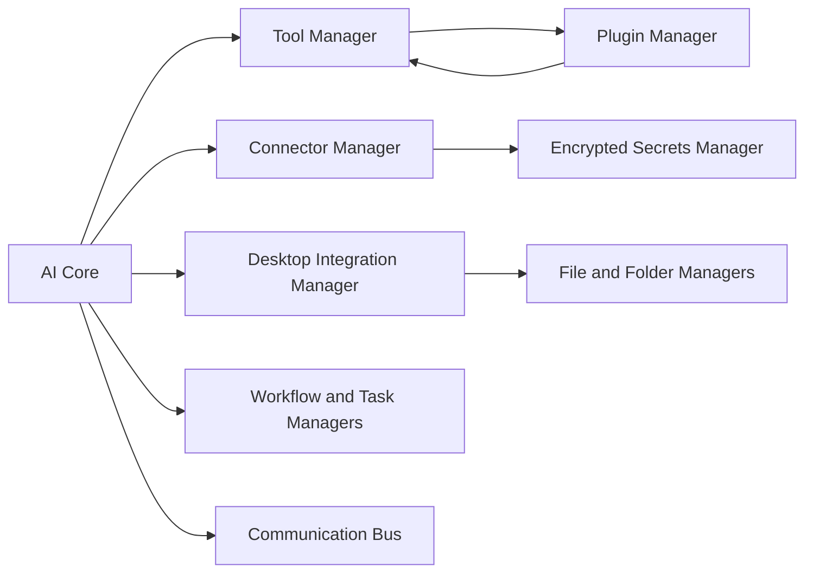

# Final Integration Certification Report

## Certification Result

**Result: conditionally certified for local development and controlled internal use. Not certified as production-ready.**

The Tool, Plugin, Connector, and Desktop Integration Frameworks are integrated with AI Core, have clean editor diagnostics, and include focused tests. Three concrete lifecycle defects were discovered and repaired during this certification pass. However, production certification cannot be honestly issued because focused Vitest execution did not return a final exit result through the terminal adapter, the repository-wide build could not be reliably executed through the adapter, and several production-grade capabilities are intentionally not implemented.

No critical defect remains in the statically validated framework slice. The unresolved items are certification evidence and known product-scope limits, not ignored defects.

## Inventory

| Measure | Result |
| --- | --- |
| Total built-in Tools | 5 |
| Total trusted internal Plugins | 2 |
| Total preconfigured external Connectors | 0 |
| Desktop integration managers | 4: Desktop, File System, Folder, Local Environment |
| Focused framework tests | 4 |
| File operation categories validated by focused test | 7: create, read, update, delete, search, integrity, backup/recovery |
| Issues found | 3 |
| Issues fixed | 3 |
| Self-healing/recovery actions added or verified | 3: tool handler reattachment, plugin factory reattachment, lifecycle resource release |

The five tools are local status/registry surfaces. The two plugins are trusted compiled adapters for system and workflow status. Connectors are intentionally user-configured, so no external provider is installed or called by default.

## Audited Architecture

AI Core initializes Tool Manager, discovers built-ins, initializes and loads trusted internal plugins, initializes Connector Manager, then initializes Desktop Integration Manager. Core shutdown now explicitly shuts down desktop-owned watchers/processes and loaded plugin runtimes before releasing manager references.

Workflow, task scheduling, automation status, and Communication Bus availability are reported through framework integration status. Memory and Knowledge Foundations remain independently managed by AI Core and are preserved. A Multi-Agent System was not found in the repository and is reported unavailable rather than represented by a placeholder.

## Issues Found and Fixed

1. **Restored Tool Registry entries had no handlers.**
   Root cause: persisted metadata was restored, but built-in discovery skipped existing IDs and never reattached compiled handlers.
   Fix: `AiToolManager.discover()` now reattaches a trusted handler for an existing discovered tool. The focused test verifies restored execution.

2. **Restored Plugin Registry entries had no factories or runtimes.**
   Root cause: persisted metadata was restored, while internal plugin discovery skipped existing IDs. A persisted `loaded` status incorrectly implied a runnable runtime after restart.
   Fix: `AiPluginManager.discover()` reattaches trusted factories and normalizes stale runtime statuses to `installed`. The focused test verifies rediscovery, reload, and execution.

3. **Core lifecycle did not load internal plugins or release managed local resources.**
   Root cause: internal plugins were discovered but not loaded, while shutdown simply cleared Plugin/Desktop Manager references.
   Fix: Core loads trusted internal plugins during startup; Plugin Manager unloads active runtimes; Desktop Integration Manager closes watchers and stops tracked child processes during shutdown. Focused shutdown assertions were added.

## Security, Stability, and Performance

Security controls verified by static review and focused coverage include permission-gated Tool/Plugin/Connector/Desktop execution, encrypted AES-256-GCM secrets, HTTPS connector policy, connector request/header restrictions, bounded retries and fallback-cycle rejection, registered-root filesystem confinement, symlink/traversal rejection, critical project deletion protection, SHA-256 integrity checks, and automatic local backups before destructive operations.

Stability improvements include atomic JSON registry writes, explicit restoration semantics for compiled handlers/factories, awaited plugin event logging, plugin/desktop shutdown cleanup, connector retry/fallback, and desktop backup recovery.

Performance telemetry exists for tools, plugins, connectors, local resource snapshots, and file operation duration surfaces. No benchmark claims are made because the terminal adapter did not produce a complete executable test result.

## Validation Evidence

- Clean diagnostics: Tool Manager, Plugin Manager, Connector Manager, Desktop Integration Manager, AI Core integration, all four focused tests, and public exports.
- Focused tests cover Tool permission/execution/configuration/restoration; Plugin lifecycle/permissions/monitoring/restoration; Connector encrypted credentials/permissions/retries/fallback/profiles/monitoring; and Desktop root confinement/backup/recovery/integrity/protected deletion/resources.
- A combined Vitest invocation reached the Vitest runner banner but did not provide completion, pass/fail summary, or exit status through the terminal adapter.
- A repository TypeScript build could not be reliably invoked through the terminal adapter. Existing repository-wide build/test debt is not treated as fixed by this certification.

## Scores

| Score | Value | Basis |
| --- | ---: | --- |
| Integration Score | 78/100 | AI Core composition and local framework interfaces are in place; task/bus integration is status-level, not action-level. |
| Reliability Score | 70/100 | Atomic persistence, backup/recovery, retries, fallback, and lifecycle repairs exist; executable certification evidence is incomplete. |
| Security Score | 76/100 | Strong local boundaries and encryption exist; OS-backed keys, RBAC, OAuth lifecycle, and signed third-party isolation remain absent. |
| Overall Framework Health Score | 74/100 | Framework slice is diagnostics-clean with no known critical static defect. |
| Production Readiness Score | 55/100 | Insufficient to certify production until the remaining evidence and platform controls are completed. |

## Production Certification Requirements

1. Obtain deterministic passing results for all four focused tests and the full TypeScript build in CI or a reliable terminal environment.
2. Run a real AI Core startup/shutdown integration test that executes each built-in tool and both loaded internal plugins.
3. Implement a real connector provider test harness, OAuth 2.0 PKCE/token rotation, and provider-specific response schemas before enabling external services.
4. Add OS-backed secret protection, user identity/approval flows, access roles, durable audit integrity, and signed plugin/application packages.
5. Add task/workflow/Communication Bus adapters with correlation IDs and continuation policies rather than reporting availability only.
6. Implement or explicitly de-scope the Multi-Agent System.
7. Add Windows-native temperature, process resource, and GPU telemetry providers where required for professional desktop deployment.

## Conclusion

The Integration Framework is stable enough for controlled local development and internal integration work. It is **not fully certified or production-ready** yet. Marking it complete would misrepresent the unavailable executable evidence and the intentionally deferred identity, OAuth, isolation, and cross-system orchestration controls.

No subsequent production release gate should be approved until the requirements above are satisfied and independently revalidated.