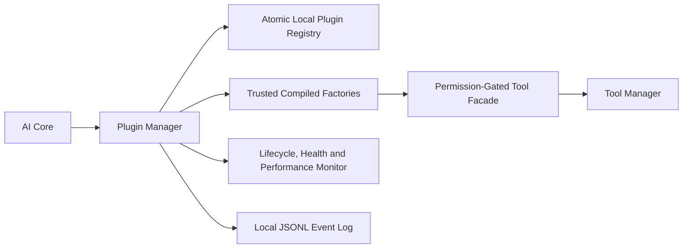

# Plugin and Extension Framework Report

## Architecture

The Plugin Framework is an additive subsystem in `ai/plugin-management`. `AiCoreManager` creates it after the Tool Manager and discovers internal plugins at startup. It does not replace or alter the existing `AiModulePlugin` lifecycle, which remains reserved for known AI Core module slots.

## Plugin Contract and Categories

Every plugin manifest includes ID, name, description, version, author, category, required permissions, dependencies, compatible platform version, entry point, configuration, external flag, runtime status, and health metrics.

Supported categories are AI, image, video, audio, marketing, rendering, workflow, database, memory, knowledge, utility, and external integration.

## Lifecycle and Manager Status

The Plugin Manager supports discovery, installation, duplicate/conflict rejection, validation, initialization, loading, execution, pause/resume, unload, enable/disable, removal, version update, configuration, health monitoring, and local persistence.

At AI Core startup, two trusted internal plugin adapters are discovered:

| Plugin | Category | Tool dependency |
| --- | --- | --- |
| `internal.system-tools` | Utility | `system.runtime-status` |
| `internal.workflow-tools` | Workflow | `workflow.status` |

Plugin metadata is persisted atomically under `plugin-management/plugins.json`. Lifecycle, execution, update, error, security, and performance events append to `plugin-management/plugin-events.jsonl`.

## Sandbox and Security Validation

The sandbox is a capability boundary, not a process sandbox:

- Plugins must use a `trusted:` entry point and an in-process, compiled factory registered by the application.
- The runtime receives no raw filesystem, network, process, AI Core, module manager, or storage handles.
- It receives only configuration and a Tool Manager facade.
- Both plugin permissions and tool permissions are validated before an action can execute.
- External plugins are explicitly rejected. No plugin code is dynamically imported from disk.
- Manifests validate IDs, categories, semantic versions, platform compatibility, dependencies, duplicate IDs, and trusted entry points.

This prevents untrusted extension code from being installed by the present framework. A true third-party sandbox requires a separate process or isolated runtime with an IPC protocol, resource quotas, signing, and explicit user approval; it is intentionally not simulated here.

## Integrations

- AI Core: owns Plugin Manager lifecycle and automatic internal discovery.
- Tool Registry and Tool Manager: plugins execute only through the permission-gated tool facade.
- Workflow Engine: exposed through the internal workflow adapter.
- Communication Bus, task scheduler, and automation/workflow availability: reported in integration status for later async adapters.
- Multi-agent system: no implementation was found, so it is reported unavailable rather than represented by a placeholder.

## Monitoring

Per-plugin health tracks availability, compatibility, execution and failure counts, error rate, execution time, process heap delta, accumulated CPU-time proxy, stability state, and last health check. This is process-observed telemetry, not OS-enforced CPU/RAM isolation.

## Validation

- Editor diagnostics are clean for the Plugin Manager, AI Core integration, public barrel, and focused Plugin Manager test.
- The focused test covers install, duplicate rejection, compatibility validation, load, permission rejection, successful execution, pause/resume, configuration, health monitoring, and metadata restoration.
- The terminal adapter did not return a Vitest exit result, so no automated test execution is claimed as passed.
- Existing repository-wide build and test debt remains outside this additive Step 2 implementation.

## Remaining Improvements and Step 3 Recommendations

1. Build a signed external-plugin package format with manifest verification and a user approval flow.
2. Run external plugins in a separate process or worker host with IPC-only capability grants, timeouts, memory caps, and network allowlists.
3. Add durable execution history with correlation IDs and replay-safe asynchronous task scheduling.
4. Add dependency version ranges and a deterministic dependency resolver.
5. Add plugin migrations for configuration schema changes and rollback for failed updates.
6. Add server/UI management endpoints only after Step 4 authentication and authorization are implemented.
7. Run the focused test in reliable CI and resolve full build/test failures before production plugin distribution.

## Step 3 Gate

Step 3 must not begin until this report is approved.