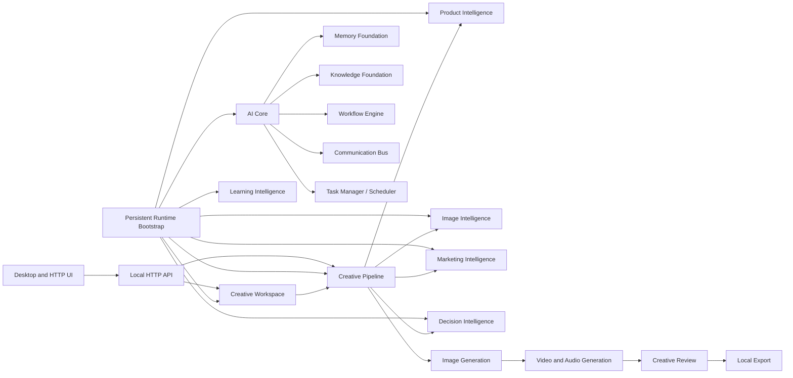

# Step 1 Complete System Integration Report

## Scope

This audit covered the persistent runtime bootstrap, AI Core lifecycle, creative project workflow, generation managers, review/export workflow, server API routing, desktop API consumers, local storage, recovery, test coverage, and the desktop management workspaces. The audit did not remove or replace any existing feature.

## Architecture Map

## Modules Discovered

- Core platform: AI Core, Workflow Engine, Communication Bus, Task Manager/Scheduler, Module Manager, State Manager, Recovery Engine, Health Monitor, logging, persistent session store, and storage bootstrap.
- Foundations: Memory and Knowledge foundations with storage, retrieval, indexing, recovery, backup, validation, and health layers.
- Creative workflow: Creative Workspace, Creative Planning, Creative Pipeline, Creative Review, local image generation, video/audio generation, generation optimization, model management, and local export.
- Intelligence: Product, Image, Marketing, Decision, and Learning intelligence managers.
- Interfaces: Node HTTP API, Project Workspace, AI Studio, Creative Editor, Business Dashboard, Brand Center, Marketing Workspace, Business Intelligence Center, and Platform Management.

## Integration Status

| Area | Status | Evidence |
| --- | --- | --- |
| Persistent bootstrap | Integrated | `dev/persistent/runtime.ts` initializes the core, workspace, planning, review, pipeline, model, generation, intelligence, decision, and learning managers in dependency order. |
| Core orchestration | Integrated | AI Core owns the existing workflow, bus, task, state, memory, knowledge, module, recovery, and health foundations. |
| Project to planning | Integrated | Workspace validation and project state feed Creative Planning and the pipeline. |
| Product, image, and marketing analysis | Integrated | The pipeline runs all available analysis managers before planning. |
| Image to video generation | Integrated | Video/audio generation reads the image-generation dashboard and uses the generated image when available. |
| Generation to review/export | Repaired | The pipeline now attaches both generation managers, generates local image/video artifacts, and ingests the generated WAV into review before approval/export. |
| UI to backend | Integrated where functional | Existing desktop workspaces use the local status/workspace endpoints and existing project APIs; business and platform management surfaces intentionally use read-only/local state. |
| Local models/providers | Local-only | Image, video, and audio model managers select/install/load local model records. No external provider is required. |
| Database/cache/file storage | Local-only | JSON stores, filesystem assets, generation caches, review/export files, and persistent session state are present. |

## Broken Connection Fixed

The Creative Pipeline previously marked `generation` and `rendering` complete without invoking a generation manager or registering any generated artifact with Creative Review. Consequently, the automatic path fell back to a source upload even if image/video generation was available.

The repair in `ai/creative-pipeline/creative-pipeline-manager.ts` adds explicit Image Generation and Video/Audio Generation attachments. The pipeline now:

1. Builds a local image request from the approved plan and project.
2. Generates a local image preview.
3. Builds and generates a local video/audio package using that image.
4. Reads the package's supported WAV artifact and ingests it into Creative Review.
5. Approves and exports that generated WAV through the established review/export contract.

`dev/persistent/runtime.ts` now supplies these manager attachments during boot. The prior source-media fallback remains intentionally available for isolated or partially initialized runtimes.

## End-to-End Workflow Status

| Flow | Status |
| --- | --- |
| Create project -> upload product media -> validate -> analyze -> plan | Implemented |
| Plan -> local image generation -> local video/audio package | Implemented after repair |
| Video/audio package -> review -> approval -> WAV export | Implemented after repair |
| Rendered image/video export | Deferred: current visual outputs are SVG previews and Creative Review intentionally accepts only PNG/JPG/WebP/MP4/MOV/WebM/MP3/WAV. A real renderer/transcoder adapter is required before visual artifact export can be automatic. |

## Validation Evidence

- VS Code diagnostics report no errors in the changed pipeline, runtime bootstrap, or focused pipeline integration test.
- A focused Vitest suite was launched for `tests/unit/ai/creative-pipeline/creative-pipeline-manager.test.ts`, including the new attached-generation route test. The terminal adapter displayed Vitest startup but did not return a completion status.
- A full TypeScript build was launched through the installed Node/npm executable. The terminal adapter displayed the `tsc -p tsconfig.json` command but did not return a completion status.

The build and test outcomes are therefore **not certified** by terminal output in this session. They should be rerun in a normal terminal before release.

## Remaining Integration Issues

- Image and video visual outputs are SVG previews. The review/export contract correctly rejects SVG, so automatic visual rendering/transcoding is not available.
- Pipeline execution is manager-driven; it does not yet submit generation stages as first-class Workflow Engine/Task Scheduler jobs. Existing workflow and task systems remain available through AI Core, but the creative pipeline has not been migrated to them.
- The desktop business, BI, and platform modules intentionally show local/read-only management surfaces rather than controlling backend engines.
- No external API, cloud sync, authentication, marketplace, or third-party provider integration is implemented by design.

## Architecture Suggestions

1. Introduce a renderer adapter that converts approved SVG preview or package timeline output into a review-supported image/video artifact without changing review's strict format validation.
2. Add a pipeline task adapter that submits generation/render/review/export stages to the existing Task Manager and Workflow Engine, retaining pipeline checkpoint recovery.
3. Define one artifact registry contract shared by image generation, video/audio generation, review, and export to eliminate file-specific bridge code.
4. Add an HTTP-level integration test that exercises project creation, upload, pipeline enqueue, review inspection, and export download against the local server.
5. Restore terminal completion visibility or run `npm.cmd test` and `npm.cmd run build` in a standard terminal before treating this step as release-certified.