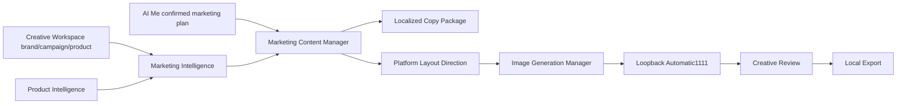

# Step 2 - AI Marketing Content Studio

## 1. Existing Marketing Studio Analysis

The repository already contained a Marketing Intelligence runtime, an image-generation foundation with branding/design blueprints, a live provider-backed image generator, creative review/export, and local desktop marketing and brand interfaces. The desktop Marketing Workspace and Brand Center are browser-local planning stores, not runtime-backed content or brand services.

## 2. Existing Marketing Engine Analysis

`MarketingIntelligenceManager` is a durable strategy planner. It analyzes the workspace product, audience, brand fields, campaign objective, platform, Product Intelligence, and Image Intelligence. It creates no creative media. `AiBrandingDesignEngine` creates rich design blueprints but does not render output assets.

## 3. Components Upgraded

- AI Me confirmation dispatch now routes marketing intent to the marketing content manager rather than the generic creative/video pipeline.
- Preserved `ImageGenerationManager` as the only local image-inference owner.
- Preserved `CreativeReviewManager` as the only review/export owner.
- Preserved project brand fields as the authoritative server-side brand data source.

## 4. Components Newly Created

`MarketingContentManager` persists project-scoped jobs, runs product and marketing analysis before generation, compiles localized copy plus platform-specific visual direction, creates provider-backed marketing images, tracks attempts and completed outputs, supports sequential batches of up to 100 projects, and exports reviewed assets locally.

## 5. Marketing Studio Architecture

## 6. Marketing Planner Status

Operational through `MarketingIntelligenceManager`: product, audience, business context, campaign objective, platform, value proposition, selling points, CTA, and recommendations are prepared before an asset job begins.

## 7. AI Design Director Status

The existing branding/design engine remains the blueprint owner for hierarchy, grid, typography, composition, logos, social formats, and print profiles. The live content manager translates platform, brand consistency, CTA area, and hierarchy direction into the real local image-generation prompt. It does not claim pixel-perfect text layout from a diffusion model.

## 8. Brand Identity Status

Runtime generation preserves `CreativeProject.brandInformation` name, voice, and guidelines in strategy and visual prompts. The desktop Brand Center remains a separate browser-local placeholder store and is not used as a server-side source of truth; duplicating its records would create inconsistent brand ownership.

## 9. Marketing Copy Engine Status

The manager creates persisted headline, description, offer, CTA, caption, and hashtag packages in English and Kinyarwanda. The copy templates are deterministic local rules based on analyzed campaign context; no unavailable language model is represented as producing copy.

## 10. Template Engine Status

Supported output types are posters, flyers, brochures, banners, roll-up banners, business cards, social posts, catalogs, promotional cards, and campaign assets. Platform adapters cover Facebook, Instagram, TikTok, LinkedIn, X, YouTube, WhatsApp, and print through aspect-ratio/layout direction. The existing branding engine remains the comprehensive template-plan catalog.

## 11. Batch Marketing Status

Jobs persist locally, reject duplicate active jobs for a project, track attempts and completed asset exports, retry individual visual generation within a bounded limit, and support sequential project batches of 1-100 requests. The existing inference queue continues to constrain concurrent provider work.

## 12. Quality Validation Status

Visual assets are validated by the existing generator for binary format, size, dimensions, and a local threshold before review/export. Failed attempts regenerate. Review/export adds approval and source-format safeguards. Grammar, typographic correctness, logo fidelity, visual balance, and marketing effectiveness cannot be truthfully pixel-validated until a local vision/OCR or layout renderer is configured.

## 13. Performance Improvements

Existing bounded local inference queues, request caching, 2048-pixel generation limits, binary size limits, and offline JSON/file persistence are retained. Batch execution is deliberately sequential at the manager level to avoid bypassing provider concurrency controls.

## 14. Security Improvements

The system keeps loopback-only providers, validated workspace image paths, UUID asset storage, strict output signature checks, a capped server request body, and local-only review/export. No cloud endpoint, shell invocation, or automatic remote model download was added.

## 15. Issues Found

1. Marketing Intelligence and branding/design engines planned content but did not create live marketing assets.
2. AI Me marketing confirmation used the generic creative pipeline instead of a marketing-specific job.
3. Marketing and Brand Center desktop state contains explicit placeholders and is browser-local, creating a potential duplicate-brand-data hazard.
4. No runtime-owned batch marketing queue or localized content package existed.
5. Quality scores are metadata/binary based without local vision, OCR, or print rendering.

## 16. Issues Repaired

1. Added a persisted runtime-owned marketing content manager.
2. Added provider-backed campaign asset generation and existing review/export handoff.
3. Added English/Kinyarwanda content packages and platform/template direction.
4. Added batch, retry, progress, and recovery state.
5. Added `GET /api/marketing-content` and `POST /api/marketing-content/jobs`.
6. Routed AI Me confirmed marketing intent to the dedicated manager.

## 17. Test Results

Added a focused fixture test that runs Product, Image, and Marketing Intelligence; creates Kinyarwanda copy; requests social and banner visuals through a local Automatic1111-compatible server; verifies dimensions stay within 2048 pixels; and checks two exports.

VS Code diagnostics found no errors in all changed files. The focused Vitest command produced no terminal result in this environment, so executable pass status is not certified.

## 18. Current AI Marketing Studio Capability

With a configured local Automatic1111 provider and matching checkpoint, KWIZERA can generate persisted, product-aware marketing image packages for supported formats/platforms, attach English or Kinyarwanda copy packages, use campaign and brand guidance, retry failed generation, and export approved PNG/JPEG/WebP assets locally. AI Me can dispatch a confirmed marketing request to that workflow.

## 19. Remaining Work Before Step 3

- Replace browser-local Brand Center placeholder data with a runtime-backed, project-linked brand profile contract before claiming full Brand Center integration.
- Configure a local language model for non-template copy generation and grammar validation.
- Configure local vision/OCR and a print/layout renderer for visual brand checks, typography, transparency, print bleed, PDF export, and automatic repair.
- Install and validate production Automatic1111 checkpoints, actual GPU throughput, every platform/template, and representative product categories.
- Run focused and full test suites once Node/npm tooling is available.

Step 3 has not been started.