# Step 2 - Real AI Image Generation Engine

## 1. Existing Image Generation Analysis

The workspace contained two image-generation layers. `AiImageGenerationFoundation` and its related engines manage durable image plans, product plans, style plans, production plans, quality plans, storage, audit, and recovery. `ImageGenerationManager` is the live project-facing artifact pipeline used by the server API.

## 2. Existing Placeholder Analysis

The live manager was a preview-only SVG composer. It wrote `.svg` files using hard-coded palettes, text, circles, and source-image links. Its image enhancement, background, placement, composition, style, colour, and brand classes were empty shells. The foundation's named engines create structured plans and metadata; they do not invoke a model or create image pixels.

## 3. Existing AI Model Analysis

The model catalog contained prepared image profiles, not executable image models. Step 1 corrected model lifecycle semantics so metadata profiles cannot directly enter `loaded` state. Before this step the inference runtime supported only Ollama language/vision/embedding and local OpenAI-compatible language services.

## 4. Components Upgraded

- `AiInferenceRuntime` now supports a loopback Automatic1111-compatible image provider.
- `ImageGenerationManager` now calls actual local `txt2img` or `img2img` endpoints and persists returned binary image bytes.
- `ImageGenerationRequest` explicitly supports image editing and restoration, in addition to existing product-to-image, enhancement, and background modes.
- `GeneratedImage` now records PNG, JPEG, or WebP artifacts instead of SVG previews.
- The focused image-generation test now uses a local Automatic1111-compatible HTTP fixture and validates real network execution plus binary PNG persistence.

## 5. Components Newly Created

The model runtime now exposes typed `ImageInferenceRequest` and `ImageInferenceResult` contracts. The Automatic1111 adapter probes `/sdapi/v1/options`, invokes `/sdapi/v1/txt2img` or `/sdapi/v1/img2img`, validates supported binary signatures, enforces a 50 MB result limit, extracts PNG dimensions, and records provider-bound model activation.

## 6. Image Generation Architecture

```mermaid
flowchart LR
  Request[Image generation API request] --> Prompt[Prompt construction]
  Prompt --> Context[Product, image, marketing context]
  Context --> Manager[ImageGenerationManager]
  Manager --> Runtime[AiInferenceRuntime]
  Runtime --> A1111[Local Automatic1111]
  A1111 --> Bytes[PNG, JPEG, or WebP bytes]
  Bytes --> Validate[Format and dimension validation]
  Validate --> Store[Offline project asset store]
```

The existing image-generation foundation remains the planning, integrity, and recovery layer. The live manager is the only execution and asset persistence layer, avoiding a duplicate engine.

## 7. Product-to-Image Pipeline

For `product-to-image`, the manager resolves the selected product image through the bounded workspace path, reads it locally, and submits it to Automatic1111 `img2img`. It enriches the prompt with product description, materials, colours, image composition evidence, campaign value proposition, brand guidance, and user direction. It rejects the request if a required local product image is unavailable.

## 8. Scene Generation Status

The request contract supports white studio, luxury studio, fashion studio, electronics studio, minimal studio, lifestyle, indoor, outdoor, and premium display scene directives. These are prompt directives rendered by the installed local image model, not slideshow logic.

## 9. Background Generation Status

Pure white, transparent, marble, wooden, glass, office, luxury, nature, and modern-room backgrounds are represented as explicit generation directives. `background-generation` uses text-to-image; `background-replacement` uses source-image `img2img` and fails when no local source image is selected.

## 10. Lighting Status

Studio, soft, natural, luxury, indoor, outdoor, and product-highlight lighting are added to the generated prompt. The actual lighting pixels are produced by the configured local model.

## 11. Shadow Status

Soft, hard, floor, floating, and directional shadow directives are incorporated into the model prompt. The supplied image intelligence remains advisory because it is presently metadata/evidence based rather than a pixel vision provider.

## 12. Reflection Status

Glass, mirror, water, and gloss reflection directives are incorporated into the local model prompt. No reflection is synthesized by SVG or procedural shape drawing.

## 13. AI Model Integration Status

Automatic1111 is discovered at `http://127.0.0.1:7860` by default and is restricted to a loopback endpoint. A registered image model ID is sent as `sd_model_checkpoint`, so the model ID must match a checkpoint installed in the local Automatic1111 runtime. Only a health-checked provider can activate a model as `loaded`.

## 14. Performance Improvements

The engine uses the existing request cache, model resource checks, provider health probes, provider-bound session state, local-only storage, and binary output limits. Variations are persisted independently and can be cached by a stable request hash. Runtime metrics track completed and failed inference requests.

## 15. Security Improvements

- Providers are limited to loopback HTTP endpoints.
- Product images are loaded only through the workspace's validated image paths.
- Generated images are limited to PNG, JPEG, and WebP signatures and 50 MB.
- Output filenames are UUID-based and stored under the generation asset root.
- No shell execution, cloud request, automatic download, SVG fallback, or arbitrary filesystem path is used.

## 16. Issues Found

- Production generation was SVG preview composition, not AI inference.
- The image MIME contract allowed SVG only.
- Model state did not identify an executable image backend.
- Product/image/marketing intelligence was unused by the actual artifact generator.
- Existing foundation quality scores measure plan metadata, not generated pixels.

## 17. Issues Repaired

- Removed the SVG composer from the execution path.
- Added a provider-backed image inference adapter and verified binary image persistence path.
- Added product-reference `img2img` for product-to-image, editing, restoration, enhancement, and background replacement.
- Added model/provider provenance and generated dimensions to asset metadata.
- Added automatic default discovery for a local Automatic1111 server.
- Updated the image test from preview text assertions to actual local HTTP image-inference assertions.

## 18. Test Results

VS Code diagnostics report no errors in all changed runtime, manager, type, and focused test files. The focused test starts a local Automatic1111-compatible server, validates provider probing, confirms `img2img` receives the product prompt, returns a CRC-valid PNG, verifies persisted PNG bytes, model/provider activation, cache reuse, and restoration.

The terminal adapter did not provide a reliable Vitest result. It returned no output for the direct Vitest process, and rejected the PowerShell assignment form used for the TypeScript process. Consequently, diagnostics are confirmed but command exit-code certification is unavailable in this environment.

## 19. Current Image Generation Capability

With Automatic1111 running locally and a matching installed checkpoint, KWIZERA can generate real local PNG/JPEG/WebP marketing images from text prompts and product photos. It supports multiple variations, product-aware prompts, scene/background/lighting/shadow/reflection direction, image-to-image enhancement/editing/restoration, offline persistence, cache reuse, and explicit provider provenance.

No generation request silently produces an SVG, WAV, slideshow, or fabricated image result when the local provider is unavailable.

## 20. Remaining Work Before Step 3

Install and validate Automatic1111 plus one or more local Stable Diffusion checkpoints on the target machine. Validate actual GPU/VRAM behavior and output quality on target hardware. Add an image-capable vision provider for pixel-level product accuracy, logo placement, composition scoring, automated defect repair, transparent-background verification, and perceptual quality validation; current quality validation verifies binary format and requested PNG dimensions but cannot truthfully score visual fidelity without a vision model.

Step 3 has not been started.