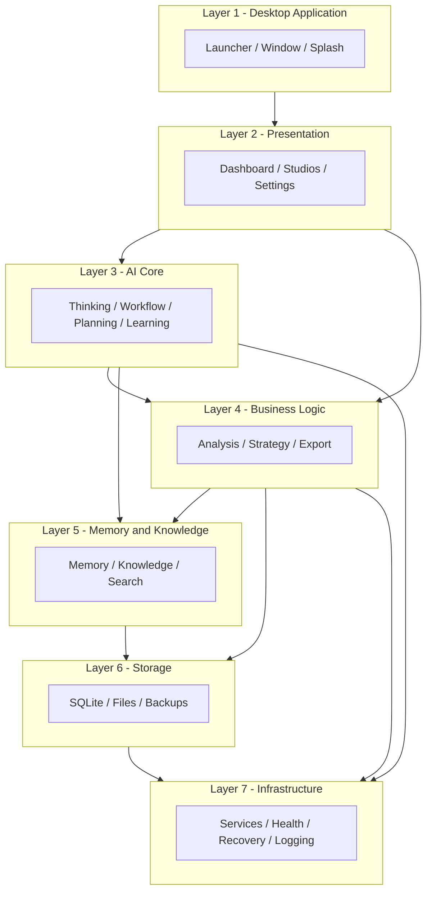
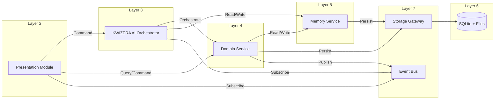
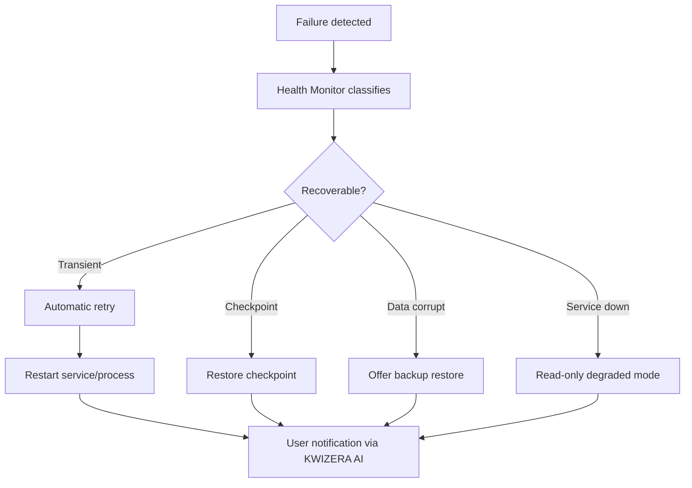

# KWIZERA AI STUDIO — Complete System Architecture Blueprint

**Document status:** Permanent foundation · Step 1H  
**Effective date:** 2026-06-28  
**Scope:** Complete system architecture — layers, communication, data ownership, isolation, performance, security, recovery, and extensibility — not frontend, backend, API, database, or UI implementation.

**Companion documents:**

| Document | Step | Scope |
|----------|------|-------|
| [BRAND-IDENTITY.md](./BRAND-IDENTITY.md) | 1A | Product name, logo, visual identity |
| [MISSION-VISION-BLUEPRINT.md](./MISSION-VISION-BLUEPRINT.md) | 1B | Mission, vision, purpose, objectives, principles, success criteria |
| [AI-IDENTITY-BLUEPRINT.md](./AI-IDENTITY-BLUEPRINT.md) | 1C | AI assistant identity, role, personality, behavior |
| [FEATURE-BLUEPRINT.md](./FEATURE-BLUEPRINT.md) | 1D | Complete feature specification by module |
| [USER-JOURNEY-BLUEPRINT.md](./USER-JOURNEY-BLUEPRINT.md) | 1E | Complete user journey by stage |
| [AI-WORKFLOW-BLUEPRINT.md](./AI-WORKFLOW-BLUEPRINT.md) | 1F | Complete internal AI execution pipeline |
| [AI-THINKING-BLUEPRINT.md](./AI-THINKING-BLUEPRINT.md) | 1G | AI thinking and decision intelligence |

| Official identity | Value |
|-------------------|-------|
| **Project name** | **KWIZERA AI STUDIO** |
| **Official logo** | **`KWIZERA AI.png`** (project root) |
| **Official AI assistant** | **KWIZERA AI** |

---

## 1. Blueprint Purpose

This document defines the **complete system architecture** of **KWIZERA AI STUDIO** before implementation begins. It establishes how major layers interact, how modules communicate, who owns data, how failures are isolated, and how the system scales, secures, recovers, and extends over time.

### 1.1 Objective

Design a **clean, scalable, modular, maintainable** architecture that:

- Supports **future growth** without major redesign  
- Runs **primarily on the user's computer** (local-first — Step 1B)  
- Implements all features from [FEATURE-BLUEPRINT.md](./FEATURE-BLUEPRINT.md)  
- Executes AI behavior from Steps 1C, 1F, and 1G  
- Delivers the user journey from [USER-JOURNEY-BLUEPRINT.md](./USER-JOURNEY-BLUEPRINT.md)  

### 1.2 Governance

| Rule | Requirement |
|------|-------------|
| **Authoritative architecture** | All implementation phases must conform to this document |
| **No silent structural changes** | New layers or cross-layer bypasses require blueprint amendment |
| **Clean break** | No reuse of BYOSE AI Studio or legacy project architecture |
| **Specification only** | No source code, schemas, API contracts, or UI components in this step |

### 1.3 Architecture principles

The architecture **must** be:

| Principle | Architectural meaning |
|-----------|----------------------|
| **Modular** | Independent units with single responsibilities and defined boundaries |
| **Scalable** | Add features, AI engines, and data volume without restructuring core layers |
| **Maintainable** | Clear ownership, logging, and separation — easy to locate and fix issues |
| **Extensible** | Plug in future AI modules without rewriting existing layers |
| **Fault tolerant** | Module failures isolated; system degrades gracefully |
| **Local-first** | Primary compute, storage, and workflow on user's Windows machine |
| **Performance optimized** | Minimize startup, memory, CPU, disk, and query overhead |
| **Easy to test** | Layers and modules testable in isolation via interfaces |
| **Easy to upgrade** | Versioned components, migration paths, backward-compatible contracts |
| **Easy to recover** | Automatic restart, health monitoring, safe startup/shutdown |

---

## 2. Layered Architecture Overview

**KWIZERA AI STUDIO** is organized into **seven vertical layers**. Dependencies flow **downward** only: upper layers depend on lower layers; lower layers never depend on Presentation or Desktop specifics.

### 2.1 Layer summary

| Layer | Name | Primary responsibility |
|-------|------|------------------------|
| **1** | Desktop Application | Windows shell, launcher, splash, local OS integration |
| **2** | Presentation | User-facing module views and navigation (future UI) |
| **3** | AI Core | **KWIZERA AI** intelligence — thinking, workflow, planning, learning, recommendations |
| **4** | Business Logic | Domain operations — analysis, planning, marketing, translation, export |
| **5** | Memory & Knowledge | Persistent memory partitions, knowledge base, search |
| **6** | Storage | SQLite, files, media, projects, logs, backups, configuration |
| **7** | Infrastructure | Local services, health, recovery, logging, validation |

---

## 3. Layer Specifications

### Layer 1 — Desktop Application Layer

#### Purpose

Provide the **Windows desktop host** for **KWIZERA AI STUDIO** — process lifecycle, windowing, splash, notifications, and direct local storage path access — aligned with [BRAND-IDENTITY.md](./BRAND-IDENTITY.md) and Feature Module 14.

#### Responsibilities

| Component | Responsibility |
|-----------|----------------|
| **Desktop Launcher** | Start application executable; handle shortcuts and taskbar pin |
| **Desktop Window** | Main window chrome, title area icon from **`KWIZERA AI.png`**, resize/minimize/close |
| **Splash Screen** | Startup branding with official logo; loading progress during Layer 7 startup |
| **Desktop Services** | OS integration: file associations, notification area, single-instance lock |
| **Local Storage Access** | Canonical paths for user data, cache, exports — delegates persistence to Layer 6 |
| **Notifications** | OS and in-app notification dispatch from Layer 2/3 events |

#### Boundaries

| Owns | Does not own |
|------|--------------|
| Window lifecycle, splash UX spec, path resolution | Business rules, AI logic, database schemas |
| Desktop icon resources derived from official logo | Module-internal UI state of feature screens |

#### Dependencies

- Layer 7 — Infrastructure (service startup before main window)  
- Layer 6 — Storage (path roots)  
- Step 1A — logo on splash, taskbar, shortcuts  

#### Maps to feature blueprint

- Module 14 — Desktop Framework  

---

### Layer 2 — Presentation Layer

#### Purpose

Host **user-facing module experiences** — navigation, views, and interaction patterns — without embedding business or AI logic. Presentation calls **Application Services** (Layer 4) and **AI Core** (Layer 3) through interfaces only.

#### Responsibilities

| Presentation area | Feature blueprint module | User journey stages |
|-------------------|-------------------------|---------------------|
| **Dashboard** | Module 1 | Stage 2 |
| **Product Management** | Module 2 | Stages 3, 5 |
| **Media Library** | Module 3 | Stage 4 |
| **Video Studio** | Module 4 | Stages 8–9, 10 |
| **Marketing Studio** | Module 10 (+ Module 5 content views) | Stages 8, 10–11 |
| **Knowledge Center** | Module 7 | Ongoing |
| **Memory Center** | Module 9 | Ongoing |
| **Learning Center** | Module 8 | Stage 12 |
| **Settings** | Module 15 | System Tools |
| **Reports** | Module 15 (Logs, Health) + Dashboard summaries | Stage 2 |

Additional presentation surfaces (future UI spec): Brand Center (Module 6), Translation Center (Module 11), AI Decision Center (Module 12), Recovery Center (Module 15).

#### Boundaries

| Owns | Does not own |
|------|--------------|
| View state, navigation, user input capture | Direct file/DB access, AI inference, memory writes |
| Display of **KWIZERA AI** messages | AI decision logic |

#### Communication rules

- All data loads via **read interfaces** from Layer 4 or Layer 5  
- All actions dispatched as **commands** to Layer 3 (AI-orchestrated) or Layer 4 (direct domain ops)  
- Never read/write Layer 6 storage directly  

#### Dependencies

- Layer 1 — window host and notifications  
- Layer 3 — **KWIZERA AI** orchestration and guided flows  
- Layer 4 — domain command handlers  
- Layer 7 — health status display  

---

### Layer 3 — AI Core Layer

#### Purpose

Implement **KWIZERA AI** as the central intelligence system — thinking, workflow execution, planning, learning, and recommendations — per Steps 1C, 1F, and 1G. **No blind execution**: AI Core runs the 16-step thinking cycle before and after tasks.

#### Responsibilities

| Engine | Responsibility | Blueprint source |
|--------|----------------|------------------|
| **AI Decision Engine** | Evaluate decision factors (§3 AI-THINKING-BLUEPRINT); choose workflows and gates | Step 1G |
| **AI Thinking Engine** | Execute 16-step thinking cycle; sufficiency, reasoning, rationale | Step 1G |
| **AI Workflow Engine** | Orchestrate 12-step pipeline modules; checkpoints, retries | Step 1F |
| **AI Planning Engine** | Production plans, video plans, creative direction | Steps 1F–1G, User Journey Stage 7 |
| **AI Learning Engine** | Post-project reflection; store/skip learning decisions | Step 1G §6 |
| **AI Recommendation Engine** | Next actions, business/marketing suggestions | Feature Module 12 |

#### Orchestration model

**KWIZERA AI** acts as **pipeline orchestrator**:

1. Thinking Engine runs Steps 1–11  
2. Workflow Engine invokes Layer 4 business services for Step 12 execution  
3. Thinking Engine runs Steps 13–16 (verify, score, learn, save)  
4. Decision Engine surfaces recommendations to Presentation via interfaces  

#### Boundaries

| Owns | Does not own |
|------|--------------|
| Thinking state, workflow state, decision logs, quality scores | Raw media bytes, SQL tables, UI components |
| Orchestration timing and retry policy | Direct mutation of Layer 5 internal indexes |

#### Dependencies

- Layer 4 — execution of domain operations  
- Layer 5 — memory/knowledge read/write via interfaces  
- Layer 7 — inference jobs, validation, recovery  
- Layer 6 — indirect via Layer 4/5 only  

#### Extensibility hook

New AI capabilities register as **AI Core plugins** with:
- Thinking cycle hooks (pre/post)  
- Workflow step handlers  
- Decision factor extensions  
- No changes to Layer 2 or Layer 6 required  

---

### Layer 4 — Business Logic Layer

#### Purpose

Implement **domain logic** for products, media, analysis, video planning, marketing, translation, brand, and export — **without** UI or raw storage access. Called by AI Core (orchestrated) and Presentation (direct CRUD where appropriate).

#### Responsibilities

| Domain service | Responsibility | Feature module |
|----------------|----------------|----------------|
| **Product Analysis** | Product CRUD, categories, RWF pricing, history | Module 2 |
| **Image Analysis** | Image upload validation, metadata, quality signals | Module 3 |
| **Video Planning** | Templates, scene plans, render job submission | Module 4 |
| **Marketing Strategy** | Campaigns, posters, flyers, banners, social assets | Module 10 |
| **Translation** | Multi-language translation and history | Module 11 |
| **Brand Analysis** | Brand identity, colors, logos, templates | Module 6 |
| **Export Management** | Export manifests, paths, format coordination | Modules 4, 10, 14 |

Additional domain services (aligned with Feature Blueprint):

| Service | Module |
|---------|--------|
| **Content Generation** | Module 5 — AI Content Studio |
| **Knowledge Management** | Module 7 |
| **Learning Operations** | Module 8 |
| **System Operations** | Module 15 — backup, restore, settings |

#### Boundaries

| Owns | Does not own |
|------|--------------|
| Business rules, validation rules, domain models (conceptual) | AI thinking rationale, UI layout |
| Service interfaces and command handlers | Cross-module direct storage access |

#### Communication

- **Inbound:** Commands from Layer 3 (orchestrated) and Layer 2 (user actions)  
- **Outbound:** Calls Layer 5 for memory/knowledge; Layer 6 via **Storage Gateway** (Layer 7); Layer 7 for long-running jobs  

#### Dependencies

- Layer 5 — context and persistence of domain-related memory  
- Layer 6 — via Storage Gateway only  
- Layer 7 — validation, job queue, logging  

---

### Layer 5 — Memory & Knowledge Layer

#### Purpose

Provide **persistent, searchable** memory and knowledge services — the long-term intelligence substrate for **KWIZERA AI** — with strict ownership and additive learning (Step 1B, 1G).

#### Responsibilities

| Component | Responsibility | Feature / thinking reference |
|-----------|----------------|------------------------------|
| **Persistent Memory** | Cross-session project and conversation memory | Module 9 |
| **Learning Memory** | Learning history and process improvements | Module 8 |
| **Marketing Memory** | Campaigns, messaging, CTA patterns | Module 9 partition |
| **Video Memory** | Video styles, templates, render outcomes | Module 9 partition |
| **Language Memory** | Tone, copy preferences, phrasing | Module 9 partition |
| **Knowledge Base** | Verified business facts and documents | Module 7 |
| **Search Engine** | Unified search across memory partitions and knowledge | Modules 7, 9 |

#### Boundaries

| Owns | Does not own |
|------|--------------|
| Memory indexes, knowledge entries, search indices | Media files, video renders, UI state |
| Memory write policies (additive) | AI orchestration logic |

#### Interface contract (conceptual)

| Operation | Description |
|-----------|-------------|
| `search(query, partitions[])` | Read-only search |
| `read(id, partition)` | Read single record |
| `write(record, partition, mode=additive)` | Append or update owned record |
| `promoteToKnowledge(recordId)` | User-approved fact promotion |

Other layers **never** write directly to partition storage.

#### Dependencies

- Layer 6 — SQLite and index files via Storage Gateway  
- Layer 7 — search indexing jobs, validation  

---

### Layer 6 — Storage Layer

#### Purpose

Provide **durable local persistence** for structured data, files, media, projects, logs, backups, and configuration — single source of truth for all bytes on disk.

#### Responsibilities

| Store | Responsibility | Content |
|-------|----------------|---------|
| **SQLite Database** | Structured records — projects, products, memory metadata, workflow history, settings references | Relational local DB |
| **Local Files** | File system layout under canonical app data root | Folder hierarchy |
| **Images** | Product and upload images | Media files |
| **Videos** | Source and rendered video | Media files |
| **Audio** | Music and voice assets | Media files |
| **Project Files** | Project manifests, plans, checkpoints | JSON or equivalent — format TBD in implementation |
| **Logs** | Application and service logs | Rotating log files |
| **Backups** | User backup archives | Compressed bundles |
| **Configuration** | App and module settings | Config files + DB settings table |

#### Storage layout (conceptual — not implementation paths)

| Root | Contains |
|------|----------|
| `app/` | Application binaries and official **`KWIZERA AI.png`** reference |
| `data/` | SQLite DB, project manifests |
| `media/` | Images, video, audio (content-addressable or project-scoped) |
| `exports/` | User-facing export output |
| `cache/` | Regenerable cache — safe to purge |
| `logs/` | Log files |
| `backups/` | Backup archives |
| `config/` | Configuration files |

#### Boundaries

| Owns | Does not own |
|------|--------------|
| All bytes on disk, DB connections (via gateway) | Business validation rules, AI logic |

#### Access rule

**Only Layer 7 Storage Gateway** and dedicated **repository adapters** (registered with Infrastructure) may read/write Layer 6. Layers 2–5 access storage **exclusively through those adapters**.

#### Dependencies

- Layer 7 — Storage Gateway, backup engine, migration runner  

---

### Layer 7 — Infrastructure Layer

#### Purpose

Provide **runtime infrastructure** — local services, health, recovery, logging, validation — that keeps the application reliable, observable, and recoverable on Windows.

#### Responsibilities

| Component | Responsibility | Feature module |
|-----------|----------------|----------------|
| **Backend Server** | Local in-process or localhost service host for heavy/async work — **not cloud-primary** | Module 13 |
| **API Services** | Internal service boundaries (inter-layer contracts) — **not public internet API** in v1 | Module 13 |
| **Local Services Manager** | Start, stop, supervise worker processes/threads | Module 13 |
| **Health Monitor** | Heartbeats, resource usage, service status | Modules 13, 15 |
| **Recovery Engine** | Automatic retry, checkpoint restore, crash recovery | Modules 13, 14, 15 |
| **Logging Engine** | Structured logs, correlation IDs, export | Module 15 |
| **Validation Engine** | File probes, schema validation, quality pre-checks | Steps 1F–1G, Module 13 |

#### Additional infrastructure services

| Service | Role |
|---------|------|
| **Storage Gateway** | Sole controlled access to Layer 6 |
| **Job Queue** | Video render, export, indexing, learning background jobs |
| **Event Bus** | Module communication — pub/sub for cross-layer events |
| **Migration Engine** | Schema and file format upgrades (easy to upgrade principle) |

#### Boundaries

| Owns | Does not own |
|------|--------------|
| Process supervision, retries, health state | Domain meaning of business data |
| Internal service contracts | User-facing copy |

#### Dependencies

- OS — Windows process, file, and notification APIs  
- Layer 6 — via Storage Gateway only  

---

## 4. Module Communication Architecture

### 4.1 Core rules

| Rule | Requirement |
|------|-------------|
| **Interface-only communication** | Modules communicate only through clearly defined interfaces |
| **No internal mutation** | No module directly modifies another module's internal data |
| **Organized and controlled** | All cross-module calls go through Application Services, AI Core, or Event Bus |
| **Downward storage access** | Storage only via Layer 7 Storage Gateway |
| **Immutable handoffs** | Pipeline contracts from Step 1F passed as read-only snapshots |

### 4.2 Communication patterns

| Pattern | Use case | Example |
|---------|----------|---------|
| **Command** | User or AI initiates action | `CreateProductCommand` → Product Analysis service |
| **Query** | Read-only data fetch | `GetRecentProjectsQuery` → Dashboard data aggregator |
| **Orchestration** | Multi-step AI pipeline | Workflow Engine → multiple domain services |
| **Event** | Fire-and-forget notifications | `VideoRenderCompleted` → Dashboard, Memory, Learning |
| **Gateway** | Persistence | Repository → Storage Gateway → SQLite/file |

### 4.3 Interface layers (conceptual)

| Interface tier | Between | Purpose |
|----------------|---------|---------|
| **Presentation API** | Layer 2 ↔ Layer 3, 4 | View models, commands, queries |
| **Domain API** | Layer 4 ↔ Layer 5, 6 (via 7) | Business operations and persistence |
| **AI API** | Layer 3 ↔ Layer 4, 5 | Pipeline and thinking orchestration |
| **Infrastructure API** | All layers ↔ Layer 7 | Jobs, health, logs, validation, storage |

**Note:** "API" here means **internal application boundary** — not an external REST specification in this blueprint phase.

### 4.4 Event bus catalog (conceptual)

| Event | Publisher | Subscribers |
|-------|-----------|-------------|
| `ApplicationStarted` | Layer 1 | Layer 2, 7 |
| `ProjectCreated` | Layer 4 | Layer 5, 2 |
| `ResourcesValidated` | Layer 4 | Layer 3 |
| `PipelineStepCompleted` | Layer 3 | Layer 5, 7 |
| `QualityVerificationFailed` | Layer 3 | Layer 4, 2 |
| `ExportCompleted` | Layer 4 | Layer 2, 5 |
| `LearningStored` | Layer 3 | Layer 5, 2 |
| `ServiceHealthChanged` | Layer 7 | Layer 2, 1 |
| `RecoveryRequired` | Layer 7 | Layer 2, 3 |

---

## 5. Data Ownership

### 5.1 Ownership rule

**Each module owns its data.** Other modules request information through **official interfaces**. **No module** directly manipulates another module's storage.

### 5.2 Ownership matrix

| Data domain | Owning layer/module | Access by others |
|-------------|---------------------|------------------|
| **UI view state** | Layer 2 (per presentation module) | Not shared — rebuilt from queries |
| **AI workflow state** | Layer 3 — AI Workflow Engine | Read-only snapshots to Layer 2 for status |
| **AI decision logs** | Layer 3 — AI Decision Engine | Append via AI Core; read via Reports/Settings |
| **Product records** | Layer 4 — Product Analysis → repos | Query/command interfaces |
| **Media metadata** | Layer 4 — Image/Media services | Query + reference by ID |
| **Media bytes** | Layer 6 — file stores | Access via media service + gateway |
| **Brand profiles** | Layer 4 — Brand Analysis | Query/command |
| **Generated content** | Layer 4 — Content Generation | Query by project ID |
| **Video projects / renders** | Layer 4 — Video Planning | Query + export commands |
| **Marketing assets** | Layer 4 — Marketing Strategy | Query + export commands |
| **Memory partitions** | Layer 5 — Memory Service | Search/read/write via Memory API |
| **Knowledge entries** | Layer 5 — Knowledge Base | Search/read/write via Knowledge API |
| **SQLite schemas** | Layer 6 — owned by repository adapters | No direct SQL from Layers 2–5 |
| **Configuration** | Layer 6 — via Settings service (Layer 4) | Read through Settings interface |
| **Logs** | Layer 7 — Logging Engine | Read through Logs interface |
| **Backups** | Layer 7 — Backup/Recovery | Trigger through System Operations |

### 5.3 Reference vs copy

| Rule | Description |
|------|-------------|
| **Reference by ID** | Cross-module links use stable IDs — not embedded internal objects |
| **Snapshot for pipeline** | AI Workflow passes immutable snapshots (Step 1F contracts) |
| **No shared mutable singletons** | Shared state only through Layer 5 or Layer 7 event cache with TTL |

---

## 6. Error Isolation

### 6.1 Isolation principle

If one module fails, it **must not crash the entire application**. Only the **affected module** (and its dependent operation) enters recovery; the rest continues **whenever possible**.

### 6.2 Failure domains

| Domain | Isolation boundary | Degraded behavior |
|--------|-------------------|-------------------|
| **Presentation module** | Per-screen error boundary | Show module error; navigation remains |
| **AI pipeline step** | Per workflow step | Pause/retry step; other projects unaffected |
| **Domain service** | Per service instance | Return error to orchestrator; circuit-break after threshold |
| **Render worker** | Separate job process/thread | Queue retry; UI responsive |
| **Memory search** | Search service | Fall back to empty results + warning — not crash |
| **Storage Gateway** | Transaction scope | Rollback single transaction; not whole app |
| **Backend local server** | Supervised process | Auto-restart via Local Services Manager |

### 6.3 Circuit breaker policy (conceptual)

| Condition | Action |
|-----------|--------|
| 3 failures in 60 seconds (same service) | Open circuit — fast-fail with user message |
| Circuit open | Route to Recovery Center suggestion; periodic half-open retry |
| Critical: Storage Gateway failure | Block writes; allow read-only mode; notify user |

### 6.4 Process model (conceptual)

| Process | Isolation |
|---------|-----------|
| **Main UI process** | Layer 1, 2, lightweight Layer 3 coordinator |
| **Local backend worker** | Layer 7 heavy jobs — AI inference, video render, indexing |
| **Communication** | IPC or localhost internal API — specification in implementation phase |

Worker crash **must not** terminate main window if Health Monitor detects and restarts worker.

### 6.5 Alignment

- [AI-WORKFLOW-BLUEPRINT.md](./AI-WORKFLOW-BLUEPRINT.md) — error severity and retry  
- [AI-THINKING-BLUEPRINT.md](./AI-THINKING-BLUEPRINT.md) — error decision chain  
- [USER-JOURNEY-BLUEPRINT.md](./USER-JOURNEY-BLUEPRINT.md) — recovery UX guidance via **KWIZERA AI**  

---

## 7. Performance Architecture

### 7.1 Optimization targets

Design minimizes:

| Target | Architectural approach |
|--------|------------------------|
| **Startup time** | Lazy-load Presentation modules; parallel Layer 7 service init; defer non-critical indexing |
| **Memory usage** | Stream large video; cache with LRU bounds; unload inactive presentation modules |
| **CPU usage** | Job queue with concurrency limits; background render separate from UI thread |
| **Disk access** | Batch writes; WAL SQLite; content-addressable cache; avoid redundant copies |
| **Database queries** | Repository pattern; indexed queries owned by Layer 5/4 repos; pagination for lists |

### 7.2 Startup sequence (conceptual)

| Phase | Action | User-visible |
|-------|--------|--------------|
| **T0** | Launcher → Splash with **`KWIZERA AI.png`** | Splash |
| **T1** | Layer 7: Logging, Storage Gateway, config load | Progress |
| **T2** | Layer 6: DB connect, migration check | Progress |
| **T3** | Layer 7: Health Monitor, essential services | Progress |
| **T4** | Layer 3: AI Core register (no model load until needed) | Progress |
| **T5** | Layer 2: Dashboard shell load | Dashboard |
| **T6** | Background: index sync, learning queue drain | Non-blocking |

**Target (architecture goal):** Dashboard interactive within **≤ 8 seconds** on reference hardware (implementation validates).

### 7.3 Caching strategy

| Cache | Layer | Eviction |
|-------|-------|----------|
| **Media thumbnails** | Layer 6 cache root | LRU + size cap |
| **Search results** | Layer 5 | TTL + invalidation on write |
| **AI model weights** | Layer 7 worker | Load on demand; unload on memory pressure |
| **Presentation view models** | Layer 2 | Session-scoped |

### 7.4 Long-running work

All operations exceeding **500ms** architecture threshold:

- Run through Layer 7 **Job Queue**  
- Report progress via Event Bus  
- Cancellable where safe (render, export, batch analysis)  

---

## 8. Security Architecture

### 8.1 Security scope

Local-first desktop application — security focuses on **protecting user data on disk** and **preventing unauthorized cross-module access** — not multi-tenant cloud isolation.

### 8.2 Protected assets

| Asset | Protection measure |
|-------|---------------------|
| **User Projects** | Stored under user app data; gateway-only write; optional future OS user ACL |
| **User Media** | Same root; no arbitrary path writes — validated export paths only |
| **AI Learning Data** | Layer 5 owned; additive writes; no external transmission in local-first v1 |
| **Memory** | Partition isolation; search respects project scope |
| **Configuration** | Validated on load; sensitive keys local only |
| **Logs** | No automatic inclusion of secrets; user export controlled |
| **Backups** | User-controlled location; integrity checksum on create |

### 8.3 Architectural controls

| Control | Implementation direction (future phase) |
|---------|----------------------------------------|
| **Storage Gateway single write path** | Prevents rogue module corruption |
| **Path validation** | All file ops resolve within allowed roots |
| **Input validation** | Validation Engine on uploads and imports |
| **No credentials in logs** | Logging Engine redaction policy |
| **Single-instance lock** | Prevents concurrent DB corruption |
| **Backup before destructive migrate** | Migration Engine policy |

### 8.4 Threat assumptions (v1)

| In scope | Out of scope (v1 architecture) |
|----------|----------------------------------|
| Accidental data loss/corruption | Cloud breach (no cloud-primary storage) |
| Malformed files crashing parsers | Nation-state adversaries |
| Module bypass of storage gateway | Network API authentication (no public API v1) |

---

## 9. Recovery Architecture

### 9.1 Recovery requirements

Every important component supports:

| Capability | Owner |
|------------|-------|
| **Automatic restart** | Local Services Manager (Layer 7) |
| **Automatic recovery** | Recovery Engine (Layer 7) |
| **Health monitoring** | Health Monitor (Layer 7) |
| **Safe shutdown** | Desktop Application Layer (Layer 1) + Services Manager |
| **Safe startup** | Layer 1 splash sequence + migration/integrity checks |

### 9.2 Recovery flows

### 9.3 Checkpoint integration

| Checkpoint source | Recovery use |
|-------------------|--------------|
| AI Workflow checkpoints (Step 1F) | Resume pipeline mid-project |
| Project save (Layer 4) | Restore project manifest state |
| Session recovery (Layer 1) | Restore window + last route |
| SQLite WAL | Transaction-level crash recovery |

### 9.4 Safe shutdown sequence

1. User closes app or OS shutdown signal  
2. Layer 1 initiates graceful shutdown flag  
3. Layer 7 cancels non-critical jobs; waits for critical saves (timeout bounded)  
4. Layer 6 flushes WAL; closes DB  
5. Layer 7 stops workers  
6. Process exit  

Forced kill: next startup runs integrity check + Recovery Engine (User Journey Stage 1).

### 9.5 Maps to feature modules

- Module 13 — Local Services, Recovery Services  
- Module 14 — Automatic Recovery  
- Module 15 — Backup, Restore, Recovery Center, Logs  

---

## 10. Extensibility Architecture

### 10.1 Extensibility goal

Future **AI modules**, domain features, and presentation areas must be added **without changing existing layer structure** — only **register** new components.

### 10.2 Extension points

| Extension point | Layer | Registration mechanism (conceptual) |
|-----------------|-------|-------------------------------------|
| **AI Thinking hooks** | Layer 3 | Plugin: pre/post thinking phases |
| **Workflow steps** | Layer 3 | Plugin: new pipeline step module |
| **Decision factors** | Layer 3 | Plugin: additional evaluation criteria |
| **Domain services** | Layer 4 | Service registry + interface binding |
| **Memory partitions** | Layer 5 | Partition registry + search adapter |
| **Presentation modules** | Layer 2 | Navigation registry + route definition |
| **Infrastructure workers** | Layer 7 | Job type handler registration |
| **Storage repositories** | Layer 6/7 | Repository adapter registration |

### 10.3 Plugin contract (minimum)

Every extension must provide:

| Field | Requirement |
|-------|-------------|
| `id` | Stable unique identifier |
| `version` | Semantic version |
| `layer` | Target layer |
| `interfaces[]` | Implemented contracts |
| `dependencies[]` | Other modules required |
| `thinkingHooks?` | Optional AI Core hooks |
| `migration?` | Optional schema/file migration |

### 10.4 Adding a future AI module (example flow)

1. Approve feature in [FEATURE-BLUEPRINT.md](./FEATURE-BLUEPRINT.md)  
2. Define thinking/decision rules amendment if needed (Step 1G)  
3. Register workflow step in AI Workflow amendment if needed (Step 1F)  
4. Implement domain service in Layer 4 (future code phase)  
5. Register AI plugin in Layer 3  
6. Add presentation route in Layer 2  
7. **No changes** to Storage Gateway contract or layer count  

### 10.5 Versioning and upgrade

| Component | Strategy |
|-----------|----------|
| **Internal interfaces** | Semantic versioning; breaking changes require migration |
| **SQLite schema** | Migration Engine — forward-only migrations with backup |
| **Project file format** | Version field in manifest; upgrade on load |
| **AI plugins** | Independent version; compatibility matrix with AI Core |

---

## 11. Layer-to-Feature Blueprint Mapping

| Feature module (Step 1D) | Primary layer(s) |
|--------------------------|------------------|
| 1 Dashboard | Layer 2 |
| 2 Product Management | Layer 2, 4 |
| 3 Media Library | Layer 2, 4, 6 |
| 4 Video Studio | Layer 2, 3, 4, 7 |
| 5 AI Content Studio | Layer 3, 4 |
| 6 Brand Center | Layer 2, 4 |
| 7 Knowledge Center | Layer 2, 5 |
| 8 Learning Center | Layer 2, 3, 5 |
| 9 Memory System | Layer 5, 6 |
| 10 Marketing Center | Layer 2, 4 |
| 11 Translation Center | Layer 4 |
| 12 AI Decision Center | Layer 3 |
| 13 Local Services | Layer 7 |
| 14 Desktop Framework | Layer 1, 6 |
| 15 System Tools | Layer 2, 4, 7 |

**KWIZERA AI** spans **Layer 3** (AI Core) and orchestrates **Layer 4** and **Layer 5**.

---

## 12. Testing Architecture (Easy to Test)

| Layer | Test approach |
|-------|---------------|
| **Layer 2** | UI tests against mocked Presentation API (future) |
| **Layer 3** | Unit test thinking/workflow engines with mocked Layer 4/5 |
| **Layer 4** | Domain service tests with mocked Storage Gateway and Memory API |
| **Layer 5** | Memory/search tests with in-memory or temp SQLite |
| **Layer 6** | Repository integration tests on temp file roots |
| **Layer 7** | Health/recovery/job queue tests with simulated failures |

**Rule:** No layer tests require full application stack unless running explicit integration suite.

---

## 13. Architecture Change Control

| Change type | Required action |
|-------------|-----------------|
| New layer | Blueprint amendment + migration plan |
| Bypass Storage Gateway | **Forbidden** without amendment |
| Direct cross-module storage | **Forbidden** |
| New AI plugin | Feature + extensibility registration |
| Breaking interface change | Version bump + Migration Engine update |

---

## 14. Explicit Non-Goals (Step 1H)

This document does **not** define or authorize:

- Programming language, framework, or library selection  
- Source code, folder structure, or class diagrams  
- REST/GraphQL API endpoint specifications  
- SQLite table definitions or migrations  
- UI wireframes or component libraries  
- AI model weights or inference implementation  
- Installer or code signing  

Those belong to later authorized implementation phases.

---

## 15. Quick Reference

| Layer | One-line role |
|-------|---------------|
| **1 Desktop** | Windows shell, splash, notifications, paths |
| **2 Presentation** | Module views and navigation |
| **3 AI Core** | KWIZERA AI — think, orchestrate, learn, recommend |
| **4 Business Logic** | Products, media, video, marketing, brand, export |
| **5 Memory & Knowledge** | Persistent memory, knowledge, search |
| **6 Storage** | SQLite, files, media, logs, backups, config |
| **7 Infrastructure** | Services, health, recovery, logging, validation, gateway |

**Communication:** Interfaces + Event Bus + Storage Gateway — never direct internal mutation  

**Ownership:** Each module owns its data — others request via official interfaces  

**Failure:** Isolate, recover, continue when possible  

**Growth:** Register plugins — do not redesign layers  

---

**KWIZERA AI STUDIO** — Seven layers. Defined boundaries. Built to last.

*End of Complete System Architecture Blueprint — Step 1H*
