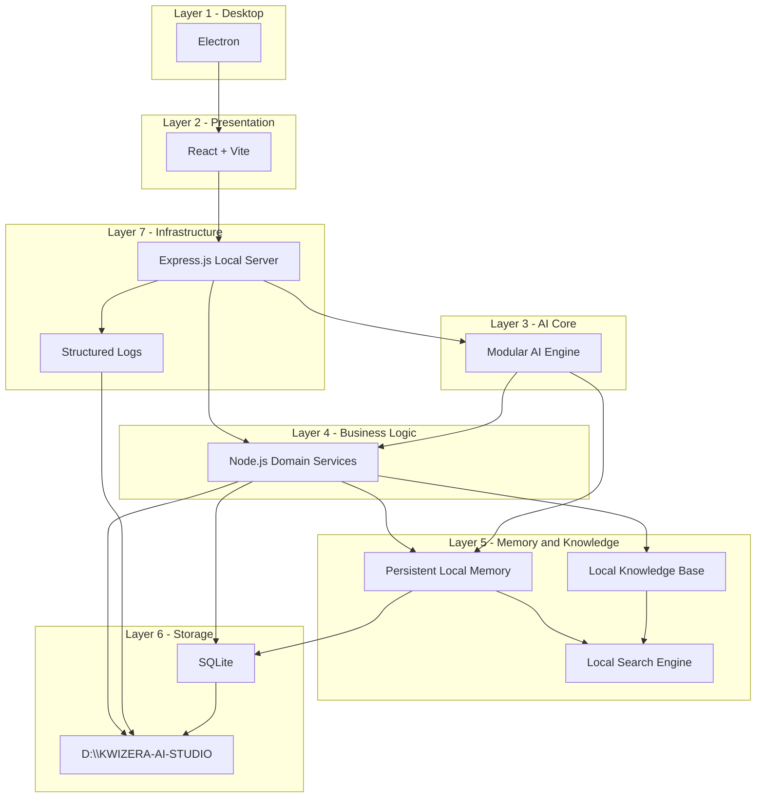

# KWIZERA AI STUDIO — Technology Stack, Project Structure & Development Foundation

**Document status:** Permanent foundation · Step 1M  
**Effective date:** 2026-06-28  
**Scope:** Official technology stack, repository layout, runtime storage layout, policies, and development foundation — not source code, APIs, database schemas, or UI components.

**Companion documents:** See [BLUEPRINT-INDEX.md](./BLUEPRINT-INDEX.md)

| Official identity | Value |
|-------------------|-------|
| **Project name** | **KWIZERA AI STUDIO** |
| **Official logo** | **`KWIZERA AI.png`** (project root) |
| **Official AI assistant** | **KWIZERA AI** |

**Aligns with:** [SYSTEM-ARCHITECTURE-BLUEPRINT.md](./SYSTEM-ARCHITECTURE-BLUEPRINT.md) · [DATA-FLOW-BLUEPRINT.md](./DATA-FLOW-BLUEPRINT.md) · [DEVELOPMENT-RULES-BLUEPRINT.md](./DEVELOPMENT-RULES-BLUEPRINT.md) · [QUALITY-STANDARDS-BLUEPRINT.md](./QUALITY-STANDARDS-BLUEPRINT.md)

---

## 1. Blueprint Purpose

This document defines the **permanent technical foundation** of **KWIZERA AI STUDIO** — the official technologies, folder structures, naming standards, dependency and configuration policies, storage root, coding standards, testing foundation, and quality gates used throughout all future development phases.

This is the **final technical planning document** before software development begins. It does **not** contain implementation code.

### 1.1 Governance

| Rule | Requirement |
|------|-------------|
| **Authoritative stack** | All implementation must use technologies defined here unless blueprint-amended |
| **Architecture alignment** | Stack maps to 7 layers (Step 1H) — no bypass |
| **Storage root** | User data at **`D:\KWIZERA-AI-STUDIO`** — mandatory |
| **Blueprint first** | [DEVELOPMENT-RULES-BLUEPRINT.md](./DEVELOPMENT-RULES-BLUEPRINT.md) governs all coding phases |

---

## 2. Official Technology Stack

### 2.1 Stack summary

| Layer (Architecture) | Official technology | Role |
|----------------------|---------------------|------|
| **Layer 1 — Desktop Application** | **Electron** | Windows desktop shell, launcher, window, splash, OS integration |
| **Layer 2 — Presentation** | **React** + **Vite** | UI views, navigation, user interaction (future implementation) |
| **Layer 7 — Backend / Infrastructure** | **Node.js** + **Express.js** | Local backend server, internal services, job queue, health |
| **Layer 6 — Storage (structured)** | **SQLite** | Projects, products, memory metadata, workflow history, settings |
| **Layer 3 — AI Core** | **Modular AI Engine** | Thinking, workflow, decision, planning, learning, recommendation plugins |
| **Layer 5 — Memory** | **Persistent Local Memory** | Module 9 partitions — SQLite + indexed files under storage root |
| **Layer 5 — Knowledge** | **Local Knowledge Base** | Module 7 — SQLite + documents under storage root |
| **Layer 5 — Search** | **Local Search Engine** | Full-text / semantic search over memory and knowledge (local indexes) |
| **Layer 6 — Storage (files)** | **Local Storage** | File system under **`D:\KWIZERA-AI-STUDIO`** |
| **Configuration** | **JSON** | Centralized config files (see §7) |
| **Logging** | **Structured Local Logs** | JSON or structured text logs under storage root |

### 2.2 Technology rules

| Rule | Requirement |
|------|-------------|
| **Local-first** | Primary compute and data on user's Windows machine — Step 1B |
| **No cloud-primary storage** | Cloud optional future addendum only — not v1 default |
| **Internal services** | Express serves **localhost internal APIs** — not public internet API in v1 |
| **Single language runtime** | Node.js for backend, Electron main, and AI orchestration unless blueprint-amended |
| **SQLite** | Single-user local DB via Storage Gateway — Step 1H |
| **Official logo asset** | **`KWIZERA AI.png`** at repository root; icons derived for Electron |

### 2.3 Stack-to-layer mapping



---

## 3. Dual Root Model

Two distinct roots exist — **do not conflate them**.

| Root | Path | Purpose |
|------|------|---------|
| **Repository root** | Project clone / development folder (e.g. `kwizera-ai-studio/`) | Source code, docs, scripts, tests, official logo |
| **Runtime data root** | **`D:\KWIZERA-AI-STUDIO`** | All important user data, media, DB, logs, backups, exports |

**Rule:** Nothing important lives only in `%TEMP%`, browser storage, or unsaved memory. All authoritative user data is under **`D:\KWIZERA-AI-STUDIO`**.

---

## 4. Repository Project Structure

Complete **source repository** folder layout. Every folder has **one clear responsibility**.

```
kwizera-ai-studio/                    # Repository root
├── KWIZERA AI.png                    # Official logo (immutable — Step 1A)
├── BLUEPRINT-INDEX.md                # Blueprint registry
├── documentation/                    # Blueprint copies, phase docs, ADRs
│   ├── blueprints/                   # Symlink or copies of Phase 1 blueprints
│   └── adr/                          # Architecture decision records
│
├── desktop/                          # Layer 1 — Electron main process
│   ├── main/                         # App lifecycle, window, splash, tray
│   ├── preload/                      # Secure IPC bridge to renderer
│   └── resources/                    # Icons derived from KWIZERA AI.png
│
├── frontend/                         # Layer 2 — React + Vite presentation
│   ├── src/
│   │   ├── app/                      # Shell, routing, layout
│   │   ├── modules/                  # Feature-aligned UI modules (1:1 with Feature Blueprint)
│   │   │   ├── dashboard/
│   │   │   ├── products/
│   │   │   ├── media/
│   │   │   ├── video/
│   │   │   ├── content/
│   │   │   ├── brand/
│   │   │   ├── knowledge/
│   │   │   ├── memory/
│   │   │   ├── learning/
│   │   │   ├── marketing/
│   │   │   ├── translation/
│   │   │   ├── decisions/
│   │   │   └── settings/
│   │   ├── shared/                   # Shared UI primitives (no business logic)
│   │   └── assets/                   # UI static assets (NOT official logo replacements)
│   └── public/
│
├── backend/                          # Layer 7 + Layer 4 entry — Express local server
│   ├── server/                       # Express app, routes (internal only)
│   ├── services/                     # Domain services (business logic)
│   │   ├── products/
│   │   ├── media/
│   │   ├── video/
│   │   ├── content/
│   │   ├── brand/
│   │   ├── marketing/
│   │   ├── translation/
│   │   └── system/
│   ├── infrastructure/               # Layer 7 — health, recovery, jobs, logging, gateway
│   │   ├── gateway/                  # Storage Gateway (sole DB/file write path)
│   │   ├── health/
│   │   ├── recovery/
│   │   ├── jobs/
│   │   └── logging/
│   └── events/                       # Event bus definitions and handlers
│
├── database/                         # Layer 6 — SQLite layer (schema, migrations, repos)
│   ├── migrations/                   # Forward-only migration scripts
│   ├── repositories/                 # Data access — used only via Gateway
│   └── seeds/                        # Dev seeds only — never production user data
│
├── ai/                               # Layer 3 — Modular AI Engine
│   ├── core/                         # Orchestrator, registry, plugin loader
│   ├── thinking/                     # Thinking Engine (Step 1G)
│   ├── workflow/                     # Workflow Engine (Step 1F)
│   ├── decision/                     # Decision Engine
│   ├── planning/                     # Planning Engine
│   ├── learning/                     # Learning Engine
│   ├── recommendation/               # Recommendation Engine
│   ├── reasoning/                    # Reasoning modules and rationale logging
│   └── plugins/                      # Future AI module plugins (extensibility)
│
├── memory/                           # Layer 5 — Persistent Local Memory (Module 9)
│   ├── partitions/                   # marketing, video, language, knowledge memory
│   └── index/                        # Memory index adapters
│
├── knowledge/                        # Layer 5 — Local Knowledge Base (Module 7)
│   ├── store/                        # Knowledge entry handlers
│   └── enrichment/                   # AI knowledge enrichment (spec only until Phase 2)
│
├── learning/                         # Layer 5/8 — Learning Center logic
│   └── history/                      # Learning history handlers
│
├── marketing/                        # Layer 4 — Marketing domain (Module 10)
├── video/                            # Layer 4 — Video domain (Module 4)
├── translation/                      # Layer 4 — Translation domain (Module 11)
├── search/                           # Layer 5 — Local Search Engine
│   ├── memory/
│   └── knowledge/
│
├── storage/                          # Storage path resolution and Gateway helpers
│   └── paths/                        # Canonical path builders for D:\KWIZERA-AI-STUDIO
│
├── config/                           # Configuration schemas and loaders (JSON)
│   ├── defaults/                     # Default JSON configs (committed)
│   └── schema/                       # JSON schema validation definitions
│
├── branding/                         # Brand asset handling (user brands — NOT app logo)
├── assets/                           # Shared non-UI assets (templates, presets)
├── icons/                            # Generated app icons from KWIZERA AI.png
├── templates/                        # Video/marketing templates
│
├── scripts/                          # Build, migrate, backup, dev utilities
├── tests/                            # All test suites (see §12)
│   ├── unit/
│   ├── integration/
│   ├── runtime/
│   ├── recovery/
│   └── performance/
│
└── release/                          # Packaging, installer specs (future)
```

### 4.1 Folder responsibility matrix

| Folder | Layer | Feature module(s) | Responsibility |
|--------|-------|-------------------|----------------|
| `desktop/` | L1 | 14 | Electron shell, splash, shortcuts, IPC |
| `frontend/` | L2 | 1–12, 15 UI | React views — no direct DB access |
| `backend/services/` | L4 | 2–11, 15 | Domain business logic |
| `backend/infrastructure/` | L7 | 13, 15 | Gateway, health, jobs, logs, recovery |
| `database/` | L6 | All | SQLite migrations and repositories |
| `ai/` | L3 | 12 + orchestration | KWIZERA AI engines and plugins |
| `memory/` | L5 | 9 | Memory partitions and indexing |
| `knowledge/` | L5 | 7 | Knowledge base |
| `learning/` | L5/8 | 8 | Learning history and handlers |
| `marketing/` | L4 | 10 | Campaign and static asset logic |
| `video/` | L4 | 4 | Video planning and render coordination |
| `translation/` | L4 | 11 | Translation services |
| `search/` | L5 | 7, 9 | Local search indexes |
| `storage/` | L6/7 | 14 | Path resolution for data root |
| `config/` | L6/7 | 15 | JSON configuration |
| `branding/` | L4 | 6 | User brand profiles |
| `templates/` | L4 | 4, 6, 10 | Reusable creative templates |

---

## 5. Runtime Storage Structure

**Permanent data root:** **`D:\KWIZERA-AI-STUDIO`**

```
D:\KWIZERA-AI-STUDIO\
├── config/                 # Runtime JSON settings (user overrides)
├── database/               # SQLite database file(s)
│   └── kwizera.db          # Primary DB (name fixed for documentation)
├── projects/               # Project manifests and checkpoints
├── uploads/                # User uploads (images, video, audio, logos)
├── exports/                # User-facing exported deliverables
├── media/                  # Processed/canonical media storage
│   ├── images/
│   ├── videos/
│   └── audio/
├── memory/                 # Memory partition files and indexes
├── knowledge/              # Knowledge documents and indexes
├── learning/               # Learning history stores
├── logs/                   # Structured application logs
├── backups/                # User and system backup archives
├── cache/                  # Regenerable cache — NOT authoritative
└── temp/                   # Short-lived processing — NOT authoritative
```

### 5.1 Permanent storage policy

| Rule | Requirement |
|------|-------------|
| **Authoritative root** | **`D:\KWIZERA-AI-STUDIO`** for all important user data |
| **No temp-only important data** | Projects, media, memory, knowledge, exports must not exist only in `temp/` or `cache/` |
| **Survives restart** | All authoritative data reloads from data root |
| **Survives reboot** | SQLite WAL + file persistence |
| **Survives Windows update** | Data on D: independent of app install directory |
| **Survives crash** | WAL recovery + workflow checkpoints + backup restore |
| **Configurable root** | Path override only via Settings JSON — default remains `D:\KWIZERA-AI-STUDIO` |
| **Gateway-only writes** | All writes through Storage Gateway — Step 1H |

### 5.2 What may use cache/temp

| Location | Allowed content |
|----------|-----------------|
| `cache/` | Thumbnails, search cache, model cache — safe to purge |
| `temp/` | In-progress render intermediates — recoverable from project state |

---

## 6. File Organization

### 6.1 Naming conventions

| Artifact | Convention | Example |
|----------|------------|---------|
| **Folders (repo)** | `kebab-case` | `ai/workflow/` |
| **Folders (runtime)** | `kebab-case` | `D:\KWIZERA-AI-STUDIO\projects/` |
| **Source files** | `kebab-case` or `camelCase` per language idiom | `project-loader.ts` |
| **React components** | `PascalCase` file and export | `DashboardHome.tsx` |
| **Services / classes** | `PascalCase` | `ProductAnalysisService` |
| **Internal API routes** | `kebab-case` plural nouns | `/internal/products` |
| **Database tables** | `snake_case` plural | `product_records` |
| **Database columns** | `snake_case` | `price_rwf` |
| **Variables** | `camelCase` (TS/JS) | `projectContext` |
| **Constants** | `SCREAMING_SNAKE_CASE` | `STORAGE_ROOT_DEFAULT` |
| **JSON config keys** | `camelCase` | `"storageRoot"` |
| **Event names** | `PascalCase` or `dot.notation` | `ProjectCreated` |
| **Test files** | `*.test.ts` / `*.spec.ts` co-located or in `tests/` | `product-service.test.ts` |
| **Blueprint IDs** | Module number + name | `Module-02-ProductManagement` |

### 6.2 Module boundaries

| Boundary | Rule |
|----------|------|
| **Frontend → Backend** | HTTP/IPC to localhost Express only — no direct SQLite |
| **Backend services → Storage** | Repository → Storage Gateway only |
| **AI → Business logic** | Orchestrator invokes service interfaces — no direct repo |
| **AI plugins** | Register with `ai/core/` — implement defined plugin contract |
| **Frontend modules** | One folder per Feature Blueprint module under `frontend/src/modules/` |
| **Backend services** | One folder per domain under `backend/services/` |

### 6.3 Import rules

| Rule | Requirement |
|------|-------------|
| **No circular imports** | Enforced by lint and architecture review |
| **No duplicate modules** | Single implementation per domain — extract shared to `shared/` or `backend/services/common/` |
| **Layer direction** | Presentation → Backend → Domain → Gateway → Database — never reverse |
| **AI imports** | AI engines may import service **interfaces** — not repositories directly |
| **Path aliases** | Use configured aliases (`@frontend/`, `@backend/`, `@ai/`) — no deep relative `../../../` |
| **Barrel exports** | `index.ts` per module — avoid cross-module deep imports |

---

## 7. Dependency Policy

### 7.1 Package categories (to be declared in manifest during Phase 2)

| Category | Purpose | Examples (official stack) |
|----------|---------|---------------------------|
| **Required runtime** | App cannot run without | `electron`, `react`, `react-dom`, `express`, `better-sqlite3` or equivalent SQLite driver |
| **Required AI runtime** | Modular AI Engine | TBD in Phase 2 — local inference bindings |
| **Required dev** | Build and test | `vite`, `@vitejs/plugin-react`, `typescript`, `eslint`, `prettier`, `vitest` or `jest` |
| **Optional dev** | DX tooling | `@types/*`, `electron-builder` (release phase) |

### 7.2 Version policy

| Policy | Rule |
|--------|------|
| **Lockfile required** | `package-lock.json` or `pnpm-lock.yaml` committed |
| **Semver** | Runtime deps: `^` minor allowed after Phase 2 baseline locked |
| **Pin critical** | Electron, SQLite driver, Node engine — pin in `engines` field |
| **No floating latest** | Never `"*"` or unbounded ranges in production deps |
| **Audit** | Run dependency audit before each phase release |
| **Document upgrades** | Major upgrades require ADR in `documentation/adr/` |

### 7.3 Upgrade policy

1. Read release notes and breaking changes  
2. Update in isolated branch  
3. Run full test suite (§12) + live validation (Step 1K §9)  
4. Update lockfile and ADR  
5. Merge only after Phase gate pass  

### 7.4 Dependency validation

| Check | When |
|-------|------|
| Lockfile present and CI-validated | Every commit to main |
| No known critical CVEs unmitigated | Pre-release |
| No duplicate packages doing same job | Architecture review |
| Bundle size review (frontend) | Pre-release |
| Electron compatibility matrix | Before desktop release |

---

## 8. Configuration Policy

All configuration **centralized in JSON**, loaded via `config/` loaders, runtime overrides in **`D:\KWIZERA-AI-STUDIO\config\`**.

### 8.1 Configuration domains

| Domain | Default location | Contents |
|--------|------------------|----------|
| **Environment** | `config/defaults/environment.json` | `nodeEnv`, dev/prod flags, port |
| **Desktop** | `config/defaults/desktop.json` | Window size, splash, single-instance |
| **Application** | `config/defaults/application.json` | App name, version, feature flags |
| **Storage** | `config/defaults/storage.json` | **`storageRoot`: `D:\\KWIZERA-AI-STUDIO`** |
| **AI** | `config/defaults/ai.json` | Model paths, concurrency, timeouts |
| **Brand (app)** | `config/defaults/brand-app.json` | Reference to **`KWIZERA AI.png`** — not user brand |
| **Language** | `config/defaults/language.json` | Default locale, translation settings |
| **Database** | `config/defaults/database.json` | DB path relative to storage root |

### 8.2 Configuration rules

| Rule | Requirement |
|------|-------------|
| **JSON only** | Human-readable; schema-validated |
| **Defaults committed** | `config/defaults/` in repository |
| **User overrides** | Runtime copy in data root — never commit user paths |
| **No secrets in repo** | API keys (if ever added) in user config only |
| **Validate on load** | Validation Engine rejects invalid config at startup |
| **Migration** | Config version field; migrate on upgrade |

---

## 9. Database Policy

| Policy | Specification |
|--------|---------------|
| **Engine** | SQLite |
| **Location** | `D:\KWIZERA-AI-STUDIO\database\kwizera.db` (default) |
| **Access** | Storage Gateway + repositories only — no ad-hoc SQL from Presentation or AI |
| **Backup strategy** | Copy DB + WAL to `backups/` before migrate; user-triggered full backup |
| **Migration strategy** | Forward-only scripts in `database/migrations/`; version table in DB |
| **Validation strategy** | Integrity check on startup; foreign key enforcement |
| **Recovery strategy** | WAL auto-recovery; restore from backup via System Tools |
| **WAL mode** | Enabled for crash safety |
| **Transactions** | Project save groups atomic — Step 1F Step 10 |

---

## 10. Coding Standards

### 10.1 General rules

| Standard | Rule |
|----------|------|
| **Language** | TypeScript for frontend, backend, AI, and shared logic |
| **Strict mode** | TypeScript `strict: true` |
| **Lint** | ESLint — no merge with errors |
| **Format** | Prettier — consistent style |
| **No duplicate code** | Extract shared logic — Step 1K |
| **No dead code** | Remove unused exports |
| **No unhandled promises** | Async errors caught at module boundary |
| **No blocking main thread** | Heavy work in backend worker / job queue |

### 10.2 Documentation rules

| Artifact | Requirement |
|----------|-------------|
| **Public service methods** | JSDoc: purpose, params, returns, errors |
| **AI engines** | Document thinking/workflow step mapping |
| **Config keys** | Document in config JSON schema |
| **Migrations** | Comment purpose and rollback limitation (forward-only) |
| **ADRs** | Significant tech decisions in `documentation/adr/` |

### 10.3 Comment rules

| Do | Don't |
|----|-------|
| Explain **why** for non-obvious business rules | Restate obvious code |
| Reference blueprint step for AI behavior | Leave magic numbers unexplained |
| Mark TODO with ticket/phase ID | Infinite TODO without owner |

---

## 11. Testing Foundation

Prepare standards for future automation — aligned with [QUALITY-STANDARDS-BLUEPRINT.md](./QUALITY-STANDARDS-BLUEPRINT.md) and [DEVELOPMENT-RULES-BLUEPRINT.md](./DEVELOPMENT-RULES-BLUEPRINT.md).

| Test type | Location | Scope |
|-----------|----------|-------|
| **Unit tests** | `tests/unit/` + co-located | Single module/function; mocked deps |
| **Integration tests** | `tests/integration/` | Service + Gateway + SQLite temp root |
| **Runtime tests** | `tests/runtime/` | Express server start, health, shutdown |
| **Live tests** | Manual + future E2E in `tests/live/` | Real Electron app — Step 1K §9 |
| **Recovery tests** | `tests/recovery/` | Crash inject, restore, backup |
| **Performance tests** | `tests/performance/` | Startup, search, render benchmarks |

### 11.1 Future automation

| Tool direction | Purpose |
|----------------|---------|
| **Vitest** or **Jest** | Unit + integration |
| **Playwright** or **Spectron successor** | Future E2E desktop (Phase 3+) |
| **CI pipeline** | Run unit/integration on push — Phase 2+ |
| **Coverage floor** | Critical paths: Gateway, AI workflow, persistence — target 80%+ in Phase 2 core |

---

## 12. Quality Policy (Technical Gate)

No code accepted unless it passes:

| Gate | Validator |
|------|-----------|
| **Blueprint validation** | Feature exists in 1D; amendment if new |
| **Architecture validation** | Layer + Gateway + interface rules — 1H, this doc §6 |
| **Code validation** | Lint, typecheck, no circular imports |
| **Runtime validation** | Service starts; health OK |
| **Live validation** | Step 1K §9 — real app feature walkthrough |
| **Documentation validation** | JSDoc, ADR if needed, config schema updated |

---

## 13. Future Expansion

Architecture supports new AI modules **without redesign**:

| Extension | Mechanism |
|-----------|-----------|
| **New AI capability** | Plugin in `ai/plugins/` — register with `ai/core/` |
| **New domain service** | Folder in `backend/services/` + Feature Blueprint amendment |
| **New memory partition** | Register in `memory/partitions/` |
| **New presentation module** | `frontend/src/modules/<name>/` |
| **New workflow step** | AI Workflow Blueprint amendment + workflow engine registration |

**Rule:** Never bypass Storage Gateway or layer boundaries when extending.

---

## 14. Phase 1 Completion Declaration

With Step **1M**, Phase 1 **Vision & Blueprint** includes:

| Steps | Deliverable |
|-------|-------------|
| 1A–1L | Vision, features, journeys, AI, architecture, governance, final approval |
| **1M** | **Technology stack, project structure, development foundation** (this document) |

### 14.1 Phase 1 status

| Status | Value |
|--------|-------|
| **Phase 1** | ✅ **OFFICIALLY COMPLETE** |
| **Technical foundation** | ✅ **DEFINED** |
| **Ready for Phase 2 planning** | ✅ **YES** |
| **Authorized to write code** | ⛔ **Await explicit user approval for Phase 2 — Core AI Engine** |

---

## 15. Explicit Non-Goals (Step 1M)

This document does **not** contain:

- Source code or configuration file contents  
- `package.json` or lockfile  
- SQLite CREATE TABLE statements  
- Express route implementations  
- React components  
- Electron main process code  

Those begin in **Phase 2** after explicit authorization.

---

## 16. Quick Reference

| Item | Official value |
|------|----------------|
| Desktop | **Electron** |
| Frontend | **React** + **Vite** |
| Backend | **Node.js** + **Express.js** |
| Database | **SQLite** |
| AI | **Modular AI Engine** |
| Memory | **Persistent Local Memory** |
| Knowledge | **Local Knowledge Base** |
| Search | **Local Search Engine** |
| Data root | **`D:\KWIZERA-AI-STUDIO`** |
| Config | **JSON** |
| Logs | **Structured Local Logs** |
| Logo | **`KWIZERA AI.png`** |

---

**KWIZERA AI STUDIO** — Stack chosen. Structure defined. Foundation ready.

*End of Technology Stack, Project Structure & Development Foundation — Step 1M*
