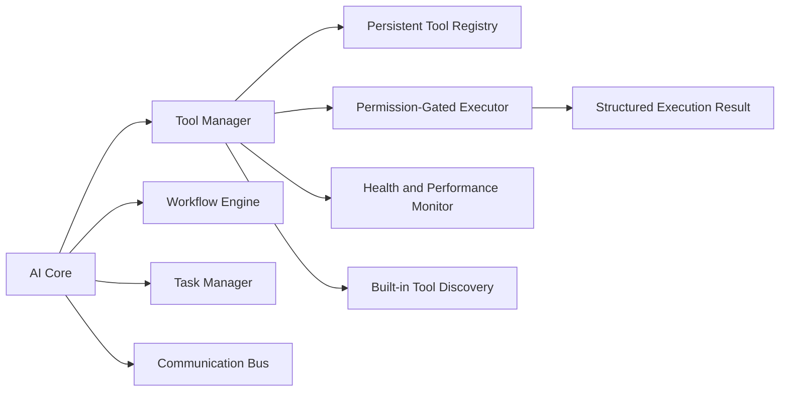

# AI Tool Registry and Tool Manager Foundation Report

## Delivered Foundation

The Tool Framework is an additive, local-first subsystem under `ai/tool-management`. `AiCoreManager` initializes it after the workflow, task, communication, module, and model services are available. The public `ai` barrel exports its types and manager.

## Discovery and Registration

- Existing capability inventory: the `ai/` source tree contains core engines, memory, knowledge, intelligence, generation, workflow, task, communication, recovery, and management modules. The framework treats these as discoverable capability surfaces, not automatically safe executable tools.
- Registered executable tools at core startup: 3.
- Built-in tools: `system.runtime-status`, `workflow.status`, and `tool.registry-summary`.
- Discovery model: newly installed code submits `{ definition, handler, configuration }` to `toolManager.discover()`. Existing tool IDs are retained; new IDs register automatically. Persisted metadata restores on restart, while handlers must be re-discovered from installed code.

## Tool Contract

Every registered tool includes an ID, name, description, category, version, author, status, input/output schema, required permissions, dependencies, supported models, execution type, and local/external designation.

All requested categories are supported: AI, image, video, audio, marketing, rendering, database, memory, knowledge, file, system, utility, and external.

## Manager Architecture

The manager supports registration, removal, metadata updates, enable/disable, load/unload, validation, execution, monitoring, and per-tool configuration. Registry persistence uses a temporary file followed by rename to preserve the last valid registry if a write is interrupted.

## Execution Workflow

1. Resolve the requested tool.
2. Verify tool state, descriptor validity, loaded handler, required inputs, and caller-granted permissions.
3. Execute the handler with a cloned input object.
4. Return a structured success, failure, or rejection result with duration.
5. Update execution count, error rate, response time, availability, and compatibility health metadata.

## Integration Status

- AI Core: integrated and owns the manager lifecycle.
- Workflow Engine: available to tool handlers; `workflow.status` validates the integration.
- Task Scheduler/Task Manager: exposed through the integration status for future asynchronous tool adapters.
- Communication Bus: exposed through the integration status for future routed tool execution.
- Module Manager: dependency compatibility checks use the core module registry.
- Multi-Agent System: no implementation was found to integrate; reported as unavailable instead of simulated.

## Validation

- Editor diagnostics are clean for the new Tool Framework sources, `AiCoreManager`, and its focused test.
- A focused Vitest lifecycle test was added for registry, validation, permission rejection, execution, configuration, health metrics, and persistence.
- The terminal adapter did not return a Vitest exit result, so this run is not reported as a passing automated test.
- Existing repository-wide TypeScript and test-suite failures remain outside this additive Step 1 change.

## Remaining Improvements and Step 2 Recommendations

1. Register safe adapters for existing image, video, audio, marketing, memory, knowledge, and export managers one workflow at a time.
2. Add a durable execution history and event log with correlation IDs.
3. Route asynchronous tools through the task manager and communication bus, with cancellation and retry policy.
4. Add JSON Schema validation rather than the current required-field foundation.
5. Add explicit permission authorities and user/agent identity once the platform implements authentication and authorization.
6. Add signed external-tool manifests, isolation, timeouts, rate limits, and allowlisted network access before enabling external tools.
7. Add reliable CI execution for the new focused test and full repository validation.

## Step 2 Gate

Step 2 must not begin until this report is approved.