# KWIZERA AI STUDIO — Complete User Journey Blueprint

**Document status:** Permanent foundation · Step 1E  
**Effective date:** 2026-06-28  
**Scope:** Complete end-to-end user workflow from application launch through project completion and learning — not frontend, backend, API, database, or UI implementation.

**Companion documents:**

| Document | Step | Scope |
|----------|------|-------|
| [BRAND-IDENTITY.md](./BRAND-IDENTITY.md) | 1A | Product name, logo, visual identity |
| [MISSION-VISION-BLUEPRINT.md](./MISSION-VISION-BLUEPRINT.md) | 1B | Mission, vision, purpose, objectives, principles, success criteria |
| [AI-IDENTITY-BLUEPRINT.md](./AI-IDENTITY-BLUEPRINT.md) | 1C | AI assistant identity, role, personality, behavior |
| [FEATURE-BLUEPRINT.md](./FEATURE-BLUEPRINT.md) | 1D | Complete feature specification by module |

| Official identity | Value |
|-------------------|-------|
| **Project name** | **KWIZERA AI STUDIO** |
| **Official logo** | **`KWIZERA AI.png`** (project root) |
| **Official AI assistant** | **KWIZERA AI** |

---

## 1. Blueprint Purpose

This document defines **every step a user follows** from opening **KWIZERA AI STUDIO** until successfully completing a project — including startup, dashboard, project creation, resource upload, business input, AI analysis and planning, content and video production, review, export, and learning.

### 1.1 General rules

| Rule | Requirement |
|------|-------------|
| **Natural guidance** | The application must guide the user naturally at every stage |
| **Simplicity** | Every workflow must be simple |
| **Clarity** | Every important action must be easy to understand |
| **Next-step visibility** | Every stage must clearly indicate what the user should do next |
| **No confusion** | No workflow should confuse the user |
| **No dead ends** | No stage should leave the user without guidance |
| **Step-by-step** | **KWIZERA AI** guides the user through each stage per [AI-IDENTITY-BLUEPRINT.md](./AI-IDENTITY-BLUEPRINT.md) |
| **Verification before success** | **KWIZERA AI** verifies results before reporting completion at any stage |

### 1.2 Governance

| Rule | Requirement |
|------|-------------|
| **Authoritative workflow** | This blueprint is the official user journey all future modules must follow |
| **No silent workflow changes** | New stages or altered flows require an explicit blueprint amendment |
| **Feature alignment** | Each stage maps to modules defined in [FEATURE-BLUEPRINT.md](./FEATURE-BLUEPRINT.md) |
| **Implementation deferral** | This document defines *what the user experiences* — not *how it is built* |

### 1.3 Journey overview

```mermaid
flowchart LR
    S1[Stage 1 - Launch] --> S2[Stage 2 - Dashboard]
    S2 --> S3[Stage 3 - New Project]
    S3 --> S4[Stage 4 - Upload Resources]
    S4 --> S5[Stage 5 - Business Info]
    S5 --> S6[Stage 6 - AI Analysis]
    S6 --> S7[Stage 7 - AI Planning]
    S7 --> S8[Stage 8 - Content Generation]
    S8 --> S9[Stage 9 - Video Production]
    S9 --> S10[Stage 10 - Review]
    S10 --> S11[Stage 11 - Export]
    S11 --> S12[Stage 12 - Learning]
    S12 --> S2
```

**Primary project path:** Stages 1 → 2 → 3 → 4 → 5 → 6 → 7 → 8 → 9 → 10 → 11 → 12 → return to Dashboard (Stage 2).

**Resume path:** User may open an existing project from Stage 2 and re-enter at the last incomplete stage with **KWIZERA AI** guidance.

---

## 2. Stage Specifications

Each stage is defined with: **Purpose**, **User Goal**, **AI Responsibility**, **Expected Input**, **Expected Output**, **Possible Errors**, **Recovery Strategy**, **Dependencies**, and **Success Criteria**.

---

### STAGE 1 — Application Launch & Startup

#### Steps in this stage

1. Launching the desktop application  
2. Application startup  
3. Splash screen  
4. Loading required services  
5. Checking local storage  
6. Checking AI modules  
7. Checking project database  
8. Opening Dashboard  

#### Purpose

Bring **KWIZERA AI STUDIO** to a **ready, trustworthy state** — verify local infrastructure and AI availability — then deliver the user to the Dashboard with clear status.

#### User Goal

Open the application and reach the Dashboard knowing the studio is ready to work (or clearly informed if something needs attention).

#### AI Responsibility

- **KWIZERA AI** does not lead conversation during splash, but the startup summary prepares context for first guidance on the Dashboard  
- If checks fail, **KWIZERA AI** (once Dashboard or recovery UI is reachable) explains status in plain language and recommends next steps  
- Never report “ready” if startup verification has not completed  

#### Expected Input

- User launch action (shortcut, executable, or taskbar)  
- Local storage paths and permissions  
- Service health from Local Services (Module 13)  
- AI module availability status  
- Project database connectivity and integrity check results  
- Official logo **`KWIZERA AI.png`** for splash display per [BRAND-IDENTITY.md](./BRAND-IDENTITY.md)  

#### Expected Output

- Splash screen with official logo and loading progress  
- Completed startup checklist (services, storage, AI, database)  
- Dashboard entry (Stage 2) or guided recovery entry if checks fail  
- Session record for automatic recovery (Module 14)  

#### Possible Errors

| Error | Description |
|-------|-------------|
| **Service failed to start** | Backend, database, or AI service did not load |
| **Local storage unavailable** | Missing path, permission denied, or disk full |
| **AI modules unavailable** | Required AI components missing or failed initialization |
| **Database check failed** | Corrupt, missing, or locked project database |
| **Crash during startup** | Application terminated before Dashboard |

#### Recovery Strategy

| Error | Recovery |
|-------|----------|
| Service failure | Automatic retry via Recovery Services (Module 13); if persistent, route to Recovery Center (Module 15) with clear message |
| Storage unavailable | Prompt user to fix path in Settings or free disk space; offer safe mode if defined in future spec |
| AI modules unavailable | Degraded mode message; guide user to System Health; block generation stages until resolved |
| Database failure | Offer restore from backup (Module 15) or guided repair via Recovery Center |
| Crash | Automatic recovery on next launch (Module 14); restore last safe checkpoint |

#### Dependencies

| Dependency | Module / Document |
|------------|-------------------|
| Desktop shell and splash | Module 14 — Desktop Framework |
| Service loading and health | Module 13 — Local Services |
| Storage paths | Module 14 — Local Storage |
| Database integrity | Module 13 — Database Services |
| Logo on splash | Step 1A — `KWIZERA AI.png` |
| Recovery and logs | Module 15 — System Tools |

#### Success Criteria

- [ ] Application starts successfully on supported Windows configurations  
- [ ] Splash displays official logo and meaningful loading progress  
- [ ] All required checks complete before Dashboard is shown as “ready”  
- [ ] User reaches Dashboard or a guided recovery path — never a blank or unexplained screen  
- [ ] Startup completes without data loss  

**Next step guidance for user:** “Your studio is ready. Go to Dashboard to start or continue a project.” — or explicit recovery instructions if not ready.

---

### STAGE 2 — Dashboard Experience

#### Steps in this stage

- Recent projects  
- Create New Project  
- Open Existing Project  
- Quick Actions  
- System Status  
- Notifications  

#### Purpose

Provide the **central hub** where the user orients, resumes work, starts new projects, and monitors studio health.

#### User Goal

Quickly understand what to do next — start fresh, continue a project, or run a common task — without searching through the application.

#### AI Responsibility

- **KWIZERA AI** greets the user and suggests the **single best next action** (e.g. continue project, create new, fix system issue)  
- Surfaces recommendations from AI Decision Center (Module 12) in plain language  
- Explains System Status or notifications when relevant  
- Follows personality rules: helpful, clear, never confusing  

#### Expected Input

- Startup completion state from Stage 1  
- Recent project list and activity feeds (Module 1)  
- Quick action definitions  
- System health summary (Modules 13, 15)  
- Notifications (completions, errors, suggestions)  
- Memory and recommendation context (Modules 9, 12)  

#### Expected Output

- Dashboard view with recent projects, quick actions, status, and notifications  
- User selection: **Create New Project** (→ Stage 3), **Open Existing Project** (→ resume at last stage), or **Quick Action** (→ target module/stage)  
- Acknowledged notifications where applicable  

#### Possible Errors

| Error | Description |
|-------|-------------|
| **Project list failed to load** | Database or index read error |
| **Stale or missing project data** | Project record incomplete |
| **System status unavailable** | Health monitor not responding |
| **Quick action routing failure** | Target module unreachable |

#### Recovery Strategy

- Retry load with user-visible progress; log error (Module 15)  
- Show partial Dashboard with explanation — never empty shell  
- **KWIZERA AI** directs to Recovery Center or Backup/Restore if project data is corrupt  
- Disable broken Quick Actions with explanation until service restored  

#### Dependencies

| Dependency | Module |
|------------|--------|
| Dashboard features | Module 1 — Dashboard |
| Project records | Module 2, Module 9 |
| Recommendations | Module 12 — AI Decision Center |
| Health and notifications | Modules 13, 15 |
| AI guidance | Step 1C — KWIZERA AI |

#### Success Criteria

- [ ] User sees recent projects or clear empty state with “Create New Project” guidance  
- [ ] Quick Actions are labeled and understandable  
- [ ] System Status accurately reflects startup checks  
- [ ] **KWIZERA AI** provides one clear recommended next step  
- [ ] User reaches Stage 3 or resumes an in-progress project without confusion  

**Next step guidance for user:** “Create a new project” or “Open [project name] to continue where you left off.”

---

### STAGE 3 — Creating a New Project

#### Steps in this stage

- Choose project name  
- Choose project type  
- Choose branding  
- Save project  

#### Purpose

Establish a **named, typed, branded project container** that anchors all subsequent uploads, business data, generation, and exports.

#### User Goal

Create a project with a clear name, purpose (type), and brand context so the studio knows what to produce.

#### AI Responsibility

- **KWIZERA AI** helps user choose project type (promotional video, campaign, product launch, etc.) based on stated goal  
- Recommends existing brand profile from Brand Center (Module 6) or guides creation of new branding  
- Validates project name (non-empty, unique enough locally)  
- Confirms save before proceeding — verify project record exists  

#### Expected Input

- Project name (user text)  
- Project type selection (studio-defined types aligned with Feature Blueprint)  
- Branding choice: existing brand profile or new brand setup (Module 6)  
- Optional initial goal description from user  

#### Expected Output

- Saved project record persisted locally  
- Link to brand profile (Module 6)  
- Project entry in Dashboard recent list  
- Project checkpoint for Memory System (Module 9)  
- Route to Stage 4 (Upload Resources)  

#### Possible Errors

| Error | Description |
|-------|-------------|
| **Empty or invalid project name** | Validation failure |
| **Save failed** | Storage or database write error |
| **Brand profile unavailable** | Brand Center read error |
| **Duplicate name conflict** | User confusion or overwrite risk |

#### Recovery Strategy

- Inline validation with clear messages — do not advance without valid name  
- Retry save; if repeated failure, **KWIZERA AI** guides to System Health / Recovery Center  
- Offer “save draft locally” recovery path if implemented in future spec  
- Never silently overwrite existing project without user confirmation  

#### Dependencies

| Dependency | Module |
|------------|--------|
| Project container | Module 2 — Product Management (project scope) / Module 9 |
| Brand selection | Module 6 — Brand Center |
| Persistence | Modules 13, 14 |
| Dashboard update | Module 1 |

#### Success Criteria

- [ ] Project name, type, and branding are saved and retrievable after restart  
- [ ] User understands project purpose before leaving stage  
- [ ] **KWIZERA AI** confirms save and introduces Stage 4  
- [ ] Project appears on Dashboard  

**Next step guidance for user:** “Upload your product images, videos, logo, and other assets for this project.”

---

### STAGE 4 — Uploading Resources

#### Steps in this stage

- Upload product images  
- Upload product videos  
- Upload logo  
- Upload audio  
- Upload brand assets  
- Verify uploaded files  
- Store files permanently  

#### Purpose

Collect and **permanently store** all media and brand files the project needs for analysis, planning, and generation.

#### User Goal

Upload all relevant files, confirm they are correct, and know they are safely stored for the project.

#### AI Responsibility

- **KWIZERA AI** lists required vs optional uploads based on project type  
- After upload, verifies files (format, readability, minimum quality signals) before reporting success  
- Organizes files into project structure via Media Library (Module 3)  
- Clearly states what is still missing before Stage 5  

#### Expected Input

- User-selected files from local filesystem  
- Project ID from Stage 3  
- Optional: drag-and-drop or folder selection  
- Brand assets from Brand Center linkage  

#### Expected Output

- Verified assets in Media Library linked to project  
- Upload verification report (success / issues per file)  
- Permanent local storage confirmation  
- Asset index for Stages 6–9  

#### Possible Errors

| Error | Description |
|-------|-------------|
| **Unsupported file format** | Rejected upload |
| **File too large or corrupt** | Read or preview failure |
| **Upload interrupted** | Partial file |
| **Storage full** | Write failure |
| **Verification failed** | File unreadable by AI or preview |

#### Recovery Strategy

- Per-file error messages with fix guidance (convert format, reduce size, re-upload)  
- Resume interrupted uploads where possible  
- **KWIZERA AI** never marks stage complete until verification passes for required assets  
- Free-space or path guidance via Settings (Module 15)  
- Quarantine corrupt files without deleting user originals  

#### Dependencies

| Dependency | Module |
|------------|--------|
| Media intake and organization | Module 3 — Media Library |
| Brand assets | Module 6 — Brand Center |
| Local storage | Module 14 |
| Persistence services | Module 13 |
| Project linkage | Module 2, Module 9 |

#### Success Criteria

- [ ] All required assets uploaded and verified  
- [ ] Files stored permanently and survive application restart  
- [ ] User has previewed or acknowledged uploaded content  
- [ ] **KWIZERA AI** confirms readiness for business information entry  
- [ ] Missing optional assets explained without blocking if not required  

**Next step guidance for user:** “Enter your product and business details so KWIZERA AI can analyze your project.”

---

### STAGE 5 — Entering Business Information

#### Steps in this stage

- Product Name  
- Product Description  
- Price (**RWF only**)  
- Category  
- Brand  
- Target Audience  
- Promotion Goal  
- Contact Information  
- Call To Action  
- Social Links  

#### Purpose

Capture **structured business and marketing context** in **Rwanda Franc (RWF)** pricing so AI analysis and generation are accurate and locally relevant.

#### User Goal

Provide complete business information so marketing content and videos reflect the real product and audience.

#### AI Responsibility

- **KWIZERA AI** presents fields in logical order with examples where helpful  
- Validates **RWF-only** price entry; rejects or clarifies non-RWF input unless future blueprint amendment  
- Detects incomplete critical fields before Stage 6  
- Suggests improvements to descriptions and CTAs without inventing facts  

#### Expected Input

| Field | Input type |
|-------|------------|
| Product Name | Text |
| Product Description | Text |
| Price | Numeric + **RWF** (default and primary currency) |
| Category | Selection or text |
| Brand | From Brand Center or text |
| Target Audience | Text |
| Promotion Goal | Text |
| Contact Information | Text (phone, email, address as applicable) |
| Call To Action | Text |
| Social Links | URLs or handles |

#### Expected Output

- Saved product/business record linked to project (Module 2)  
- Knowledge entries where applicable (Module 7)  
- Validation summary for Stage 6  
- Memory checkpoint (Module 9)  

#### Possible Errors

| Error | Description |
|-------|-------------|
| **Missing required fields** | Validation blocks progress |
| **Invalid RWF price** | Non-numeric or wrong currency |
| **Save failure** | Database or storage error |
| **Conflicting brand data** | Mismatch with Brand Center profile |

#### Recovery Strategy

- Highlight missing fields with plain-language explanations  
- **KWIZERA AI** asks for specific missing items — never guesses values  
- Autosave drafts where possible to prevent data loss on crash  
- Retry persistence; escalate to Backup/Recovery if repeated failure  

#### Dependencies

| Dependency | Module |
|------------|--------|
| Product records | Module 2 — Product Management |
| Brand context | Module 6 — Brand Center |
| Knowledge capture | Module 7 — Knowledge Center |
| Memory | Module 9 |
| RWF default | Step 1B — Core Objectives |

#### Success Criteria

- [ ] All required business fields saved with **RWF** pricing where price is used  
- [ ] User confirms information is accurate  
- [ ] **KWIZERA AI** confirms readiness for analysis  
- [ ] Data persists after restart  

**Next step guidance for user:** “KWIZERA AI will now analyze your uploads and business information.”

---

### STAGE 6 — AI Analysis

#### Steps in this stage

- Analyze uploaded images  
- Analyze product  
- Analyze branding  
- Analyze business information  
- Detect missing information  
- Recommend improvements  

#### Purpose

Enable **KWIZERA AI** to **understand the full project context** — visual, product, brand, and business — and identify gaps before planning and generation.

#### User Goal

Receive a clear picture of what the studio understood, what is missing, and what to improve before production begins.

#### AI Responsibility

- Execute analysis on all Stage 4 and Stage 5 inputs  
- Follow seven-step decision workflow ([AI-IDENTITY-BLUEPRINT.md](./AI-IDENTITY-BLUEPRINT.md)): understand → analyze → detect gaps → recommend → (pause for user if gaps) → verify understanding → report  
- **Never invent** product facts, prices, or brand attributes  
- Recommend improvements with honest, actionable rationale  
- Block Stage 7 if critical gaps remain — guide user to fix in Stage 4 or 5  

#### Expected Input

- Media assets from Stage 4 (Module 3)  
- Business record from Stage 5 (Module 2)  
- Brand profile (Module 6)  
- Existing knowledge and memory (Modules 7, 9)  

#### Expected Output

- Analysis report: images, product, branding, business summary  
- Missing information list (if any)  
- Improvement recommendations (prioritized)  
- User decision: proceed to Stage 7, or return to Stage 4/5 to supply fixes  
- Analysis record stored for Memory and Knowledge (Modules 9, 7)  

#### Possible Errors

| Error | Description |
|-------|-------------|
| **Analysis service unavailable** | AI module failure |
| **Unreadable media** | Corrupt or unsupported assets |
| **Incomplete business data** | Detected during analysis |
| **Timeout on large assets** | Performance limit exceeded |
| **False confidence** | AI risk — mitigated by verification rules |

#### Recovery Strategy

- Retry analysis with progress indicator  
- Skip non-critical assets only with explicit user consent  
- Return user to Stage 4 or 5 with **KWIZERA AI** listing exact missing items  
- Log failure; offer degraded manual continuation only if user accepts quality risk  
- Never report “analysis complete” if verification failed  

#### Dependencies

| Dependency | Module |
|------------|--------|
| AI inference | Module 13 — Local Services |
| Media, product, brand data | Modules 2, 3, 6 |
| Knowledge and memory | Modules 7, 9 |
| AI behavior rules | Step 1C |

#### Success Criteria

- [ ] All provided inputs analyzed or explicitly flagged as failed  
- [ ] Missing information clearly listed or confirmed none  
- [ ] Recommendations are understandable and actionable  
- [ ] User explicitly proceeds to Stage 7 or returns to supply data  
- [ ] Analysis stored for future sessions  

**Next step guidance for user:** “Review recommendations, add anything missing, then continue to planning.”

---

### STAGE 7 — AI Planning

#### Steps in this stage

- Select marketing style  
- Select video style  
- Select color theme  
- Select transitions  
- Select animations  
- Select voice  
- Select music  
- Prepare complete production plan  

#### Purpose

Convert analyzed context into a **complete, user-approved production plan** covering creative direction for content and video output.

#### User Goal

Choose creative direction (or accept **KWIZERA AI** recommendations) and approve a clear plan before anything is generated.

#### AI Responsibility

- Propose **best default plan** based on analysis, brand, and memory — user may override  
- Explain each choice in simple language (marketing style, video style, theme, etc.)  
- Ensure plan aligns with Brand Center (Module 6) unless user explicitly overrides  
- Produce a **complete production plan** document/checklist for Stages 8–9  
- Verify plan completeness before Stage 8  

#### Expected Input

- Analysis output from Stage 6  
- Brand colors and templates (Module 6)  
- User selections or approvals for each creative dimension  
- Memory of successful past plans (Module 9 — video/marketing memory)  
- Recommendations from AI Decision Center (Module 12)  

#### Expected Output

- Approved production plan: styles, theme, transitions, animations, voice, music  
- Plan persisted to project and Memory System  
- Clear handoff specification for Content Generation (Stage 8) and Video Production (Stage 9)  

#### Possible Errors

| Error | Description |
|-------|-------------|
| **Incomplete selections** | Required plan elements missing |
| **Brand conflict** | Plan contradicts brand guidelines |
| **Unavailable voice/music assets** | Missing local or licensed resources |
| **Plan save failure** | Persistence error |

#### Recovery Strategy

- **KWIZERA AI** fills gaps with recommended defaults — user must approve  
- Offer alternative voice/music from available library  
- Resolve brand conflicts with user choice: follow brand or override  
- Autosave plan draft; retry save on failure  

#### Dependencies

| Dependency | Module |
|------------|--------|
| Brand alignment | Module 6 — Brand Center |
| Planning intelligence | Module 12 — AI Decision Center |
| Memory | Module 9 |
| Media (music/audio) | Module 3 |
| AI services | Module 13 |

#### Success Criteria

- [ ] Production plan covers all listed dimensions or documents intentional defaults  
- [ ] User explicitly approves plan before Stage 8  
- [ ] Plan aligns with brand unless user overrides with acknowledgment  
- [ ] Plan persisted and recoverable after restart  
- [ ] **KWIZERA AI** summarizes plan in plain language  

**Next step guidance for user:** “KWIZERA AI will generate scripts, captions, titles, and marketing content from this plan.”

---

### STAGE 8 — Content Generation

#### Steps in this stage

- Generate script  
- Generate captions  
- Generate titles  
- Generate subtitles  
- Generate product highlights  
- Generate promotional text  
- Generate marketing content  

#### Purpose

Produce **all written and structured content** required for video production, marketing assets, and export — before final video render.

#### User Goal

Obtain professional scripts, captions, titles, subtitles, highlights, and promotional copy aligned with the approved plan.

#### AI Responsibility

- Generate each content type per production plan (Stage 7) and business facts (Stage 5)  
- Ground all copy in verified analysis — **no invented facts**  
- Present content for user awareness; full edit/review occurs in Stage 10  
- Verify each generation job completed before reporting stage progress  
- Store all artifacts permanently  

#### Expected Input

- Approved production plan (Stage 7)  
- Product and business data (Stage 5)  
- Brand voice (Module 6)  
- Knowledge context (Module 7)  
- Language and marketing memory (Module 9)  

#### Expected Output

- Script document  
- Captions and subtitles  
- Titles and headlines  
- Product highlights  
- Promotional and general marketing text  
- Content package linked to project for Stages 9, 10, 11  

#### Possible Errors

| Error | Description |
|-------|-------------|
| **Generation service failure** | AI or worker error |
| **Empty or low-quality output** | Failed quality check |
| **Language mismatch** | Wrong tone or language |
| **Partial generation** | Some content types failed |
| **Storage failure** | Could not save artifacts |

#### Recovery Strategy

- Regenerate failed content types individually  
- **KWIZERA AI** explains failure and offers retry or adjusted parameters  
- Never mark Stage 8 complete until all required content types verified  
- Preserve partial outputs; do not discard on single failure  
- Log errors for System Tools (Module 15)  

#### Dependencies

| Dependency | Module |
|------------|--------|
| Text generation | Module 5 — AI Content Studio |
| Translation (if needed later) | Module 11 |
| Memory | Module 9 |
| AI services | Module 13 |
| AI integrity rules | Step 1C |

#### Success Criteria

- [ ] All required content types generated and saved  
- [ ] Content reflects approved plan and verified business facts  
- [ ] **KWIZERA AI** verifies outputs before reporting completion  
- [ ] Artifacts persist and load in Stage 9 and 10  

**Next step guidance for user:** “Content is ready. KWIZERA AI will now produce your promotional video.”

---

### STAGE 9 — Video Production

#### Steps in this stage

- Create promotional video  
- Generate preview  
- Generate final render  
- Store generated files  

#### Purpose

Produce the **promotional video** — preview first, then final render — and store outputs permanently for review and export.

#### User Goal

See a preview of the video, approve the render path, and obtain a final high-quality promotional video file.

#### AI Responsibility

- Orchestrate video creation per production plan and Stage 8 content  
- Generate preview before final render when possible  
- Verify preview and final files exist and are playable before success  
- Report render progress in plain language  
- Never claim video is complete without file verification  

#### Expected Input

- Production plan (Stage 7)  
- Generated content (Stage 8)  
- Media assets (Stage 4)  
- Brand templates and colors (Module 6)  
- Video templates (Module 4)  

#### Expected Output

- Video project record with timeline/scene metadata  
- Preview file (intermediate)  
- Final rendered video file  
- Stored paths in project and Video Memory (Module 9)  
- Dashboard notification on completion  

#### Possible Errors

| Error | Description |
|-------|-------------|
| **Render failure** | Encoder or worker crash |
| **Missing assets** | Broken links to media or audio |
| **Preview generation failed** | Cannot produce preview |
| **Out of disk space** | Export write failure |
| **Excessive render time** | Timeout or user cancellation |

#### Recovery Strategy

- Automatic retry for transient render failures (Module 13 — Recovery Services)  
- **KWIZERA AI** offers re-render with adjusted settings or return to Stage 7/8  
- Resume render from checkpoint if supported  
- Preserve preview even if final render fails  
- Guide user to free space or change export path  

#### Dependencies

| Dependency | Module |
|------------|--------|
| Video creation | Module 4 — Video Studio |
| Content and media | Modules 3, 5, 6, 8 outputs |
| Processing services | Module 13 |
| Memory | Module 9 — Video Memory |
| Local storage | Module 14 |

#### Success Criteria

- [ ] Preview generated and verified playable (or user skips preview with acknowledgment)  
- [ ] Final render completed and verified  
- [ ] Video files stored permanently  
- [ ] Project updated with video artifacts for Stage 10  
- [ ] Professional quality bar per Step 1B success criteria  

**Next step guidance for user:** “Preview your video and all content. Edit or regenerate anything before final approval.”

---

### STAGE 10 — Review

#### Steps in this stage

- Preview results  
- Edit information  
- Regenerate specific sections  
- Approve final version  

#### Purpose

Give the user **full control to inspect, edit, and regenerate** any part of the project before export and lock-in for learning.

#### User Goal

Confirm every element is correct — or fix it — then explicitly approve the final version for export.

#### AI Responsibility

- Guide review checklist: video, script, captions, titles, marketing text, business info  
- Support targeted regeneration (single section) without restarting entire project  
- Track what changed since last approval  
- **Verify** user approval is recorded before Stage 11  
- Honest about what regeneration will affect  

#### Expected Input

- All outputs from Stages 8 and 9  
- Business and brand data from Stages 5 and 6  
- User edits to text, metadata, or plan parameters  
- Regeneration requests (specific content types or video re-render)  

#### Expected Output

- Updated artifacts where edited or regenerated  
- Final approval record with timestamp  
- Approval snapshot for export (Stage 11) and learning (Stage 12)  
- Clear status: approved / pending items  

#### Possible Errors

| Error | Description |
|-------|-------------|
| **Preview unavailable** | Missing or corrupt file |
| **Edit save failure** | Persistence error |
| **Regeneration failure** | Same class as Stages 8–9 errors |
| **Approval without review** | UX risk — require explicit confirmation |
| **Inconsistent state** | Edited business data not reflected in video |

#### Recovery Strategy

- Reload artifacts from last saved version  
- **KWIZERA AI** flags inconsistencies (e.g. price changed but video not regenerated)  
- Offer “regenerate affected sections” workflow  
- Block export (Stage 11) until approval recorded or user confirms override  
- Autosave all edits continuously  

#### Dependencies

| Dependency | Module |
|------------|--------|
| Video preview | Module 4 |
| Content editing | Module 5 |
| Marketing assets | Module 10 (if generated in parallel path) |
| Product/business edits | Module 2 |
| Memory | Module 9 |
| AI guidance | Step 1C |

#### Success Criteria

- [ ] User has previewed primary deliverables (video + key content)  
- [ ] All requested edits and regenerations completed and verified  
- [ ] User explicitly approves final version  
- [ ] Approval state persisted  
- [ ] **KWIZERA AI** confirms readiness for export  

**Next step guidance for user:** “Export your video, posters, captions, and marketing files to your chosen folder.”

---

### STAGE 11 — Export

#### Steps in this stage

- Export video  
- Export poster  
- Export captions  
- Export images  
- Export marketing assets  
- Save project  

#### Purpose

Deliver **all approved project outputs** to user-chosen local destinations and finalize the project save state.

#### User Goal

Export every needed file format to disk and know the project is fully saved and complete.

#### AI Responsibility

- Present export checklist mapped to approved artifacts  
- Verify each export file exists and matches expected size/format before reporting success  
- Confirm project save after exports  
- Summarize export locations in plain language  
- Never report export complete if any selected item failed verification  

#### Expected Input

- Approved project snapshot (Stage 10)  
- User export destination paths  
- User selection of export types (video, poster, captions, images, marketing assets)  
- Marketing assets from Module 10 if generated in project path  

#### Expected Output

- Exported video file(s)  
- Exported poster(s) and marketing images  
- Exported caption/subtitle files  
- Exported marketing asset bundle  
- Final saved project record  
- Export manifest/log for user reference  
- Dashboard “project completed” status  

#### Possible Errors

| Error | Description |
|-------|-------------|
| **Export path invalid** | Permission or missing folder |
| **Disk full** | Write failure mid-export |
| **Partial export** | Some files failed |
| **Format conversion error** | Unsupported export option |
| **Project save failed** | Final persistence error |

#### Recovery Strategy

- Per-item retry with clear error for each failed export  
- **KWIZERA AI** suggests valid path or alternative format  
- Preserve successfully exported files; do not delete on partial failure  
- Complete project save before declaring learning stage; if save fails, block Stage 12 until resolved  
- Offer export log in System Tools (Module 15)  

#### Dependencies

| Dependency | Module |
|------------|--------|
| Video export | Module 4 |
| Marketing exports | Module 10 |
| Content files | Module 5 |
| Project persistence | Modules 2, 9, 13, 14 |
| Backup recommendation | Module 15 |

#### Success Criteria

- [ ] All user-selected export types verified on disk  
- [ ] User informed of exact file paths  
- [ ] Project fully saved with export manifest  
- [ ] No data loss during export  
- [ ] **KWIZERA AI** reports completion only after verification  

**Next step guidance for user:** “Your project is exported and saved. KWIZERA AI is updating memory and learning for your next project.”

---

### STAGE 12 — Learning

#### Steps in this stage

- Store project history  
- Store AI learning  
- Store successful workflow  
- Update Memory  
- Update Knowledge  
- Update Learning Database  
- Prepare future recommendations  

#### Purpose

Persist **project outcome and learning signals** so **KWIZERA AI** improves future recommendations and generation **without forgetting** prior user data (Step 1B).

#### User Goal

Benefit from a studio that remembers this project and gets smarter for the next one — without losing any saved work.

#### AI Responsibility

- Summarize project outcome for user (what was learned, not opaque ML jargon)  
- Write learning updates **additively** — never erase user data  
- Update memory partitions: marketing, video, language, knowledge  
- Prepare recommendations for Dashboard (Module 12)  
- Verify all learning writes succeeded before closing workflow  

#### Expected Input

- Completed and exported project (Stage 11)  
- Approval record (Stage 10)  
- Production plan and analysis (Stages 6–7)  
- User feedback if provided (accept/reject ratings, edits)  
- Export manifest  

#### Expected Output

- Project history entry (searchable)  
- AI learning records (Module 8 — Learning Center)  
- Successful workflow pattern stored  
- Updated Memory System partitions (Module 9)  
- Knowledge Center updates where facts were confirmed (Module 7)  
- Learning database updated (via Module 13 — Database Services)  
- Future recommendations queued for Dashboard  

#### Possible Errors

| Error | Description |
|-------|-------------|
| **Memory write failure** | Database error |
| **Learning pipeline error** | Service failure |
| **Knowledge update conflict** | Duplicate or corrupt entry |
| **Partial learning save** | Some partitions updated, others not |

#### Recovery Strategy

- Retry learning writes with idempotent operations  
- Queue failed learning jobs for background retry (Module 13)  
- **Never delete** user project or export files due to learning failure  
- Alert user only if learning failed persistently — project still complete  
- Recovery Center can rebuild indexes from project history if needed  

#### Dependencies

| Dependency | Module |
|------------|--------|
| Learning | Module 8 — Learning Center |
| Memory | Module 9 — Memory System |
| Knowledge | Module 7 — Knowledge Center |
| Recommendations | Module 12 — AI Decision Center |
| Database | Module 13 |
| Learn without forgetting | Step 1B |

#### Success Criteria

- [ ] Project history stored and searchable from Dashboard  
- [ ] Learning updates applied without loss of prior user data  
- [ ] Memory and knowledge partitions updated or job queued with transparency  
- [ ] Future recommendations available on next Dashboard visit  
- [ ] **KWIZERA AI** closes workflow with clear summary and return path to Dashboard  

**Next step guidance for user:** “Project complete. Return to Dashboard to start your next project or view recommendations.”

---

## 3. Stage-to-Module Mapping

| Stage | Primary modules |
|-------|-----------------|
| **1 — Launch** | 14, 13, 15 |
| **2 — Dashboard** | 1, 12, 13, 15 |
| **3 — New Project** | 2, 6, 9, 1 |
| **4 — Upload Resources** | 3, 6, 14, 13 |
| **5 — Business Information** | 2, 6, 7, 9 |
| **6 — AI Analysis** | 2, 3, 6, 7, 9, 12, 13 + KWIZERA AI |
| **7 — AI Planning** | 6, 9, 12 + KWIZERA AI |
| **8 — Content Generation** | 5, 9, 13 + KWIZERA AI |
| **9 — Video Production** | 4, 3, 5, 6, 9, 13 + KWIZERA AI |
| **10 — Review** | 4, 5, 2, 10, 9 + KWIZERA AI |
| **11 — Export** | 4, 5, 10, 2, 9, 14, 15 + KWIZERA AI |
| **12 — Learning** | 8, 9, 7, 12, 13 + KWIZERA AI |

---

## 4. Alternate and Resume Paths

| Scenario | Entry stage | Behavior |
|----------|-------------|----------|
| **New project from Dashboard** | Stage 3 | Full path 3 → 12 |
| **Open existing incomplete project** | Last incomplete stage | **KWIZERA AI** states current stage and next action |
| **Open completed project** | Stage 2 or 10 | View, re-export (11), or duplicate as new project (3) |
| **Quick Action: Generate video** | Stage 4 or 5 if data missing | **KWIZERA AI** routes to earliest incomplete prerequisite |
| **Startup failure** | Stage 1 recovery | Recovery Center before project work |
| **Return after crash** | Last checkpoint | Automatic recovery (Module 14) + **KWIZERA AI** resume message |

No alternate path may skip **verification**, **approval (Stage 10)**, or **permanent storage** requirements.

---

## 5. Guidance Standards (All Stages)

Every stage implementation must include:

| Element | Requirement |
|---------|-------------|
| **Stage title** | Plain-language name visible to user |
| **Progress indicator** | User knows stage number and what remains (e.g. “Step 5 of 12 — Business Information”) |
| **Primary action** | One obvious button or command for the next step |
| **KWIZERA AI prompt** | Short guidance message aligned with Step 1C communication style |
| **Error state** | What went wrong + what to do next — never error codes alone |
| **Back navigation** | Return to previous stage without data loss where safe |

---

## 6. Journey Success Criteria (End-to-End)

A project journey is **successfully completed** when:

- [ ] User launched app and reached Dashboard (Stage 1–2)  
- [ ] Project created, resourced, and documented (Stages 3–5)  
- [ ] **KWIZERA AI** analyzed, planned, generated, and produced with verification (Stages 6–9)  
- [ ] User reviewed and approved final version (Stage 10)  
- [ ] All selected exports verified on disk; project saved (Stage 11)  
- [ ] History and learning stored without data loss (Stage 12)  
- [ ] User returned to Dashboard with clear next recommendations  
- [ ] No stage left the user without guidance  

---

## 7. Workflow Change Control

| Action | Requirement |
|--------|-------------|
| **Add a stage** | Amend this document; update module mapping and FEATURE-BLUEPRINT if needed |
| **Reorder stages** | Requires explicit approval and migration notes for in-progress projects |
| **Skip a stage** | Not allowed for verification, approval, or storage requirements |
| **Remove a stage** | Explicit deprecation with user impact analysis |

---

## 8. Explicit Non-Goals (Step 1E)

This document does **not** define or authorize:

- Application pages, screens, or UI components  
- Frontend or backend source code  
- API contracts or endpoints  
- Database table schemas  
- Wireframes or visual mockups  

Those belong to later authorized phases. Step 1E defines **the official user workflow** only.

---

## 9. Quick Reference — All Stages

| Stage | Name | Key outcome |
|-------|------|-------------|
| **1** | Launch & Startup | Ready Dashboard or guided recovery |
| **2** | Dashboard | User chooses new, open, or quick action |
| **3** | New Project | Named, typed, branded project saved |
| **4** | Upload Resources | Verified, permanent media assets |
| **5** | Business Information | RWF-priced business data saved |
| **6** | AI Analysis | Understanding, gaps, recommendations |
| **7** | AI Planning | Approved production plan |
| **8** | Content Generation | Scripts, captions, titles, marketing text |
| **9** | Video Production | Preview and final video stored |
| **10** | Review | Edits, regenerations, final approval |
| **11** | Export | Files on disk; project saved |
| **12** | Learning | Memory, knowledge, and recommendations updated |

---

**KWIZERA AI STUDIO** — One journey. Twelve stages. Clear guidance at every step.

*End of Complete User Journey Blueprint — Step 1E*
